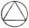
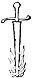

  
[Intangible Textual Heritage](../../index)  [Esoteric](../index.md) 
[Index](index)  [Previous](cdg06)  [Next](cdg08.md) 

------------------------------------------------------------------------

[Buy this Book at
Amazon.com](https://www.amazon.com/exec/obidos/ASIN/1564592014/internetsacredte.md)

------------------------------------------------------------------------

*Comte de Gabalis* \[1913\], at Intangible Textual Heritage

------------------------------------------------------------------------

p. 69

 

|                     |
|---------------------|
|  |

FTER dinner we returned to the labyrinth. I was pensive and my pity for
the Comte's madness, which I fully realised would be hard to cure,
prevented my being as much amused at all that he had told me as I should
have been, could I have had any hope of restoring him to reason. I kept
searching antiquity for some counter arguments which he would be unable
to refute for, on my adducing the opinions of the church, he had
declared that he cared for naught save the ancient religion of his
Fathers the Philosophers [XLVIII](#fn_62.md); and
to seek to convince a Cabalist by reason would be a long winded
undertaking, besides I vâas not anxious to get into a dispute with a man
whose motives I did not as yet altogether understand.

It crossed my mind that what he had said concerning the false gods, for
whom he had substituted the Sylphs and other Elementary Peoples, might
be refuted by the

p. 70 p. 71

\[paragraph continues\] Pagan Oracles whom
Scripture everywhere calls devils, and not Sylphs. But not knowing
whether the Comte might not in the tenets of his Cabala attribute the
answer of the Oracles to some natural cause, I believed that it would be
to the point to make him explain what he thought about them.

He gave me an opportunity to broach the subject when, before entering
the labyrinth, he .turned towards the garden. "This is very fine," he
said, "and these statues are rather effective."

"The Cardinal who had them brought here [XLIX](#fn_63.md)," I replied, "had a fancy little worthy
of his great genius. He believed the majority of these figures to have
given forth Oracles in bygone days, and paid exceedingly dear for them
on that account."

"That is a failing of many people," the Comte reoined. "Every day
ignorance causes a very criminal kind of idolatry to be committed, since
people preserve with such great care and consider so precious those very
idols which they believe the Devil formerly employed to make himself
worshipped. O God, will people never in this world know that Thou hast
precipated Thine enemies beneath Thy footstool from the birth of time,
and that Thou dost hold the demons prisoners under the earth in the
vortex of darkness? This unpraiseworthy desire to conect these
counterfeit instruments of the demons might become innocent, my Son, if
people would let themselves be persuaded that the

p. 72 p. 73

angels of darkness have never been allowed to speak through the
Oracles."

"I do not believe," I interrupted, "that it would be easy to establish
that hypothesis amongst the antiquarians, but possibly it might be
amongst the free thinkers. For not long ago it was decided by the
leading minds of the day, in a conference called for the purpose, that
all these pretended Oracles were either a fraud due to the avarice of
the Gentile priests, or but a political trick of the Sovereigns."

"Was this conference held and this question thus de-cided by the members
of the Muhammedan Embassy [L](#fn_64.md) sent to
your King?"

"No Sir," I answered.

"Then of what religion are these gentlemen," he retorted "since they set
at naught the Holy Scriptures which make mention in so many instances of
so many different Oracles, especially of the Pythian Oracles who made
their abode and gave forth their replies in places destined for the
multiplication of the image of God?"

"I mentioned all those ventriloquists," I answered, "and I reminded the
company that King Saul [LI](#fn_65.md) had banished
them from his kingdom where, notwithstanding, he found one of them on
the evening ofthe day before his death, whose voice had the wondrous
power ofraising Samuel from the dead in answer to his prayer, and to his
ruin. But these learned men did not alter their decision that there
never had been any Oracles."

p. 74 p. 75

"If the Scripture made no impression upon them," a said the Comte, "you
should have convinced them by all antiquity, wherein it would have been
easy to point out a thousand marvellous proofs. There were so many
virgins pregnant with the destiny of mortals, who brought forth the good
and bad fortunes of those who consulted them. What do you allege as to
Chrysostom, Origen and Oecumenius, who make mention of those divine men
whom the Greeks called 'Engastrimyths,' [LII](#fn_66.md) whose prophetic abdomens articulated
such famous Oracles? And if your gentlemen did not care for the
Scriptures and the Fathers, you should have reminded them of those
miraculous maidens of whom the Greek Pausanias speaks, who changed
themselves into doves and in that form delivered the celebrated Oracles
of the Doves of Dodona [LIII](#fn_67.md). Or else
you might have said, to the glory of your nation, that there were of old
in Gaul illustrious maidens [LIV](#fn_68.md) who
transformed their entire appearance at the will of those who consulted
them and who, in addition to the famous Oracles which they delivered,
had a wonderful power over the waters and a salutary authority over the
most incurable diseases."

"They would have treated all these fine proofs as apocryphal," said I.

"Does their antiquity render them suspect? " he reoined. "If so, you had
only to adduce the Oracles which are still delivered every day."

"And in what part of the world? " said I.

p. 76 p. 77

"In Paris," he replied.

"In Paris!" I exclaimed.

"In Paris," he repeated, "'Art thou a master of Israel [LV](#fn_69.md) and knowest not these things?' Do not
people daily consult Aquatic Oracles in glasses of water or in basins,
and Aerial Oracles in mirrors and on the hands of virgins? Do they not
recover lost beads and pilfered watches? Do they not learn news from
distant countries in this way, and see the absent?"

"Eh, Sir, what are you saying?" said I.

"I am recounting that which I am positive happens every day," he
answered, "and it would not be difficult to find a thousand eyewitnesses
of it."

"I cannot believe that Sir," I returned. "The magistrates would make an
example of such culprits and people would not permit idolatry------"

"Ah! how hasty you are!" interrupted the Comte. "There is not so much
evil in all this as you might suppose, and Providence will not permit
the total destruction of that remnant of Philosophy which has escaped
the lamentable shipwreck Truth has sustained. If there yet remains among
the people any vestige of the dread power of the Divine Names [LVI](#fn_70.md), are you of the opinion that it should
be blotted out and that they should lose the respect and recognition due
to the great name AGLA [LVII](#fn_71.md), which
works all these wonders, even when invoked by the ignorant and sinful
and which, spoken by a Cabalist, would perform many other miracles. Ifs

p. 78 p. 79

you had wished to convince your gentlemen ofthe truth of the Oracles,
you had only to exalt your imagination and your faith, and turning
towards the East cry aloud 'AG' ------"

"Sir," I interposed, "I was careful not to advance that kind of argument
to such proper folk as those with whom I was debating. They would have
taken me for a fanatic for, depend upon it, they have no faith whatever
in that sort of thing, and even if I had known the Cabalistic Procedure
to which you refer, it would not have succeeded when pronounced by me; I
have even less faith than they."

"Well, well," said the Comte, "If you lack faith we shall supply it. If
you had reason to believe, however, that your gentlemen would not credit
that which they can see any day in Paris, you might have cited a story
of rather recent date. That Oracle, which Celius Rhodeginius [LVIII](#fn_72.md) says he himself witnessed, delivered
towards the end of the last century by that extraordinary woman who
spoke and predicted the future by means of the same organ as did the
Eurycles of Plutarch."

"I should not have cared to cite Rhodeginius," I answered, "it would
have seemed pedantic to do so, moreover they would certainly have told
me that the woman was beyond question a demoniac."

"They would have said that very monachally," he replied.

"Sir," I ventured to say, "notwithstanding the

p. 80 p. 81

Cabalistic aversion to monks which I perceive you to entertain, I cannot
help siding with them on this occasion. I believe that there would not
be so much harm in absolutely denying that Oracles ever existed as there
is in saying it was not the Devil who spoke through them because, in
short, the Fathers and the theologians--"

"Because, in short," he interrupted, "do not the theologians agree that
the learned Sambethe, the most ancient of the Sibyls was the daughter of
Noah [LIX](#fn_73.md)?"

"Eh! what has that to do with it?" I retorted.

"Does not Plutarch say," he rejoined, "that the most ancient of the
Sibyls was the first to deliver Oracles at Delphi? Therefore the Spirit
which Sambethe harboured in her breast was not a devil nor was her
Apollo a false god, for idolatry did not begin until long after the
division of languages, and it would be far from the truth to attribute
to the Father of Lies the sacred books of the Sibyls [LX](#fn_74.md), and all the proofs of the true religion
which the Fathers have drawn from them. And then, too, my Son," he
laughingly continued, "it is not for you to annul the marriage of David
and the Sibyl which was made by a celebrated cardinal, nor to accuse
that learned personage of having placed side by side a great prophet and
a wretched demoniac. Since either David strengthens the testimony of the
Sibyl or the Sibyl weakens the authority of David."

p. 82 p. 83

"Sir," I exclaimed, "I entreat you again to become serious."

"Willingly," said he, "provided you will not accuse me of being too much
so. Is it your opinion that the Devil is sometimes divided against
himself and against his own interests?"

"Why not?" said I.

"Why not!" said he, "Because that which Tertullian has so felicitously
and so grandly termed 'the Reason of God' does not find it fitting.
Satan is never divided against himself. It therefore follows either,
that the Devil has never spoken through the Oracles, or that he has
never spoken through them against his own interests; and therefore if
the Oracles have spoken against the interests of the Devil, it was not
the Devil who was speaking through the Oracles."

"But," said I, 'has not God been able to compel the Devil to bear
witness to the truth and to speak against himself?"

"But," he answered, "What if God has not compelled him to do so?"

"Ah, in that case," I replied, "you are more in the right than the
monks."

p. 84 p. 85

"Let us look into this matter then," he continued, "and that I may
proceed invincibly and in good faith, I do not care to introduce the
evidence concerning Oracles cited by the Fathers of the Church, although
I am aware of the veneration you entertain for those great men. Their
religion and the interest they took in the matter might have prejudiced
them, and seeing Truth to be rather poor and naked in their own time,
their love of her might have caused them to borrow from  [LXI](#fn_76.md) Falsehood's self some robe and ornament
for Truth's adornment. They were men and consequently capable of bearing
false witness, according to the maxim of the Poet of the Synagogue. I
shall therefore take a man who cannot be suspected of such a motive, a
Pagan, and a Pagan of a very different kind to Lucretius, or Lucian, or
the Epicureans. A Pagan thoroughly imbued with the belief that there are
gods and devils without number, immeasurably superstitious, a mighty
magician, or supposedly so, and consequently a great partisan of devils
namely Porphyry. Here are word for word some Oracles which he reports.

p. 86 p. 87

### ORACLE. [LXII](#fn_77.md)

*Above the Celestial Fire there is an Incorruptible Flame, ever
sparkling, Source of Life, Fountain of all Beings, and Principle of all
Things. This Flame produces all, and nothing perishes save that which it
consumes. It reveals itself by virtue of itself This Fire cannot he
contained in any place; it is without form and without substance, it
girdles the Heavens and from it there proceeds a tiny spark which: makes
the whole fire of the Sun, Moon and Stars. This is what I know of God.
Seek not to know more, for this passes thy comprehension howsoever wise
thou mayest be. Nevertheless, know that the unjust and wicked man cannot
hide himself from God, nor can craft nor excuse disguise aught fröm His
piercing eyes. All is full of God, God is everywhere*.

p. 88 p. 89

"You will admit, my Son, that this Oracle is not too greatly influenced
by his devil."

"At least," I answered "the Devil in this instance rather departs from
his character."

"Here is another," said he, "that preaches still better."

### ORACLE.

*There is in God an immense depth of Flame. The heart must not, however,
fear to touch this adorable Fire nor to be touched by it. It will in no
wise he consumed by this gentle Flame, whose tranquil and peaceful
warmth causes the union, harmony and duration of the world. Nothing
exists save by this Fire, which is God himself It is uncreate, it is
without mother, it is omniscient and unteachable: it is unchanging in
purposes, and its Name is Inefable. This is God; as for us who are His
messengers, WE ARE BUT A LITTLE PART OF GOD*.

"Well! What say you to that?"

"I should say of both," I replied, "that God can force the Father of
Lies to bear witness to the truth."

"Here is another," rejoined the. Comte, "which will remove that
scruple."

p. 90 p. 91

### ORACLE. [LXIII](#fn_80.md)

*Alas Tripods! Weep and make funeral oration for your Apollo. HE IS
MORTAL, HE IS ABOUT TO DIE, HE EXPIRES; because the Light of the
Celestial Flame extinguishes him.*

"You see, my child, that whoever this may be who speaks through these
Oracles, and who so admirably explains to the Pagans the Essence, Unity,
Immensity and Eternity of God, he owns that he is mortal and but a spark
of God. Therefore it cannot be the Devil who is speaking, since he is
immortal, and God would not compel him to say that he is not. It is
therefore proven that Satan is not divided against himself. Is it a way
to make himself worshipped to say that there is but one God? The Oracle
says that he is mortal, since when is the Devil become so humble as to
deprive himself of even his natural qualities? Therefore you see, my
Son, that if the principle of Him who is called par excellence the God
of the Sciences exists, it cannot have been the Devil who spoke through
the Oracles."

p. 92 p. 93

"But if it was not the Devil," said I, "either lying from gaiety of
heart when he speaks of himself as mortal, or telling the truth under
compulsion when he speaks of God, then to what will your Cabala ascribe
all the Oracles which you maintain to have been actually delivered? Is
it to an exhalation of the earth, as Aristotle, Cicero and Plutarch
say?" [LXIV](#fn_81.md)

"Ah! not to that my child," said the Comte. "Thanks to the Sacred Cabala
my imagination has not led me astray to that extent."

"What do you mean?" I inquired, "Do you consider that opinion so
exceedingly visionary? Nevertheless its partisans are men of good
sense."

"Not in this instance," he replied, "and it is impossible to attribute
to an exhalation all that happened in the Oracles. For example, that man
in Tacitus, who appeared in a dream to the priests of a temple
ofHercules [LXV](#fn_82.md) in Armenia, and
commanded them to make ready for him hunters equipped for the chase. Up
to this point exhalation might account for it: but when those horses
returned in the evening jaded, and their quivers emptied of shafts; and
when the next day exactly the same number of dead beasts were found as
there had been arrows in the quivers, you will perceive that exhalation
could not have produced this effect, much less the Devil. For to believe
that the Devil has been permitted to divert himself by chasing the hind
and hare, is to have an irrational and uncabalistic

p. 94 p. 95

idea of the misery of the enemy of God." "Then," said I, "to what cause
does the Sacred Cabala ascribe all this?"

"Wait," he answered "before I reveal this mystery to you I must overcome
any prejudice you might have because of this hypothetical exhalation.
For, if I remember aright, you cited Aristotle, Plutarch and Cicero with
emphasis. You might likewise have cited lamblichus, who very great
genius though he was, laboured for a time under this delusion, but
speedily relinquished it when he had examined the matter at close range
in the Book of the Mysteries.

Peter of Aponus, Pomponatius, Levinius, Sirenius, and Lucilius Vanino
were also overjoyed to find this subterfuge in some of the ancient
writers. All these pseudo-geniuses who, when they treat of divine
things, say rather what pleases them than what they know to be true, are
unwilling to admit that there is anything superhuman in the Oracles,
lest they should acknow- ledge the existence of something superior to
man.'' They fear lest men should make of the Oracles 'a lad= der
wherewith to mount to God, Whom they''dread

to acknowledge as manifesting through gradations of His spiritual
creatures [LXVI](#fn_83.md), and they prefer to
manufac ture a ladder to descend into nothingness. Instead of mounting
towards heaven they delve into the earth, ;ày. and instead of seeking in
Beings superior to man 'the cause if those transports which lift him
above himself

p. 96 p. 97

and restore to him a kind of divinity, they weakly ascribe to impotent
exhalations this power to penetrate the future, discover hidden things,
and attain to the supreme secrets of the Divine Essence."

"Such is the misery of man when possessed by the spirit of contradiction
and the disposition to think differently to others. Instead of achieving
his ends he becomes involved and fettered. These intellectual libertines
do not wish to make man subject to substances less material than
himself, and yet they make him subject to an exhalation: and
disregarding the absence of any connection whatever between this
chimerical vapour and the soul of man, between this emanation and future
events, between this frivolous cause and these miraculous effects, the
mere singularity of their theories is to them sufficient evidence of
their reasonableness. They are content to deny the existence of spirits
and to assume the rôle of free thinkers."

"Then, Sir, is singularity exceeding displeasing to you?" I asked.

"Ah! my Son," said he, "’tis the bane of commonsense and the stumbling
block of the greatest minds. Aristotle, great logician though he was,
could not avoid the snare into which the passion for singularity leads
those whom it unbalances as violently as it did him. He could not, I
say, avod becoming entangled and contradicting himself. In is hook on
'The Generation of Animals' [LXVII](#fn_84.md) and
in his 'Ethics,' he says that the

p. 98 p. 99

spirit and understanding of man come to him from without, and cannot be
transmitted from father to son. And from the spirituality of the
operations of man's soul he concludes it to be of a different nature to
that composite material which it animates, the grossness of which only
serves to becloud speculation and is far from contributing to its
production. Blind Aristotle! Since you maintain [LXVIII](#fn_85.md) that the matter of which we are
composed cannot be the source of our spiritual thoughts, how can
youexpect a weak exhalation to be the source of sublime thought and of
those soaring flights of spirit achieved by those who gave forth the
Pythian Oracles? See, my child, how forcibly this genius contradicts
himself, and how his craving for singularity leads him astray."

"You reason very logically, Sir," said I, enchanted to perceive that he
was talking excellent sense, and hoping that his madness would not prove
incurable, "God willing--"

"Plutarch, [LXIX](#fn_86.md) so sound in other
respects," he said, interrupting me, "moves me to pity in his dialogue
concerning the 'Cessation of the Oracles.' Convincing objections are
raised which he in no wise refutes. Why does he not answer what is said
to him, namely, that it is the exhalation which causes these transports,
all those who approach the prophetic Tripod would be seized with
enthusiasm and not merely a single maiden who moreover must be virgin.
But how can this vapour articulate cries through the abdomen? Besides
this exhalation

p. 100 p. 101

is a natural cause which must necessarily produce its effect regularly
and at all times. Why is this maiden agitated only when consulted? And,
what is more important, why has the earth ceased to breathe forth these
divine vapours? Is it less earth now than then? Is it subject to other
influences? Has it other seas and other rivers? Who then has stopped
earth's pores or changed its nature?"

"I wonder that Pomponatius, Lucilius and the other Libertines should
borrow this idea from Plutarch and cast aside his explanation. He spoke
more judiciously than Cicero and Aristotle, for he was a man of great
good sense and, not knowing what conclusion to draw from all these
Oracles, after tedious irresolution, he decided that this exhalation,
which he believed issued from the earth, was a most divine spirit. Thus
he ascribed to divinity the extraordinary agitations and illuminations
of the Priestesses of Apollo [LXX](#fn_88.md).
'*This divinatory vapour is a breath and a most divine and most holy
spirit*,' said he."

"Pomponatius, Lucilius and modern atheists do not adapt themselves
readily to fashions of speech which imply divinity. 'These exhalations',
say they, 'were of the nature of those vapours which infect splenetics
who speak languages they do not understand.' Fernelius refutes these
impieties rather well, by proving that bile which is a peccant humour
cannot cause that diversity of tongues which is one of the most
marvellous

p. 102p. 103

effects under consideration and an artificial expression of thought.
Nevertheless, he decided erroneously in subscribing to Psellus, and to
all those who have not penetrated far enough into our Holy Philosophy
for, like them, not knowing where to locate the causes of these
surprising effects, he imitated the women and monks and attributed them
to the Devil."

"Then to whom should one attribute them? " said I, "I have long awaited
this Cabalistic secret."

"Plutarch [LXXI](#fn_89.md) has very well indicated
it," he said, "and he would have been wise had he let matters rest
there. Since this irregular method of expressing one's opinion by means
of an unseemly organ was neither solemn enough nor sufficiently worthy
of the majesty of the gods, says that Pagan, and since the sayings of
the Oracles surpassed the powers of the soul of man, they have rendered
great service to Philosophy, for they have established the existence of
mortal beings between the gods and man to whom one can ascribe all that
surpasses human weakness yet falls short of divine greatness."

"This is the opinion held in every ancient philosophy. The Platonists
and the Pythagoreans took it from the Egyptians, and the latter from
Joseph the A Saviour, and from the Hebrews who dwelt in Egypt before the
crossing of the Red Sea. The Hebrews used to call these beings who are
between the Angels and man Sadaim, and the Greeks, transposing the

p. 104 p. 105

letters and adding but one syllable, called them Daimonas. Among the
ancient Philosophers these demons were held to be an Aerial Race, ruling
over the Elements, mortal, engendering, and unknown in this century to
those who rarely seek Truth in her ancient dwelling place, which is to
say, in the. Cabala and in the theology of the Hebrews, who possessed
the special art of holding communion with that Aerial People and of
conversing with all these Inhabitants of the Air."

"Now, Sir, I think you have returned again to your Sylphs."

"Yes, my Son," he went on, "the Teraphim of the Jews was but the
ceremony which had to be observed

for that communion: and that Jew Micah [LXXII](#fn_90.md), who complains in the Book of Judges
that his gods have been taken from him, only laments the loss of the
little image through which the Sylphs used to converse with him. The
gods which Rachel stole from her father were also Teraphim. Neither
Micah nor Laban are reproved for idolatry, and Jacob would have taken
care not to live for fourteen years with an idolater, nor to marry his
daughter. It was only a commerce with Sylphs; and tradition tells us
that the Synagoge considered such commerce permissible, and that the
image belonging to David's wife was but the Teraphim by virtue of which
she conversed with the Elementary Peoples: for you can well imagine that
the Prophet after God's own heart would not have tolerated idolatry

p. 106 p. 107

in his household."

"These Elementary Nations, so long as God neglected the salvation of the
world in punishment for the first sin, used to take pleasure in
explaining to men through the Oracles what they knew of God, in teaching
them how to live morally, and in giving them most wise and most
profitable counsels, such as are seen in great number in Plutarch and in
all historians. As soon as God took pity on mankind and was willing
Himself to become their Teacher, these little Masters withdrew. Hence
the silence of the Oracles."

"Then the upshot of your entire discourse, Sir," I remarked, "is that
there certainly were Oracles, and that the Sylphs delivered them, and
even to-day deliver them in goblets or in mirrors."

"The Sylphs or Salamanders, the Gnomes or Undines," corrected the Comte.

"If that be so," I replied, "all your Elementary Peoples are very
dishonest folk."

"Why do you say that? " said he.

"Why? Could anything be more knavish," I pursued, "than all these
responses with double meanings which they always give?"

"Always? " he replied. " Ah! not always. Did the Sylphid speak very
obscurely who appeared to that Roman in Asia [LXXIII](#fn_91.md) and predicted to him that he would
one day return to Rome with the dignity of Proconsul?

p. 108 p. 109

\[paragraph continues\] And does not
Tacitus say that the event occurred exactly as predicted? That
inscription and a those statues famous in the history of Spain which
warned unfortunate King Rodriguez [LXXIV](#fn_92.md) that his indiscretion and incontinence
would be punished by men dressed and armed exactly as they were, and
that those black men would take possession of Spain and rule there for
many a year. Could anything have been more explicit, and was not the
prophecy verified by the event in that selfsame year? For did not the
Moors come to dethrone that effeminate king? You know the story, and you
must admit that the Devil, who since the reign of the Messiah does not
dispose of empires, could not have been the author of this Oracle: and
that it was undoubtedly some great Cabalist who had it from one of the
most learned Salamanders. Since the Salamanders love chastity
exceedingly, they willingly make known to us the misfortunes which must
befall mankind for lack of that virtue."

"But, Sir," said I to him, "do you consider that heteroclitic organ
which they made use of for the preaching of their ethics very chaste and
altogether in keeping with Cabalistic modesty?"

"Ah!" said the Comte, smiling, "Your imagination is shocked, and you
fail to perceive the physical reason which causes the flaming Salamander
naturally to de-

light in the most igneous places and to be attracted by--" [LXXV](#fn_93.md)

"I understand, I understand," I interrupted, "Do

p. 110 p. 111

not take the trouble to explain further."

"As for the obscurity of some Oracles which you dub knavery," he went on
seriously, "are not shadows the usual cloak of Truth? Is not God pleased
to hide Himself in their sombre veil? And is not Holy Writ, that
perpetual Oracle which He has left to His children, enveloped in an
adorable obscurity which confounds and bewilders the proud even as its
Light guides the humble?"

"If this be your only difficulty, my Son, I advise you not to postpone
entering into communion with the Elementary Peoples. You will find them
very sincere folk, learned, benevolent and God-fearing. I am of opinion
that you should begin with the Salamanders, for you have Mars in
mid-heaven in your horoscope, which signifies that there is a great deal
of fire in all your actions. And as for marriage, I rather think that
you should choose a Sylphid. You would be happier with her than with any
of the others, for you have Jupiter in the ascendant with Venus in
sextile. Now Jupiter presides over the Air and the Peoples of the Air.
You must, however, consult your own heart in this matter for, as you
will one day see, a Sage governs himself by the interior stars, and the
stars of the exterior heaven but serve to give him a more certain
knowledge of the aspects of the stars of that interior heaven [LXXVI](#fn_94.md) which is in every creature. Thus it
rests with you to tell me what your

p. 112 p. 113

inclination is, that we may proceed to your alliance with those
Elementary Peoples which are most pleasing to you."

"Sir," I replied, "in my opinion this affair demands a little
consultation."

"I esteem you for that answer," said he, laying his hand on my shoulder.
"Consult maturely as to this affair, and above all, with him who is
called in an eminent degree the Angel of the Grand Council [LXXVII](#fn_95.md). Go, and devote yourself to prayer,
and I shall be at your house at two o'clock to-morrow afternoon."

We came back to Paris, and on the way I led him once more to discourse
against atheists and libertines. I have never heard arguments so well
supported by reason, nor such sublime and subtle ideas advanced for the
existence of God, and against the blindness of those who go through life
without wholly surrendering themselves to a serious and continual
worship  
of Him to whom we owe the gift and preservation of our being. I was
surprised at  
the character of this man, and I could  
not comprehend how it was  
possible for him to be at  
once so strong, and so  
weak, so  
admirable,  
yet so  
ridiculous  
.

------------------------------------------------------------------------

### Footnotes

[69:XLVIII](cdg07.htm#fr_62.md) p. 70 ANCIENT RELIGION OF HIS FATHERS THE
PHILOSOPHERS. The Philosophers hold that the relation of the Creator to
His Creation has been the same in all ages; that all creeds evolved by
man are but man's concept of this relation and in no wise alter it; that
the Truth regarding the Fatherhood of God, Sonship of His Messengers,
the great Teachers of humanity, and Brotherhood of all His creatures, is
superior to creeds and religions, and will unify them when once
apprehended.

[71:XLIX](cdg07.htm#fr_63.md) p.
72 THE GARDENS OF RUEL AND THE CARDINAL.--RUel, in the department
of Seine et Oise, is fourteen kilometres distant from Paris, and "is
situated at the base of those heights on which stood, in olden days, the
magnificent villa of Cardinal Richelieu with its two chapels, hundred
fountains, and lofty and balustraded cascade." In the years 1621-42 the
cardinal minister established and maintained there a château and estate
which eclipsed those of the King of France. Nowhere was there to be
found so vast a collection of curiosities of every discription, such
extensive gardens, so superb an orangery, nor such grottoes, fountains
and cascades surpassing indeed anything previously known. These
celebrated gardens, extolled by contempory authors, and even envied by
the great King Louis XIV who sent Le Nôtre to Ruel to study and
reproduce them on a larger scale at Versailles, are a sad example of the
transitoriness of the handiwork of man. A gradual deterioration
culminating in their destruction during the Revolution has left almost
no trace of them extant.

[73:L](cdg07.htm#fr_64.md) p.
74 MOHAMMEDAN EMBASSY.--The subtle irony of this allusion to the
strained relations existing between Louis xiv and the Porte at this
period is made plain by the following statement of the historian, E.
Lavisse when summarising the foreign policy of France from 1661-1685.
"During the second half of the 16th century the alliance 'of the lily
and the crescent' was lost. In 1661 France, after several ambassadors
had been ill treated, was represented at the Porte solely by a merchant
whom 'the nation' had chosen. There was therefore in that direction a
lost position for french diplomacy to regain." E. LAVISSE, HISTOIRE DE
FRANCE. VOL. 7II PAGE 203. COMPARE MUHAMMED AND THE
MUHAMMEDANS. [NOTE R](cdg28.htm#an_R.md), COMMENTARY CONTINUED.

[73:LI](cdg07.htm#fr_65.md) KING SAUL. [NOTE
S](cdg29.htm#an_S.md), COMMENTARY CONTINUED.

[75:LII](cdg07.htm#fr_66.md) p.
76 ENGASTRIMYTHS.--For it would be too absurd and puerile to
conclude that God Himself, in the guise of Engastrimyths, that is to say
tutelary deities speaking from within the abdomen, such as were of old
called Eurycles and to-day Pythons, should the bodies of Prophets and
make use of their mouths and voices as instruments for speaking. For he
who thus introduces God into human affairs is lacking in reverence for
His Greatness, nor does he maintain the Majesty and Glory of God's
Worth. TRANSLATED FROM PLUTARCH'S CESSATION OF THE ORACLES. CHAPTER ix.

[75:LIII](cdg07.htm#fr_67.md) THE ORACLE OF DODONA.
[NOTE T](cdg30.htm#an_T.md), COMMENTARY CONTINUED.

[75:LIV](cdg07.htm#fr_68.md) MAIDENS OF GAUL.--Sena
being situate in the Britishe Sea, against the countrie of the
Osis-Myes, is renowned with the Oracle of the God of the Galles, whose
Vow-esses in number nine, are hallowed to continuall Virginitie. They
call them Gallicens, and are of opinion, that through the singuler
wisdom wherewith they are endued, they rayse the seas and winds with
their charmes, and transforme themselves into what. Beastes theywill,
and and heale such diseases as to others are incurable, knowe thinges to
come and prophesie of them, but not unto any other than such as sayle
thither for the nonce, and come of set purpose to demaund Counsell of
them.

THE RARE AND SINGULER WORK OF POMPONIUS MELA, THAT EXCELLENT AND WORTHY
COSMOGRAPHER. TRANSLATED INTO ENGLISH BY ARTHUR GOLDING, GENTLEMAN,
LONDON, 1590. BOOK., III., CHAPTER vi.

[77:LV](cdg07.htm#fr_69.md) MASTER OF ISRAEL.--an
official interpreter of the sacred books of the Jews. The Comte's words
are quoted from the third chapter of the Gospel of St. John.

[77:LVI](cdg07.htm#fr_70.md) DIVINE NAMES.--"It
must be obsérved that these divine names were produced by scientific men
energising according to a divine afflatus," THOMAS TAYLOR," THE CRATYLUS
OF PLATO." NOTE PAGE 131.

[77:LVII](cdg07.htm#fr_71.md) AGLA.--Every letter
of the Hebrew alphabet has hidden or sacred meaning, knowledge of which
renders Hebrew names self interpretative. The four letters of the word
AGLA and their significance are:--

A.--The First Cause, Positive Force.

G.--Negative Force.

L.--Objective Force.

A.--The First Cause.

\[paragraph continues\] Hence AGLA is seen
to signify the First Cause in triple aspect and to be a synonym of the
ancient Hebrew word Al--the Sun, (Creator of the Sun of our Solar
system) . Al signifies the Sun behind the Sun in triple aspect, the
Trinity Unmanifest symbolised thus 
. As in the microcosm, the physical body is informed
and animated by the invisible or spiritual man, so in the macrocosm, the
visible Sun derives its light and life from an invisible or Spiritual
Sun, whose glory and power p. 80 can be
apprehended by man solely through his Solar Principle to which the Sun
behind the Sun is manifest as a radiance of unspeakable glory realised,
or participated in, as an ecstacy of consciousness unframable in any
medium of expression known to the finite mind. In some Christian
churches this state 'is called Union with God, in the East, Yoga, and
among Initiates of all races has been striven for though rarely
attained. It is "the flight of the Alone to the Alone" says Porphyry. "I
and my Father are one," said Christ.

Agla is here used as a substitute for the Ineffable Name of the Sun
behind the Sun, which is the Lost Word of Masonry and Sacrificial Word
pronounced by the First Cause of the Brahmins, and whose property it is
to open the human consciousness to this estate of oneness with God.
Reference is made to this Name in the Egyptian Book of the Dead "I am
the Great God existing of myself, the Creator of His Name,--I know the
Name of the Great God that is there." As in ancient Egypt so in our own
land and day there exists that spoken Word or Name, inner key of
spiritual knowledge possessed by the hierophants of all ages, to the
power of which Christ testified, saying " the works that I do in my
Father's Name, they bear witness of me." COMPARE THE DIVINE POWER OF
LETTERS, [NOTE U](cdg31.htm#an_U.md), COMMENTARY CONTINUED.

[79:LVIII](cdg07.htm#fr_72.md) CELIUS RHODIGINUS
AND HIS ORACLE. [NOTE V](cdg32.htm#an_V.md), COMMENTARY CONTINUED.

[81:LIX](cdg07.htm#fr_73.md) SAMBETHE, THE DAUGHTER
OF NOAH. [NOTE W](cdg33.htm#an_W.md), COMMENTARY CONTINUED.

[81:LX](cdg07.htm#fr_74.md) SACRED BOOKS OF THE
SIBYLS.--Under the title of "Oracles of the Sibyls" there exists a
collection of verses in Greek hexameter in fourteen books, which has
long been regarded as an authentic collection of the prophecies of the
pagan Sibyls. In Libri Divin-arum Rerum, Lactantius quotes Varro as
saying that these books are not all written by one Sibyl, but are called
Sibylline because by the ancients all prophetesses were called Sibyls.
And Diodorus Siculus states that the Sibyl was actuated by the spirit of
God and that the name Sibyl signifies "being full of God."

As these books accurately prophesied the mission, teaching, and miracles
of Christ as well as his death upon the cross and resurrection, the
church fathers accepted and made use of them without hesitation. The
pleasantry of the Comte as to the marriage of David and the Sibyl is a
reference to the words occuring in the Mass for the Dead, "Teste David
cum Sibylle." (By the witness of David and the Sibyl).

The original Sibylline Books were kept concealed in the Capitol at Rome,
and were lost when it was destroyed by fire in 405, A.D. They were held
in p. 84 profound veneration and were
consulted only by decree of the Senate. Cicero bears witness to their
worth saying,"How often has our Senate enjoined the decemvirs to consult
the hooks of the Sibyls," when " portentious events announced to the
Romans terrible and disastrous seditions. On all these occasions the
diviners and their auspices were in perfect accordance with the
prophetic verses of the Sibyl." There is a famous tradition that the
first Sibylline Book was sold to King Tarquin, one of the early rulers
of Rome, by the Sibyl who dwelt at Cumae, in Italy.

Now Justin Martyr states that it was the ancient Babylonian Sibyl
(Sambethe), who came to Cumae, and there gave Oracles which contain the
true religion, and which Plato admired as divine. Thus Sambethe, the
most ancient of the Sibyls, is seen to have initiated the Sibylline
Oracles which guided the destinies of ancient Rome as well as the
Delphic Oracles which exercised such influence over the evolution of
ancient Greece. And if Justin Martyr's statement [\*](#fn_75.md) as to the tenor of her teachings is to be
believed, we must conclude that the

TRUE RELIGION EXISTED IN BOTH ROME AND GREECE PRIOR TO THE CHRISTIAN ERA
AND DURING WHAT IS NOW TERMED THE PAGAN PERIOD.

[81:\*](cdg07.htm#fr_75.md) GIVEN [NOTE
X](cdg34.htm#an_X.md), COMMENTARY CONTINUED.

SIBYLLINE PROPHECY OF WORLD PEACE. [NOTE II](cdg46.htm#an_II.md),
COMMENTARY CONCLUDED.

[85:LXI](cdg07.htm#fr_76.md) p.
87 MAXIM OF THE POET OF THE SYNAGOGUE. "I said in my haste, all
men are liars." PSALMS OF DAVID, CXV1, 11.

[87:LXII](cdg07.htm#fr_77.md) p.
88 THE PRINCIPLE OF ALL THINGS.--BEYOND THE SUN IN THE DIRECTION
OF THE DOG STAR LIES THAT INCORRUPTIBLE FLAME OR SUN, PRINCIPLE OF ALL
THINGS, WILLING OBEDIENCE FROM OUR OWN SUN WHICH IS BUT A MANIFESTATION
OF ITS RELEGATED FORCE. THE EXISTENCE OF THE SUN BEHIND THE SUN HAS BEEN
KNOWN IN ALL AGES, as well as the fact that its influence is most potent
upon earth during that period every 2000 years when it is in conjunction
with the Sun of our solar system. Then gathering to itself the power of
its own Source and transmitting it through our Sun to this planet, it is
said to send the Sons of God into the consciousness of the earth sphere
that a anew world of thought and emotion may be born in the minds of men
for the stimulation of humanity's spiritual evolution. Such a
manifestation marks the beginning or end of an epoch upon earth by the
radiation of that divine consciousness known as the Christ Ray or
Paraclete.

To the Egyptians the Sun behind the Sun was known as Osiris, [\*](#fn_78) said to be the husband of Isis (Nature.md)
and parent of Horus (the Sun), symbolically represented as a hawk
because that bird flies nearest the Sun. This ancient people knew that
once every year the Parent Sun is in line with the Dog Star. Therefore
the Great Pyramid was so constructed that, at this sacred moment, the
light of the Dog Star fell upon the square "Stone of God" at the upper
end of the Great Gallery descending p. 90 upon
the head of the high priest who received the Super Solar Force and
sought through his own perfected Solar Body to transmit to other
Initiates this added stimulation for the evolution of their Godhood.
This then was the purpose of the "'Stone of God,' whereon, in the
Ritual, Osiris sits to bestow upon him (the illuminate) the Atf crown of
celestial light." "North and South of that crown is love" proclaims an
Egyptian hymn. "And thus throughout the teaching of Egypt the visible
light was but the shadow of the invisible Light; and in the wisdom of
that ancient country the measures of Truth were the years of the Most
High." [†](#fn_79.md) The adorable Fire and immense
depth of Flame which the human heart must not fear to touch is that
power proceeding from the Lord and Giver of Life, the Creative Principle
of the Universe, the Sun behind the Sun.

Modern science partially confirms these facts as to the significance of
the Great Pyramid but lacks the key to them. Dr. Percival Lowell, in a
recent essay entitled "Precession and the Pyramids," says--"The Great
Pyramid was in fact a great observatory, the most superb one ever
erected," and "The Great Gallery's floor exactly included every possible
position of the Sun's shadow at noon from the year's beginning to its
end. We thus reach the remarkable result that the gallery was a gigantic
gnomon or sundial telling, not like ordinary sundials the hour of the
day, but on a more impressive scale, the seasons of the year."

[87:\*](cdg07.htm#fr_78.md) AND ALSO AS AMEN-RA,
THE HIDDEN SUN.

[87:†](cdg07.htm#fr_79.md) MARSHAM ADAMS "THE BOOK
OF THE MASTER." PAGE 141-2.

[91:LXIII](cdg07.htm#fr_80.md) p. 92 THE DELPHIC ORACLE'S PROPHECY REGARDING
CHRIST.--This prophecy foretells the silence of the Oracles subsequent
to the cdming of Christ, the Light of the Celestial Flame." Its
fulfilment is confirmed by the following authorities. Scarcely thirty
years after the supposed date of Jesus' death, Lucan in his Pharsalia
states that "the greatest calamity of our century is the loss of that
wonderful gift of heaven, the Delphic Oracle, which is silent." Eusebius
cites Porphyry as saving that since Jesus began to be worshipped no man
had received any public help or benefit from the Gods. And Plutarch
wrote his treatise affirming the "Cessation of  the Oracles" during the
first century of the Christian Era.

[93:LXIV](cdg07.htm#fr_81.md) p.
94 ARISTOTLE ON EXHALATION.--Likewise there exist in many parts
of the world openings through which exhalations escape, some of these
cause those who approach them to become inspired, while others make
people waste away, and others again, as for instance those at Delphi and
Labadea, cause them to utter oracles.

TRANSLATED FROM ARISTOTELIS DE MUNDO AD ALEXANDRUM. CHAPTER IV, §10.

CICERO ON EXHALATION.--"I believe also that there were certain
exhalations of certain earths, by which gifted minds were inspired to
utter oracles." CICERO, "ON DIVINATION." CHAPTER L.

PLUTARCH ON EXHALATION.--For the power of the exhalation neither has a
predisposing influence over all nor does it always predispose the same
people in the same way hut, as has been said, it supplies a beginning
and, as it were, enkindles those spirits which are prepared and fitted
to receive and suffer change under its influence. This divinatory vapour
is a breath and a most divine and most holy Spirit, (literally, divine
it is in very fact and supernatural). TRANSLATED FROM PLUTARCH MORALIA,
"DE DEFECTU ORACULORUM" §438 C, D.

[93:LXV](cdg07.htm#fr_82.md) TEMPLE OF HERCULES IN
ARMENIA. [NOTE Y](cdg35.htm#an_Y.md), COMMENTARY CONTINUED.

[95:LXVI](cdg07.htm#fr_83.md) p.
96 GRADATIONS OF HIS SPIRITUAL CREATURES.--The purpose of this
book is to point out to man the possibility of his own divine evolution
and to make plain to him that through obedience to the highest instincts
and impulses which he knows, he may evolve from darkness into light,
from knowledge into understanding, and from understanding into Wisdom
Found which is the consciousness of the Universal Mind.

It is true that God manifests through the gradations of His spiritual
creatures, for the Creator is omnipresent in His Creation and
inseparable from it. Therefore knowledge of the Creator or true
religion, and knowledge of His Creation or exact science, are in their
essence one. And as the scientist of to-day re- cognises as being
between the vegetable and animal kingdoms, certain forms of life which
demonstrably partake of the nature of, and may be claimed by both; so
the scientist of the future will have power to discern that man is by
nature both human and divine, possessing at once the attributes of
humanity and the elements of a Godhood, the science of whose evolution
is as exact and as logical as the science of mathematics. Hence the
religion of the future will be a knowledge of Truth which the science of
the future will sublimely sustain, while the aim of both will be to
instruct humanity as to its place in the Divine Plan and as to the Law
of Nature, God, which wills obedience from all things. COMPARE PLATO ON
MAN'S PLACE IN NATURE, [NOTE Z](cdg36.htm#an_Z.md), COMMENTARY CONTINUED.

[97:LXVII](cdg07.htm#fr_84.md) THE GENERATION OF
ANIMALS.--"Plainly those principles whose activity is bodily cannot
exist without a body, e.g. walking cannot exist without feet. For the
same reason also they cannot enter from outside. It remains, then, for
the reason alone so to enter And alone to be divine, for no bodily
activity has any connection with the activity of reason." ARISTOTLELIS
DE GENERATIONE ANIMALIUM. BOOK II, CHAPTER iii.

ETHICS.--"But such a life will be higher than mere human nature, because
a man will live thus, not in so far as he is man, but in so far as there
is in him a divine Principle. And in proportion as this Principle excels
his composite nature, so far does the Energy thereof excel that in
accordance with any other kind of Virtue. And therefore if pure
Intellect, as compared with human nature, is divine, so too will the
life in accordance with it be divine compared with man's ordinary life."

"These (the Moral Virtues), moreover, as bound up with the passions,
must belong to the composite nature, and the Excellences or Virtues of
the composite nature are proper to man; therefore so too will be the
life and Happiness which is in accordance with them. But that of the
Pure Intellect is separate and distinct." ARISTOTLE'S NICOMACHEAN
ETHICS. CHASE'S TRANSLATION. EXTRACTS BOOK X, CHAPTER vi.

[99:LXVIII](cdg07.htm#fr_85.md) p. 100 384 B.C. ARISTOTLE, 322 B.C., the disciple
of Plato. "Aristotle and Plato are reckoned the respective heads of two
schools. A wise man will see that Aristotle Platonises." [\*](#fn_87.md)

[99:LXIX](cdg07.htm#fr_86.md) 45 A.D. PLUTARCH, 120
A.D.--A Greek Initiate, for many years priest of Apollo apparently at
Delphi. "You know that I have served the Pythian God for many Pythiads
past, yet you would not now tell me, 'you have taken part enough in the
sacrifices, processions and dances, and it is high time Plutarch, now
you are an old man, to lay aside your garland, and retire as
superannuated from the Oracle.'"

[99:\*](cdg07.htm#fr_87.md) Ralph Waldo Emerson.

[101:LXX](cdg07.htm#fr_88.md) p. 102 PRIESTESSES OF APOLLO.--"But the prophetess
at Delphi, whether she gives oracles to mankind through an attenuated
and fiery spirit, bursting from the mouth of the cavern, or whether
being seated in the adytum on a brazen tripod, or on a stool with four
feet, she becomes sacred to the God; which so ever of these is the case,
she entirely gives herself up to a divine spirit, and is illuminated
with a ray of divine fire. And when, indeed, fire ascending from the
mouth of the cavern, circularly invests her in collected abundance, she
becomes filled from it with a divine splendour. But when she places
herself on the seat of the God, she becomes co-adapted to his stable
prophetic power; and from both those preparatory operations she becomes
wholly possessed by the God. And then, indeed, he is present with and
illuminates her in a separate manner, and is different from the fire,
the spirit the proper seat, and, in short, from all the visible
apparatus of the place, whether physical or sacred." IAMBLICHUS ON THE
MYSTERIES. SECTION III, CHAPTER xi. THOMAS TAYLOR'S TRANSLATION.

[103:LXXI](cdg07.htm#fr_89.md) p. 103 PLUTARCH ON THE ORACLES.--"We have formerly
shown that he (Plutarch) owned the unity of a Godhead; whom, according
to his attributes, he calls by several names, as Jupiter from his
almighty power, Apollo from his wisdom, and so of the rest; but under
him he places those beings whom he styles Genii or Daemons, of a middle
nature, between divine and human; for he thinks it absurd that there
should be no mean between the two extremes of an immortal and a mortal
being; that there cannot be in nature so vast a flaw, without some
intermedial kind of life, partaking of them both. As, therefore, we find
the intercourse between the soul and body to be made by the animal
spirits, so between divinity and humanity there is this species of
daemons. Who, having first been men, and followed the stria rules of
virtue, having purged off the grossness and feculency of their earthly
being, are exalted into these genii; and are from thence either raised
higher into an ethereal life, if they still continue virtuous, or
tumbled down again into mortal bodies, and sinking into flesh after they
have lost that purity which constituted their glorious being. And this
sort of Genii are those who, as our author imagines, presided over
oracles." A. H. CLOUGH: INTRODUCTION TO PLUTARCH'S LIVES. COMPARE SIR
THOMAS BROWNE ON MAN'S PLACE IN NATURE, [NOTE AA](cdg37.htm#an_AA.md),
COMMENTARY CONTINUED.

[105:LXXII](cdg07.htm#fr_90.md) p. 106 MICAH.--"And the man Micah had an house of
gods, and made an ephod, and teraphim, and conse- crated one of his
sons, who became his priest. And there was a young man out of
Bethlehem-judah of the family of Judah, who was a Levite; and Micah
consecrated the Levite; and the young man became his priest. And the
five men that went to spy out the land went up, and came in thither, and
took the graven image, and the ephod, and the teraphim, and the molten
image. And when they were a good way from the house of Micah, the men
that were in the houses near to Micah's house were gathered together,
and overtook the children of Dan. And they cried unto the children of
Dan. And they turned their faces and said unto Micah, What aileth thee,
that thou comest with such a company?' And he said, Ye have taken away
my gods which I made, and the priest, and ye are gone away: and what
have I more?'" EXTRACTS FROM BOOK OF JUDGES, CHAPTERS xvii. AND xviii.

MICHAL AND DAVID.--"Saul also sent messenger unto David's house to watch
him, and to slay him in the morning: and Michal, David's wife told him.
saying, If thou save not thy life to-night, to-morrov, thou shalt be
slain.' So Michal let David dowr through a window: and he went, and
fled, and escaped And Michal took an image, and laid it in the bed and
put a pillow of goat's hair for his bolster, and covered it with a
cloth." I SAMUEL, xix., 11-13.

RACHEL, JACOB AND LABAN.--"Yet wherefore has p.
108 thou stolen my gods? And Jacob answered and said to Laban,
'With whomsoever thou findest thy gods, let him not live.' For Jacob
knew not that Rachel had stolen them. Now Rachel had taken the images,
and put them in the camel's furniture, and sat upon them. And Laban
searched all the tent, but found them not." EXTRACTS FROM BOOK OF
GENESIS, CHAPTER XXXI.

TERAPHIM.--"The use of these Images was to consult with them as with
Oracles, concerning things for the present unknown, or future to come.
To this purpose they were made by Astrologers under certain
constellations, capable of heavenly influences, whereby they were
enabled to speak. The teraphims have spoken vanity, (*Zacharias x. 2*).
And among other reasons why Rachel stole away her father's images, this
is thought to be one, that Laban might not, by consulting with these
Images, discover what way Jacob took his flight." THOMAS GODWYN.

[107:LXXIII](cdg07.htm#fr_91.md) LCOMMENTARY. THAT
ROMAN IN ASIA WAS CURTIUS RUFUS. [NOTE BB](cdg38.htm#an_BB.md), COMMENTARY
CONTINUED.

[109:LXXIV](cdg07.htm#fr_92.md) p. 110 KING RODRIGUEZ.--[NOTE CC](cdg39.htm#an_CC.md),
COMMENTARY CONTINUED.

[109:LXXV](cdg07.htm#fr_93.md) DUAL ASPECT OF SOLAR
FORCE.--Allusion is here made to the fact that the force manifesting in
generation is identical with that which, when rightly controlled,
becomes the instrument of regeneration, the upbuilding of the Spiritual
or Solar Body.

"In love is found the secret of divine unity: it is love that unites the
higher and lower stages, and that lifts every thing to that stage where
all must be one." ZOHAR.

"Oh height of love, thou openest the double Gate of the Horizon."
EGYPTIAN BOOK OF THE DEAD.

"Men have called Love Eros, because he has wings the Gods have called
him Pteros, because he has the virtue of giving wings." PLATO, "THE
BANQUET."

[111:LXXVI](cdg07.htm#fr_94.md) p. 112 INTERIOR STARS.--Reference is here made to
the seven principal ganglia of the sympathetic nervous system. When
awakened and stimulated by the inflowing Solar Force, these centres
appear to the seer as flaming rapidly revolving wheels or stars of great
luminositly. In Sanskrit works the planets are held to govern these
ganglia as follows: Saturn the sacral, Jupiter the prostatic, Mars the
epigastric, Venus the cardiac, Mercury the pharyngeal, Moon the post
nasal, Sun the pineal. COMPARE THE INMATES OF THE CAVE, OR THE STORY OF
THE SEVEN SLEEPERS, AS RELATED IN THE KORAN. [NOTE DD](cdg40.htm#an_DD.md),
COMMENTARY CONTINUED.

[113:LXXVII](cdg07.htm#fr_95.md)

ANGEL OF THE GRAND COUNCIL.--when a group of souls is sent forth from
the Infinite Mind to perform a desired work and to gain a definite range
of experience, these souls descend into matter and lose consciousness
for a time of their own true estate. A chosen member remains upon the
loftiest plane of consciousness in which it is possible to fun ion while
maintaining constant communication with the most highly evolved soul of
the group now immersed in matter. This chosen member is the Angel of the
Grand Council, whose office it is to be the channel of that Source which
sent them forth in the beginning. This exalted being retains and makes
known to those of his own  
Order, working in the lower states  
of consciousness, a knowledge  
of the divine plan and purpose  
for which they  
incarnated. COMPARE  
SLEEP. [NOTE EE](cdg41.htm#an_EE.md),  
COMMENTARY  
CONTINUED  
.  
 

------------------------------------------------------------------------

[Next: Discourse IV](cdg08.md)
