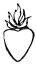
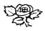

  
[Intangible Textual Heritage](../../index)  [Esoteric](../index.md) 
[Index](index)  [Previous](cdg07)  [Next](cdg09.md) 

------------------------------------------------------------------------

[Buy this Book at
Amazon.com](https://www.amazon.com/exec/obidos/ASIN/1564592014/internetsacredte.md)

------------------------------------------------------------------------

*Comte de Gabalis* \[1913\], at Intangible Textual Heritage

------------------------------------------------------------------------

p. 114 p. 115

 

|                     |
|---------------------|
|  |

AWAITED the Comte de Gabalis at my house, as we had arranged at parting.
He came at the appointed hour and accosting me with a smiling air said,
"Ah well, my Son, which of the Invisible Peoples does God give you most
inclination for, and would you prefer an alliance with Salamanders,
Gnomes, Nymphs, or Sylphids?"

"I have not yet quite made up my mind to this marriage, Sir," I replied.

"What deters you?" he inquired.

"To be frank with you, Sir," said I, "I cannot conquer my imagination,
which always represents these pretended hosts of the Elements as so many
imps of Satan." [LXXVIII](#fn_96.md)

p. 116 p. 117

"Dissipate, O Lord!" cried he, "O God of Light! Dissipate the darkness
in which ignorance and a perverse education have enveloped the mind of
this chosen one, whom Thou hast made me know that Thou dost destine for
such great things! And you, my Son, close not the door against Truth
which is willing to enter in unto you. Be non-resistant. Nay, you need
not be so, for it is most injurious to Truth to prepare the way for her.
She knows how to break through gates of iron and how to enter where she
pleases despite all resistance of falsehood. What have you to oppose to
her? Would you say that God has not, power to create in the Elements
real beings such as have described?" [LXXIX](#fn_100.md)

"I have not looked into the matter," said I, "to ascertain whether the
thing itself be impossible, whether a single Element can furnish blood,
flesh and bones; whether temperament can exist without admixture, and
action without opposing force; but assuming that God has been able thus
to create, what sound proof is there that He has done so?"

"Let me convince you of it at once, without further temporising. I am
going to summon the Sylphs of Cardan; and you shall hear from their own
lips what they are, and what I have taught you about them."

"By no means, Sir," I exclaimed hastily. "Postpone such proof, I beg of
you, until I am persuaded that these folk are not the enemies of God;
for until

p. 118 p. 119

then I would rather die than wrong my conscience by------"

"Behold the ignorance and false piety of these unhappy times,"
interrupted the Comte wrathfully. "Why do they not expunge the greatest
of the Anchorites [LXXX](#fn_101.md) from the
Calendar of the Saints? Why do they not burn his statues? It is a
thousand pities people do not insult his venerable ashes and cast them
to the winds, as they would those of the poor wretches who are accused
of having had dealings with devils! Did he bethink himself to exorcise
the Sylphs? And did he not treat them as men? What have you to say to
that, scrupulous Sir, you and all your miserable doctors? And is it your
opinion that the Sylph who discoursed concerning his nature to this
Patriarch was an imp of Satan? Did this incomparable man confer with a
hobgoblin concerning the Gospel? And will you accuse him of having
profaned the adorable Mysteries by conversing concerning them with a
phantom enemy of God? In that case Athanasi.us and Jerome are most
unworthy of the great name accorded them by your learned men, for they
have written eloquent eulogies of a man who treated devils thus
humanely."

"If they had taken this Sylph for a devil they would either have
concealed the adventure or have altered the sense of the sermon, or of
that very pathetic apostrophe, which the Anchorite--more zealous and
more credulous than you--made to the cify of Alexandria.

p. 120 p. 121

\[paragraph continues\] Now if they
thought him a being who had, as he affirmed, a share in the redemption
as well as we ourselves, and if they considered this apparition an
extraordinary favour bestowed by God upon the Saint whose life they
wrote, are you rational in thinking yourself better informed than
Athanasius and Jerome, and a greater Saint than the divine Antony? What
would you have said to that admirable man had you been one of the ten
thousand hermits to whom he recounted the conversation he had just been
having with the Sylph? Wiser and more enlightened than all those
terrestial Angels, you would doubtless have demonstrated to the Holy
Abbot that his entire adventure was but pure illusion, and you would
have dissuaded his disciple Athanasius from making known to all the
world a story so little in keeping with religion, philosophy, and common
sense. Is not this true?"

"It is true," said I, "that I should have thought best either to say
nothing whatever about it or to tell more." [LXXXI](#fn_102.md)

"Athanasius and Jerome," replied he, "were careful not to tell more, for
that was all they knew, and even though they had known all, which is
impossible if one is not of our number, they would not rashly have
divulged the secrets of the Sages."

"But why not? Did not the Sylph propose to St. Antony what you are
to-day proposing to me? " "What?" said the Comte laughing, "Marriage?

p. 122 p. 123

\[paragraph continues\] Ah! would that
have been quite fitting?"

"Probably the good man would not have accepted the offer," I ventured.

"No, certainly not," said the Comte, "for it would have been tempting
God to marry at that age and to ask Him for children."

"What! " I exclaimed. "Do people marry Sylphs for the purpose of having
children?"

"Indeed! " said he, "Is it ever permissible to marry for any other
purpose?"  [LXXXII](#fn_104.md)

"I did not imagine," said I, "that they aspired to I' the planting of
family trees. I had supposed their sole object to be the immortalisation
of the Sylphids."

"Ah! you are mistaken," quoth he. "The charity of the Philosophers
causes them to have as their ultimate aim the immortality of the
Sylphids: but Nature makes them desire to see them fruitful. Whenever
you wish you shall see these philosophic families in the Air. Happy
world, if there had been no other families and if there had been no
children of sin!"

"What do you mean by children of sin?" I inquired.

"They are, my Son," he explained, "all children who are born in the
ordinary way, children conceived by the will of the flesh and not by the
will of God, children of wrath and malediction; in a word, children. of
man and woman. You are longing to interrupt me. I see exactly what you
would like to say. Yes,

p. 124 p. 125

my child, know that it was never the will of the Lord that men and women
should have children in the way in which they do. The design of the Most
Wise Craftsman was far nobler. He would have had the world peopled in a
different manner than we see it. If wretched Adam had not grossly
disobeyed God's command not to touch Eve, and had he contented himself
with all the other fruits in the garden of pleasure [LXXXIII](#fn_106.md), with the beauties of the Nymphs
and Sylphids, the world would not have had the shame of seeing itself
filled with men so imperfect that they seem monsters when compared with
the children of the Philosophers."

"Apparently, Sir," said I, "you believe Adam's crime to have been other
than that of eating the apple."

"Why, my Son," he replied, "are you one of those who are so
simple-minded as to take the story of the apple literally? Ah! know that
the Holy Language makes use of these innocent metaphors to prevent us
from having improper ideas of an action which has caused all the
misfortunes of the human race. Thus when Solomon said, 'I will go up
unto the palm tree and gather the fruit thereof,' [\*](#fn_105.md) he had another appetite than that for
eating dates. This language consecrated by the Angels, and in which they
chant hymns to the living God, has no terms to express what it implies
figuratively by the words apple and date. But the

p. 126 p. 127

\[paragraph continues\] Sage easily
deciphers these chaste figures of speech. [\*](#fn_108.md) When he sees that the taste and mouth
of Eve were not punished, and that she was delivered with pain, he knows
that it was not the tasting which was criminal. And discovering what the
first sin was, by reason of the care which the first sinners took to
hide certain parts of their bodies with leaves, he concludes that God
did not will men to multiply in this vile way. O Adam! thou shouldst
only have begotten men like unto thyself, or have engendered none save
heroes or giants.''

"Eh! What expedient had he," I asked, "for either of these marvellous
generations?"

"Obeying God," he replied, "and touching only the Nymphs, Gnomids,
Sylphids or Salamanders: Thus there would have been none save heroes
born, and the Universe would have been peopled with marvellous men
filled with strength and wisdom. God has been pleased to enable us to
conjecture the difference between that innocent world and the guilty one
we behold to-day by now and then permitting us to see children born in
the manner He designed."

"Then, Sir, have these children of the Elements occasionally been seen?
If so, a Master of Arts from the Sorbonne, who was citing St. Augustin,
St. Jerome, and Gregory of Nazianzus the other day, was mistaken in
believing that no issue can spring from the love

p. 128 p. 129

of spirits for women, or from the relationship men can have with certain
demons he called Hyphialtes."

"Lactantius has reasoned better," the Comte replied, "and cautious
Thomas Aquinas has learnedly determined not only that these intimacies,
may be fruitful, but also that the children thus born are of a far
nobler and more heroic nature. In fact, when it pleases you, you shall
read of the lofty deeds of those mighty and famous men [LXXXIV](#fn_109.md) whom Moses says were born in this
manner. We have their records in our possession in the Book of the Wars
of the Lord [LXXXV](#fn_110.md), cited in the
twenty-first chapter of the Book of Numbers. Meantime just think what
the world would be if all its inhabitants were like Zoroaster."

"What!" said I, "Zoroaster whom people say was the inventor of
necromancy?"

"The same of whom the ignorant have written that calumny," said the
Comte. "He had the honour of being the son of the Salamander Oromasis
and of Vesta, Noah's wife. He lived for twelve hundred years, the sagest
monarch in the world, and then was carried away to the Region of the
Salamanders by his father Oromasis."

"I do not doubt that Zoroaster is with the Salamander Oromasis in the
Region of Fire," said I, "but I should not like to put such an affront
upon Noah as you have been guilty of."

"The affront is not so great as you might think,"

p. 130 p. 131

replied the Comte; "all your patriarchs considered it a great honour to
be the reputed fathers of those children whom the Sons of God were
pleased to have by their wives [LXXXVI](#fn_111.md), but as yet this is too much for
you. Let us return to Oromasis. He was beloved by Vesta, Noah's wife.
This Vesta after her death became the tutelary genius of Rome, and the
Sacred Fire [LXXXVII](#fn_112.md), which she
desired the virgins to preserve with so much care, was in honour of the
Salamander, her lover. Besides Zoroaster, there sprang from their love a
daughter of rare beauty and wisdom, the divine Egeria, from whom Numa
Pompilius received all his laws. She compelled Numa, whom she loved, to
build a temple to Vesta [XC](#fn_115.md), her
mother, where the Sacred Fire should be maintained in honour of her
father Oromasis. This is the truth concerning the fable about the Nymph
Egeria which Roman poets and historians have related."

"William Postel, least ignorant of all those who have studied the Cabala
in ordinary books, was aware that Vesta was Noah's wife [LXXXVIII](#fn_113.md), but he did not know that Egeria
was Vesta's daughter, and not having read the secret books of the
ancient Cabala, a copy of which the Prince de Mirande [LXXXIX](#fn_114.md) bought so dearly, he confused
things and believed that Egeria was merely the good genius of Noah's
wife."

"In those books we learn that Egeria was conceived upon the waters when
Noah was wandering upon

p. 132 p. 133

the avenging floods which inundated the Universe. Women were at that
time reduced to the small number who were saved in the Cabalistic Ark,
built by that second father of mankind."

"This illustrious man, mourning over the frightful chastisement
wherewith the Lord was punishing the crimes caused by Adam's love for
Eve, and seeing that Adam had ruined his posterity by preferring her to
the daughters of the Elements and by taking her from that Salamander or
Sylph who would have gained her affection--Noah, I say, profited by the
fatal example of Adam and was content that his wife Vesta should yield
herself to the Salamander Oromasis, Prince of Fiery Beings; and
persuaded his three sons likewise to surrender their three wives to the
Princes of the three other Elements. The Universe was, in a short time,
re-peopled with heroic men, so learned, so handsome, so admirable, that
their posterity dazzled by their virtues has mistaken them for
divinities. One of Noah's children, rebelling against his father's
counsel, could not resist the attractions of his wife any more than Adam
could withstand the charms of his Eve . But just as Adam's sin blackened
the souls of all his descendants, so Ham's lack of complaisance for the
Sylphs branded all his black posterity; whence comes the horrible
complexion of the Ethiopians, say our Cabalists, and of all those
hideous peoples who have been commanded to dwell in the torrid zone as
punishment for the profane ardour of their father."

p. 134 p. 135

"These are very singular fancies, Sir," said I, marvelling at the man's
ravings, "and your Cabala is of wonderful service in illuminating
antiquity."

"Of wonderful service," he rejoined gravely, "and without it Scripture,
history, fable and Nature are obscure and unintelligible. You believe,
for example, that the injury Ham did his father was what it seems
literally to be; as a matter of fact, it was something quite different.
Noah went forth from the Ark, and perceiving that his wife Vesta had but
grown more beautiful through her love for Oromasis, fell passionately in
love with her again. Ham fearing that his father was about to re-people
the earth with progeny as black as his own Ethiopians, seized his
'opportunity one day when the old man was full of wine, and mercilessly
maltreated him. You laugh?"

"I laugh at Ham's indiscreet zeal," said I.

"Rather," replied he, "admire the kindness of the Salamander Oromasis,
whom jealousy did not prevent from taking pity upon the disgrace of his
rival. He taught his son Zoroaster, otherwise known as Japhet, [XCI](#fn_116.md) the Name of Omnipotent God which
expresses His eternal fecundity. Japhet pronounced the Redoubtable Name
JABAMIAH [XCII](#fn_117.md) six times alternately
with his brother Shem, walking backward towards the patriarch, and they
completely restored the old man. This story, misunderstood, caused the
Greeks to say that the oldest of the Gods was maltreated by one of his
children;

p. 136 p. 137

but this is the truth of the matter. Hence you [XCIII](#fn_118.md) can see how much more humane are the
ethics of the Children of Fire than our own, and even more so than those
of the Peoples of the Air or the Water; for their jealousy is cruel, as
the divine Paracelsus shows us in an incident he recounts, and which was
witnessed by the entire town of Stauffenberg. A certain Philosopher,
with whom a Nymph was engaged [XCIV](#fn_119.md)
in an intrigue of immortality, was so disloyal as to love a woman. As he
sat at dinner with his new paramour and some friends, there appeared in
the air the most beautiful leg in the world. The invisible sweetheart
greatly desired to show herself to the friends of her faithless lover,
that they might judge how wrong he was in preferring a woman to her.
Afterward the indignant Nymph killed him on the spot."

"Ah Sir," I exclaimed, "this is quite enough to disgust me with these
tender sweethearts."

"I confess," he rejoined, "that their tenderness is apt to be somewhat
violent. But if exasperated women have been known to murder their
perjured lovers, we must not wonder that these beautiful and faithful
mistresses fly into a passion when they are betrayed, and all the more
so since they only require men to abstain from women whose imperfeaions
they cannot tolerate, and give us leave to love as many of their number
as we please. They prefer the interest and immortality of their
companions to their personal satisfaction,

p. 138 p. 139

and they are very glad to have the Sages give to their Republic as many
immortal children as possible."

"But after all, Sir," I asked. "how does it happen that there are so few
examples of all that you tell me?"

"There are a great number, my child," he answered, "but they are neither
heeded nor credited, in fact, they are not properly interpreted for lack
of knowledge of our principles. People attribute to demons all that they
should ascribe to the Elementary Peoples. A little Gnome was beloved by
the celebrated Magdalen of the Cross [XCV](#fn_120.md), Abbess of a Monastery at Cordova in
Spain. Their alliance began when she was twelve years of age; and they
continued their relationship for the space of thirty years. An ignorant
confessor persuaded Magdalen that her lover was a hobgoblin, and
compelled her to ask absolution of Pope Paul III. It could not possibly
have been a demon, however, for all Europe knew, and Cassiodorus
Renius [XCVI](#fn_121.md) was kind enough to
transmit to posterity, the daily miracles wrought through the
intercession of this holy maiden, and which obviously would never have
come to pass if her relationship with the Gnome had been as diabolical
as the venerable Dictator imagined. This same Doctor, if I mistake not,
would impertinently have said that the Sylph who immortalised himself
with the youthful Gertrude [XCVII](#fn_122.md),
nun of the Monastery of Nazareth in the diocese of Cologne, was some
devil or other."

p. 140 p. 141

"And so he was, no doubt," I said.

"Ah, my Son," pursued the Comte mirthfully, "If that were the case the
Devil is not the least unfortunate if he has power to carry on an
intrigue with a girl of thirteen, and to write her such billets doux as
were found in her casket. Rest assured, my child, that. the Devil, in
the region of death, has sadder employment and that more in keeping with
the hatred which the God of Purity bears him; but thus do people
wilfully close their eves to the truth. We find, for instance, in Titus
Livy, that Romulus [XCVIII](#fn_123.md) was the
son of Mars. The sceptics say that this is a fable, the theologians that
he was the son of an incubus devil, the

wags that Mademoiselle Sylvia had lost her gloves and sought to cover
her confusion by saying that a god had stolen them from her."

"Now we who are acquainted with Nature, and whom God has called out of
darkness into His wonderful Light, know that this so-called Mars was a
Salamander in whose sight the young Sylvia found favour, and who made
her the mother of the great Romulus, that hero who, after having founded
his superb city, was carried away by his father in a fiery chariot as
Zoroaster was by Oromasis [XCIX](#fn_124.md).
Another Salamander was the father of Servius Tullius [C](#fn_125.md). Titus Livy, deceived by c the
resemblance, says that he was the God of Fire. And the ignorant have
passed the same judgment upon him as upon the father of Romulus. The
renowned Hercule [CI](#fn_126.md)

p. 142 p. 143

and the invincible Alexander [CII](#fn_128.md)
were sons of the greatest of the Sylphs [CIII](#fn_129.md). Not knowing this, the historians
said that Jupiter was their father. They spoke the truth for, as you
have learned, these Sylphs, Nymphs and Salamanders set themselves up for
divinities. The historians, believing them to be so, called all those
who were born of them 'Children of the Gods.'"

"Such was the divine Plato [CIV](#fn_130.md), the
most divine Apollonius of Tyana, Hercules, Achilles, Sarpedon, the pious
Æneas, and the celebrated Melchizedek. For do you know who the father of
Melchizedek was?"

"No, indeed," said I, "St. Paul himself did not know."

"Rather say that he did not tell," returned the Comte, "and that he was
not permitted to reveal the Cabalistic Mysteries. He well knew that
Melchizedek's father was a Sylph, and that the King of Salem was
conceived in the Ark by the wife of Shem. That Pontiff's method of
sacrificing was the same as that which his cousin Egeria taught King
Numa, as well as the worship of a Supreme Deity without image or
statue [\*](#fn_127.md), for which reason the
Romans, becoming idolaters at a later period, burned the Holy Books of
Numa which Egeria had dictated. The first God of the Romans was the true
God, their sacrifice a true sacrifice. They offered up bread and wine to
the Supreme Ruler of the Universe: but all that became perverted

p. 144 p. 145

in course of time. In acknowledgment of this first worship, however, God
gave the Empire of the World to this city which had owned His supremacy.
The same sacrifice which Melchizedek------"

"Sir," I interposed, "Pray let us drop Melchizedek, [CV](#fn_131.md) the Sylph that begat him, his cousin
Egeria, and the sacrifice of bread and wine. These proofs seem to be
rather remote. I should be greatly obliged if you would tell me some
more recent news. For when someone asked a certain Doctor what had
become of the companions of that species of Satyr which appeared to St.
Antony and which you call a Sylph, I heard him say that all these folk
are dead nowadays. So it may be that the Elementary Peoples have
perished [CVI](#fn_134.md) since you own they are
mortal and we hear no tidings of them."

"I pray God," exclaimed the Comte with emotion, "I pray God, who is
ignorant of nothing, to be pleased to ignore that ignoramus who decides
so presumptously that of which he is ignorant. May God confound him and
all his tribe! Where has he learned that the Elements are abandoned and
that all those wonderful Peoples are annihilated? If he would take the
trouble to read history a little, and not ascribe to the Devil, as the
old wives do, everything which goes beyond the bounds of the chimerical
theory which has been con-structed about Nature, he would find in all
ages and in all places proofs of what I have told you."

p. 146 p. 147

"What would your Doctor say to this authentic [CVII](#fn_135.md) account of a recent occurrence in
Spain? A beautiful Sylphid was beloved by a Spaniard, lived with him for
three years, presented him with three fine children and" then died.
Shall one say that she was a devil? A clever answer that! According to
what Natural Philosophy can the Devil organise for himself a woman's
body, conceive, bear children and suckle them? What proof is there in
Scripture of the extravagant power which your theologians are forced in
this instance to accord the Devil? And with what probable reason can
their feeble Natural Philosophy supply them? The Jesuit Delrio in good
faith naïvely recounts several of these adventures, and without taking
the trouble to give physical explanations, extricates himself by saying
that those Sylphids were demons. How tirue it is that your greatest
doctors very often know no more than silly women!"

"How true it is that God loves to withdraw into His cloud-enveloped
throne, and deepening the darkness which encompasses His Most Awful
Majesty, He dwells in an inaccessible Light, and reveals His Truths only
to the humble in heart. Learn to be humble, my Son, if you would
penetrate that sacred night which environs Truth. Learn from the Sages
to concede the devils no power in Nature since the fatal stone has shut
them up in the depths of the abyss. Learn of the Philosophers to seek
always for natural

p. 148 p. 149

causes in all extraordinary events; and when natural causes are lacking
have recourse to God and to His holy Angels, and never to evil spirits
who can no longer do aught but suffer, else you would often be guilty of
unintentional blasphemy and would ascribe to the Devil the honour of the
most wonderful works of Nature."

"If you should be told, for example, that the divine Apollonius of
Tyana [CVIII](#fn_136.md) was immaculately
conceived, and that one of the noblest Salamanders descended to
immortalise himself with his mother, you would.call that Salamander a
demon and you would give the Devil, the glory of fathering one of the
greatest men who ever sprang from our Philosophic marriages."

"But, Sir," I remarked, "this same Apollonius is reputed amongst us to
be a great sorcerer, and they have nothing better to say of him."

"Behold," exclaimed the Comte, "one of the most wonderful effects of
ignorance and bad education! Because one hears one's nurse tell stories
about sorcerers, every extraordinary occurrence can have only the Devil
for author. The greatest doctors may strive in vain, they are not
believed unless they echo the nurses. Apollonius was not born of man; he
understood the language of birds; he was seen on the same day in
different parts of the world. He vanished in the presence of the Emperor
Domitian who wished to do him harm; he raised a girl from the dead by
means of Onomancy. He announced at Ephesus, in

p. 150 p. 151

an assembly gathered from all parts of Asia, that at that very hour they
were killing the tyrant at Rome. A judgment of this man is the point at
issue. The nurses say that he was a sorcerer. St. Jerome and St. Justin
Martyr say that he was merely a Philosopher. [CIX](#fn_137.md) Jerome, Justin and our Cabalists are
to be adjudged visionaries, and silly women are to carry the day. Ah!
Let the ignorant perish in their ignorance, but do you, my child, save
yourself from shipwreck."

"When you read that the celebrated Merlin was immaculately conceived by
a nun, daughter of a king of Great Britain, and that he foretold the
future more clearly than Tyresias [CX](#fn_138.md), do not say with the masses that he was
the son of an incubus devil, because there never have been any; nor that
he prophesied through the assistance of devils, since according to the
Holy Cabala devil is the most ignorant of all beings. Rather say with
the Sages that the English Princess was consoled in her retirement by a
Sylph who took pity on her, that he diverted her with his attentions,
that he knew how to please her, and that Merlin [CXI](#fn_139.md), their son, was brought up by the
Sylph in all knowledge, and learned from him to perform the many wonders
which English history relates of him."

"No longer cast aspersion upon the Comtes de Cleves by saying that the
Devil is their father, and have a better opinion of the Sylph who, so
the story goes, came to Cleves in a miraculous boat drawn by

p. 152 p. 153

a swan harnessed with a silver chain. After having several children by
the heiress of Cleves, this Sylph re-embarked on his aerial boat one day
at high noon, in full view of everyone. What has he done to your doctors
that constrains them to pronounce him a devil?"

"Have you so little regard for the honour of the House of Lusignan as to
give your Comtes de Poitiers a diabolical genealogy? What will you say
of their celebrated mother?"

"I verily believe, Sir," I declared, "that you are about to tell me the
fairy tale of Melusina."

"Ah!" he replied, "If you deny the story of Melusina [CXII](#fn_140.md) I am inclined to think you
prejudiced. But in order to deny it you must burn the books of the
great  Paracelsus who affirms in five or six different places that
nothing is more certain than the fact that this same Melusina was a
Nymph. And you must give the lie to your historians who say that since
her death or, to speak more accurately, since she disappeared from the
sight of her husband, whenever her descendants are threatened with
misfortune, or a King of France is to die in some extraordinary way, she
never fails to appear in mourning upon the great tower of the Château of
Lusignan which she had built. If you persist in maintaining that she was
an evil spirit, you will pick a quarrel with all those who are descended
from this Nymph, or who are related to her house."

p. 154 p. 155

"Do you think, Sir," said I, "that these noblemen prefer to trace their
origin to the Sylphs?"

"They would undoubtedly prefer to do so," he rejoined, "if they knew
that which I am now teaching

you, and they would consider these extraordinary births [CXIII](#fn_141.md) a great honour. If they had any
Cabalistic Light they would know that such births are more conformable
with the method whereby God, in the beginning, intended mankind to
multiply. Children [CXIV](#fn_142.md) born in this
way are happier, more valiant, wiser, more renowned and more blest of
God. Is it not more glorious for these illustrious men to be descended
from beings so perfect, wise and powerful than from some foul hobgoblin
or infamous Asmodeus?"

"Sir," said I, "our theologians are far from saying that the Devil is
the father of all those men who are born without one's knowing who is
responsible for them. They recognise the fact that the Devil is a spirit
and therefore cannot engender."

"Gregory of Nice," replied the Comte, "does not say that, for he holds
that demons multiply among A themselves as men do."

"We are not of his opinion," I answered, "but it happens, our doctors
say, that------"

"Ah!" the Comte interrupted, "do not tell me what they say or you will
be talking very obscene and indecent foolishness as they do. What
abominable evasion they have been guilty of! The way in which

p. 156 p. 157

they have all, with one accord, embraced this revolting idea is amazing.
And what pleasure they have taken in posting hobgoblins in ambush to
take advantage of the unoccupied lower nature of the recluse, and so
hasten into the world those miraculous men whose illustrious memory they
blacken by so base an origin. Do they call this philosophising? Is it
worthy of God to say that He has such complaisance for the Devil as to
countenance these abominations, granting them the grace of fecundity
which He has denied to great Saints, and rewarding such obscenity by
creating for these embryos of iniquity, souls more heroic than for those
formed in the chastity of legitimate marriage?"

"If I dared to break in upon your declamation, Sir," said I, "I would
own, in order to pacify you, that it were .greatly to be desired that
our doctors had hit upon some solution less offensive to such pure ears
as yours. Indeed, they have been obliged altogether to deny the facts
upon which the question is founded."

"A rare expedient! " he rejoined. "How is it possible to deny manifest
truths? Put yourself in the place of an ermine-furred theologian and
suppose the blessed Danhuzerus comes to you as the Oracle of his
religion------''

At this point a lackey came to say that a certain young nobleman had
come to visit me.

"I do not care to have him see me" remarked the

p. 158 p. 159

Comte.

"I ask your pardon, Sir," said I, "but as you can readily judge from
this nobleman's name, I cannot say that I am not at home to anyone;
therefore may I trouble you to go into this closet?"

"It is not worth while," said he, "I am about to make myself invisible."

"Ah! Sir," I exclaimed. "A truce to deviltry, I beg  
of you, I am not prepared to jest about it."  
"What ignorance," said the Comte,  
smiling and shrugging his shoulders,  
"not to know that to become invisible  
one has only to place before  
oneself the opposite of the  
light! " He went into my  
closet and the young  
nobleman entered  
at almost the  
same moment. I now  
ask his pardon for  
not speaking to  
him of my  
adventure  
   
.

------------------------------------------------------------------------

### Footnotes

[115:LXXVIII](cdg08.htm#fr_96.md) p. 116 SATAN CABALISTICALLY DEFINED.--St. Paul
states that there is "One God and Father of all, who is above all, and
through all, and in you all." [1](#fn_97.md) If
this be true, Satan, the so-called force of evil, can be but a
manifestation of God. "The Hebrew satan is derived from the same root as
séteh, 'turn away,' (*Prov. iv., 15*), it implies the notion of turning
and moving away from a thing; "hence the meaning of adversary,
opposer."According to our Sages the evil inclination, the adversary
(satan) and the angel are undoubtedly identical, and the adversary being
called 'angel,' because he is among the sons of God. "It has thus been
shown to you that one and the same thing is designated by these three
different terms, and that actions ascribed to these three are in reality
the actions of one and the same agent." [2](#fn_98.md) In the Book of Genesis this agent is
personified as "the serpent more subtil than any beast of the field
which the Lord God had made," in which allegory interpreted [\*](#fn_99.md) Satan, the serpent, is seen to be the
Serpent Fire or Solar Force misgoverned by the human mind, turning away
from and operating in opposition to the Law of Nature, God, which wills
obedience from all things.

[115:1](cdg08.htm#fr_97.md) Ephesians, iv., 6;

[115:2](cdg08.htm#fr_98.md) RABBI MOSES MAIMONIDES,
"GUIDE FOR THE PERPLEXED." EXTRACTS PART III., CHAPTER XX71., PAGES
298-299. 2ND EDITION OF TRANSLATION BY M. FRIEDLANDER, PH.D.

[115:\*](cdg08.htm#fr_99) PAGE [126](#page_126.md).

[117:LXXIX](cdg08.htm#fr_100.md) PLATO ON THE
PEOPLE OF THE ELEMENTS.--"There are also many other animals and men upon
it (the earth), some dwelling in mid-earth, others about the air, as we
do about the sea, and others in islands which the air flows round, and
which are near the continent: and in one word, what water and the sea
are to us for our necessities, the air is to them; and what air is to
us, that ether is to them. But their seasons are of such a temperament
that they are free from disease, and live for a much longer time than
those here, and surpass us in sight, hearing, and smelling, and
everything of this kind, as much as air excels water, and ether air, in
purity." SOCRATES SPEAKING. PLATO, THE PHAEDO." PAGE 195, EVERYMAN
EDITION.

SYLPHS OF CARDAN. [NOTE D](cdg14.htm#an_D.md), COMMENTARY CONTINUED.

[119:LXXX](cdg08.htm#fr_101.md) p. 120 251 A.D. ST. ANTONY, 356 A.D., the founder
of Christian monasticism, born at Coma in Egypt.

Incident to which the Comte refers.

ST. ANTONY AND THE ELEMENTARY BEING.--

"Antony was amazed, and thinking over what he had seen went on his way.
Before long in a small rocky valley shut in on all sides he sees a
mannikin with hooked snout, horned forehead, and extremities like goats'
feet. When he saw this, Antony like a good soldier seized the shield of
faith and the helmet of hope: the creature none the less began to offer
him the fruit of the palm-trees to support him on his journey and as it
were pledges of peace. Antony perceiving this stopped and asked who he
was. The answer he received from him was this: I am a mortal being and
one of those inhabitants of the desert whom the Gentiles deluded by
various forms of error worship under the names of Fauns, Satyrs, and
Incubi. I am sent to represent my tribe. We pray you in our behalf to
entreat the favour of your Lord and ours, who, we have learnt, came once
to save the world, and 'whose sound has gone forth into all the earth.'
As he uttered such words as these, the aged traveller's cheeks streamed
with tears, the marks of his deep feeling, which he shed in the fulness
of his joy. He rejoiced over the Glory of Christ and the destruction of
Satan, and marvelling all the while that he could understand the Satyr's
language, p. 122 and striking the ground with
his staff, he said, 'Woe to thee, Alexandria, who instead of God
worshippest monsters! Woe to thee, harlot city, into which have flowed
together the demons of the whole world! What will you say now? Beasts
speak of Christ, and you instead of God worship monsters,' He had not
finished speaking when, as if on wings, the wild creature fled away. Let
no one scruple to believe this incident; its truth is supported by what
took place when Constantine was on the throne, a matter of which the
whole world was witness. For a man of that kind was brought alive to
Alexandria and shewn as a wonderful sight to the people. Afterwards his
lifeless body, to prevent its decay through the summer heat, was
preserved in salt and brought to Antioch that the Emperor might see it."
ST. JEROME'S LIFE OF PAULUS THE FIRST HERMIT, CHAPTER VIII. TRANSLATED
BY THE HON. W. H. FREEMANTLE, M.A.

[121:LXXXI](cdg08.htm#fr_102.md)

Incident to which the Abbé refers.

TEMPTATION OF ST. ANTONY.--"But the devil, who hates and envies what is
good, could not endure to see such a resolution in a youth, but
endeavoured to carry out against him what he had been wont to effect
against others. In a word he raised in his mind a great dust of debate,
wishing to debar him from his settled purpose. But when the enemy saw
himself to be too weak for Antony's determination, and that he rather
was conquered by the other's firmness, overthrown p.
124 by his great faith and falling through his constant prayers,
then at length putting his trust in the weapons [\*](#fn_103.md) which are 'in the navel of his belly,'
and boasting in them--for they are his first snare for the young--he
attacked the young man, disturbing him by night and harassing him by
day, so that even the onlookers saw the struggle which was going on
between them. And the devil, uuhappy wight, one night even took upon him
the shape of a woman and imitated all her acts simply to beguile Antony.
But he, his mind filled with Christ and the nobility inspired by Him,
and considering the spirituality of the soul, quenched the coal of the
other's deceit."

ATHANASIUS' "LIFE OF ANTONY," CHAPTER V.

[121:\*](cdg08.htm#fr_103.md) COMPARE BEHEMOTH AND
LEVIATHAN. [NOTE FF](cdg43.htm#an_FF.md), COMMENTARY CONTINUED.

[123:LXXXII](cdg08.htm#fr_104.md) "DIVORCE should
warn the age of some fundamental error in the marriage state." MARY
BAKER EDDY.

[125:\*](cdg08.htm#fr_106.md) *Song of Solomon,
Chapter vii:, verse 8*.

[125:LXXXIII](cdg08.htm#fr_105.md)

|                     |
|---------------------|
|  |

LLEGORY OF EVE AND THE SERPENT.--The primordial elericity or Solar
Force, semi-latent within the aura of every human being, was known to
the Greeks as the Speirêma, the serpent-coil; and in the Upanishads, the
sacred writings of India, it is said to lie coiled up like a slumbering
serpent. In the third chapter of the Book of Genesis it is symbolised as
the serpent, "more subtil than any beast of the field which the Lord God
had made." Eve, when this force stirred within her, was tempted to its
misapplication. Directed downward through the lower physical centres for
generation, unhallowed by a consciousness of responsibility to God and
the incoming soul, the Serpent Force or Fire brought knowledge of evil;
directed upward toward the brain for regeneration, the formation of the
deathless Solar Body, it brought knowledge of good. Hence the dual
operation of the Solar Force is symbolised as the tree of the knowlege
of good and evil.

The curse of the Lord upon the serpent, "upon thy belly shalt thou go,
and dust shalt thou eat all the days of thy life:" makes reference to
the fact that, during a certain period of human evolution, man shall
remain in ignorance of the Law governing the serpent (Solar Force) which
shall manifest in man's lower or earthly vehicles misgoverned by the
human mind.

"And I will put enmity between thee and the woman, p. 128 and between thy seed and her seed; it shall
bruise thy head, and thou shalt bruise his heel." During the above
mentioned cycle of evolution, in his ignorance of the Law governing the
Serpent Fire, man shall continually direct it downward or bruise its
head, while the Serpent Fire, thus misdirected, shall bruise man's heel,
heel being a euphemism for that part of man nearest the earth, that is
to say, the body, lower emotions and mortal mind.

"And the Lord God said, Behold, the man is become as one of us, to know
good and evil: and now, lest he put forth his hand, and take also of the
tree of life, and eat, and live for ever: "Here the tree of life
symbolises the upward play of the Solar Force for the creation of the
deathless or Solar body. Hence the meaning is lest man should learn the
Law governing Solar Force and, directing it upward, become immortal.

"So He drove out the man; and He placed at the east of the garden of
Eden Cherubims, and a flaming sword which turned every way, to keep the
way of the tree of life." Various interpretations of this passage . are
possible. Cosmically speaking, the garden of Eden symbolises those
realms -of higher spiritual attainment, at the gates of which, from the
time of man's descent into the lower cycles of evolution, God placed
Heavenly Beings charged with the duty of preventing that nature in man
correspondent to their own from receiving stimulation during man's
progress through p. 130 the lower spheres of
knowledge. The Muhammedans rightly hold that man can only be born again
in Spirit through the aid of Heavenly Powers typified by the Angel
Gabriel, [†](#fn_107.md) who is said by them to
connect the heart of man with the soul, the lower consciousness with the
higher. Then the same,force in Nature which has deterred man from
premature spiritual attainment assists him in his upward evolution, the
mind having been prepared through man's own effort for a further
understanding of God's Mysteries.

[125:†](cdg08.htm#fr_107.md) "GABRIEL, ONE. OF THE
HOLY ANGELS, WHO IS OVER PARADISE AND THE SERPENTS AND THE CHERUBIM."
BOOK OF ENOCH, CHAPTER XX., 7.

[127:\*](cdg08.htm#fr_108.md) *The Holy Language
described by Emmanuel Swedenborg. [Note gg](cdg44.htm#an_GG.md), Commentary
Continued*.

[129:LXXXIV](cdg08.htm#fr_109.md) MIGHTY AND
FAMOUS MEN.--"There were giants in the earth in those, days; and also
after that, when the sons of God came in unto the daughters of men, and
they bare children to them, the same became mighty men which were of
old, men of renown." *Genesis vi., 4*. Since the Book of Genesis is
attributed to Moses, this verse is authority for the Comte's statement.

MOSES AN INITIATE. [NOTE HH](cdg45.htm#an_HH.md), COMMENTARY CONTINUED.

[129:LXXXV](cdg08.htm#fr_110.md) BOOK OF THE WARS
OF THE LORD. [NOTE ii](cdg46.htm#an_II.md), COMMENTARY CONTINUED.

[131:LXXXVI](cdg08.htm#fr_111.md) p. 132 MARRIAGES OF THE GODS. "We are informed by
Proclus in his Mss. commentary on the Parmenides of Plato, that ancient
theologists mystically dominated the kindred conjunction and communion
of divine causes with each other, Marriage."

[131:LXXXVII](cdg08.htm#fr_112.md) SACRED FIRE.
[NOTE JJ](cdg47.htm#an_JJ.md), COMMENTARY CONTINUED.

[131:LXXXVIII](cdg08.htm#fr_114.md) NOAH, VESTA
AND EGERIA. [NOTE KK](cdg48.htm#an_KK.md), COMMENTARY CONTINUED.

[131:LXXXIX](cdg08.htm#fr_115.md) PRINCE DE
MIRANDE AND THE CABALA. [NOTE LL](cdg49.htm#an_LL.md), COMMENTARY
CONTINUED.

[131:XC](cdg08.htm#fr_113.md) NUMA.--When those
Higher Intelligences which guide the evolution of mankind have
determined upon that fixed ideal or principle which shall hold together
in concord the minds of a race for a certain epoch of time, in order
that a definite range of experience may p.
134 be gained, they send their Messenger to mankind endowed with
the radiance and life-giving powers of the Sun that its divine
regenerative force may be poured into the channel determined upon,
creating in the minds of men that new ideal which shall give a dynamic
impulse to human evolution. Numa, Son of the Sun, was such a Messenger
imparting to Roman civilisation that spiritual impulse and initiative
which vitalised and guided it until the focus of the current was
changed. The decline of the Roman Empire was coincident with the ebb of
this current, and with the withdrawal of the Sun Force from the
conjunction of planets dominated by Mars under which the Roman
civilisation was generated.

When a religion is given to the world, a centre is usually established
in which the pure essence of the sacred teachings is preserved intact.
For as the human mind evolves in this essence it becomes tinctured so
that the original teaching and instruction tend to become disintegrated
by the action of human thought. Thus those whom Numa anointed with the
Sacred Fire or Everliving Solar Force transmitted this power and
knowledge of its mystery to their successors, who maintained their
temples of worship as centres for its radiation and the regeneration of
the race, until that purpose for which the religion of Numa had been
instituted was fulfilled and the Force which had vitalised it was
withdrawn.

[135:XCI](cdg08.htm#fr_116.md) p. 136 JAPHET. [NOTE MM](cdg50.htm#an_MM.md),
COMMENTARY CONTINUED.

[135:XCII](cdg08.htm#fr_117.md)
JABAMIAH.--"Therefore Divine Plato in Cratylus and in Philebus
commandeth to reverence the names of God more than the Images or statues
of the gods: for there is a more express Image and power of God,
reserved in the faculty of the mind, especially if it be inspired from
above, than in the works of mens hands; Therefore sacred words have not
their power in Magi-call operations, from themselves, as they are words,
but from the occult Divine powers working by them in the minds of those
who by faith adhere to them; by which words the secret power of God as
it were through Conduite pipes, is transmitted into them, who have ears
purged by faith, and by most pure conversation and invocation of the
divine names are made the habitation of God, and capable of these divine
influences; whosoever therefore useth rightly these words or names of
God with that purity of mind, in that manner and order, as they were
delivered, shall both obtain and do many wonderfull things."

THREE BOOKS OF OCCULT PHILOSOPHY, WRITTEN BY HENRY CORNELIUS AGRIPPA OF
NETTESHEIM, COUNSELLER TO CHARLES THE FIFTH, EMPEROR OF GERMANY: AND
JUDGE OF THE PREROGATIVE COURT. TRANSLATED OUT OF THE LATIN INTO THE
ENGLISH TONGUE, BY J. F. LONDON 1651. BOOK III., CHAPTER xi. OF THE
DIVINE NAMES, AND THEIR POWER AND VERTUE.

[137:XCIII](cdg08.htm#fr_118.md) p. 138 THE GREEK MYTH.--"The Goddess Night, too, in
Orpheus, advises Jupiter to make use of honey as an artifice. For she
says to him--

When stretch'd beneath the lofty oaks you view  
Saturn, with honey by the bees produc’d,  
Sunk in ebriety, fast bind the God.

\[paragraph continues\] This, therefore,
takes place, and Saturn being bound," is maltreated in the same manner
as Noah; "the theologist obscurely signifying by this, that divine
natures become through pleasure bound, and drawn down into the realms of
generation." PORPHYRY, TREATISE ON THE HOMERIC CAVE OF THE NYMPHS. § 7.

[137:XCIV](cdg08.htm#fr_119.md) NYMPH OF
STAUFFENBERG. [NOTE NN](cdg51.htm#an_NN.md), COMMENTARY CONTINUED.

[139:XCV](cdg08.htm#fr_120.md) p. 140 MAGDALEN OF THE CROSS. [NOTE
OO](cdg52.htm#an_OO.md), COMMENTARY CONTINUED.

[139:XCVI](cdg08.htm#fr_121.md) CASSIODORUS
RENIUS. [NOTE PP](cdg53.htm#an_PP.md), COMMENTARY CONTINUED.

[139:XCVII](cdg08.htm#fr_122.md) GERTRUDE, NUN OF
THE MONASTERY OF NAZARETH. [NOTE QQ](cdg54.htm#an_QQ.md), COMMENTARY
CONTINUED.

[141:XCVIII](cdg08.htm#fr_123.md) p. 142 ROMULUS. [NOTE RR](cdg55.htm#an_RR.md),
COMMENTARY CONTINUED.

[141:XCIX](cdg08.htm#fr_124.md)
OROMASIS.--Plutarch, in his treatise on Isis and Osiris, says that it
was the opinion of the most ancient Sages that "Oromasis was born of the
purest light--and being thrice increased withdrew from the Sun to as
great a distance as there is from the Sun to the earth, and adorned the
heaven with planets and stars, among which he established one as
guardian and guide to the others, the Dog Star." ISIS AND OSIRIS,
CHAPTER 47.

This statement identifies Oromasis with Osiris (page
[88](cdg07.htm#page_88).md), and with the God of the Hebrew, Christian, and
Muhammedan religions (page [26](cdg05.htm#page_26).md).

[141:C](cdg08.htm#fr_125.md) SERVIUS TULLIUS.
[NOTE SS](cdg56.htm#an_SS.md), COMMENTARY CONTINUED.

[141:CI](cdg08.htm#fr_126.md) HERCULES. [NOTE
TT](cdg57.htm#an_TT.md), COMMENTARY CONTINUED.

[143:\*](cdg08.htm#fr_130.md) *Roman worship.
[Note vv](cdg59.htm#an_VV.md), Commentary Continued*.

[143:CII](cdg08.htm#fr_127.md) p. 144 356 B.C. ALEXANDER THE GREAT, 323 B.C., was
the reputed son of Philip, King of Macedonia. In reality he was the son
of an Egyptian high priest and Initiate, and of Philip's wife Olympias.
From the age of fifteen he was for three years the pupil of Aristotle
who moulded his genius for the work for which it had incarnated, namely,
that initial fusing of civilisations culminating in the Roman Empire
under Julius Cæsar, whereby Greek and Roman letters leavened the then
known world and made a medium for the transmission of the Christ and
Muhammed messages. The divine authority under which the Adept Alexander
the Great accomplished what was virtually the conquest of the then known
world in less than fifteen years, is explicitly acknowledged in the
Koran Sura i8. "They will ask thee of Dhoulkarnain (Alexander the
Great), SAY: I will recite to you an account of him. We stablished his
power upon the earth; and made for him a way to everything. And a route
he followed.' The Angel Gabriel speaking.

[143:CIII](cdg08.htm#fr_128.md) GREATEST OF THE
SYLPHS.--The word Sylph\] I4at times used'in these Discourses with the
meaning, of Master or Spiritual Teacher. MASTER DEFINED. [NOTE
UU](cdg58.htm#an_UU.md), COMMENTARY CONTINUED.

[143:CIV](cdg08.htm#fr_129.md) PLATO, A SON OF
THESUN.--Elearchus the Sophist, Amaxilides in the second book of his
Philosophy, and Plato's nephew Speusippus, his sister's son, who p. 146 succeeded him in the conduct of his academy,
affirm that Plato's mother Periione was beloved by Apollo, the Sun God,
who made her the mother of Plato, who was therefore a Son of the Sun.

[145:CV](cdg08.htm#fr_131.md) p. 146 MELCHIZEDEK AND SHEM.--Philo speaks of
Melchizedek as "the logos, the priest whose inheritance is the true
God." [\*](#fn_132.md) And other Hebrew
authorities state that the Rabbis identify Melchizedek with Shem, and
say that Noah having been crippled by the lion [†](#fn_133.md) while in the Ark, Shem officiated as
priest at the sacrifice of thanksgiving offered after the subsidence of
the flood. They also state that Noah in blessing his two sons declared
that the Shekinah (Paraclete) was to to dwell only in the tents of Shem.
Melchizedek and Shem are known as Sovereign Directors of this Divine or
Super Solar Force.

[145:\*](cdg08.htm#fr_133.md) *De Allegoriis
Legum, iii., 26*.

[145:†](cdg08.htm#fr_134.md) *Symbolic of the
lower nature and passions*.

[145:CVI](cdg08.htm#fr_132.md) RECENT TIDINGS OF
THE ELEMENTARY PEOPLES? [NOTE WW](cdg60.htm#an_WW.md), COMMENTARY
CONTINUED.

[147:CVII](cdg08.htm#fr_135.md) THE MAN WHO
THINKS, WILLS TO KNOW.--The Abbe recounts these stories as a means of
pointing out the folly of accepting and affirming without reflectior the
opinion of others.

 

Man sinks into oblivion and indifference of though and allows himself to
be governed by the minds am opinions of others.

It has therefore been possible to keep him in ignorance of his true
estate and to retard his spiritual progres for centuries.

The man who does not think cannot know, and he becomes the slave and
property of other minds.

The man who thinks, wills to know, and tends to become the expression of
the God within.

 

[149:CVIII](cdg08.htm#fr_136.md) p. 150 BIRTH OF APOLLONIUS OF TYANA, 97
A.D.--"Apollonius was born in Tyana, a town founded by Greeks in
Cappodocia. He was called Apollonius from his father. Whilst his mother
was with child of him, Proteus the Egyptian god appeared to her, who, as
Homer writes, has the power of assuming such a variety of shapes. The
woman without being much alarmed, asked him what she should bring forth?
to which he replied, 'Thou shalt bring forth me.' The natives of the
place affirm, that at the instant of her delivery, a thunderbolt which
seemed ready to fall on the ground, rose aloft, and suddenly
disappeared. By this the Gods prefigured, I think, the splendor of the
child, his superiority over earthly beings, his intercourse with them,
and what he was to do when arrived to manhood. All the people of the
country say that Apollonius was the son of Jupiter." EXTRACTS FROM
CHAPTERS IV., V. AND VI. OF PHILOSTRATUS’ "LIFE OF APOLLONIUS OF TYANA."
TRANSLATED FROM THE GREEK BY THE REV. EDWARD BERWICK.

ST. JEROME ON APOLLONIUS OF TYANA.--"Apollonius too was a traveller--the
one I mean who is called the sorcerer by' ordinary people and the
philosopher by such as follow Pythagoras. Everywhere he found something
to learn, and as he was always going to new places, he became constantly
wiser and better."

EXTRACTS FROM ST. JEROME'S LETTER TO PAULINUS ON THE STUDY OF SCRIPTURE.
§1.

[151:CIX](cdg08.htm#fr_137.md) JUSTIN MARTYR ON
APOLLONIUS OF TYANA.--HOW is it that the talismans of Apollonius have
power over certain parts of creation? For, as we see, they arrest the
fury of the waves and the violence of the winds and the attacks of wild
beasts. And while the miracles wrought by our Lord are preserved by
tradition alone, those of Apollonius are most numerous and manifested to
us in the very moment of their occurence: why, then, should they not
lead astray all beholders? QUESTION xxiv.

Apollonius was a man well skilled in the powers of Nature and the mutual
attra&ions and repulsions inherent in them, and by virtue of this skill
produced the effects he did. EXTRACT FROM ANSWER xxiv. TRANSLATED FROM
THE GREEK, JUSTIN MARTYRIS OPERA, 1593, PAGE 316.

[151:CX](cdg08.htm#fr_138.md) TYRESIAS. [NOTE
XX](cdg61.htm#an_XX.md), COMMENTARY CONTINUED.

[151:CXI](cdg08.htm#fr_139.md) MERLIN was born
during the fifth century of the present era at the town now called
Caermarthen, Wales, and was a professed Christian. When King Vortigern
asked Merlin's mother, daughter of King Demetius, to tell him the name
of her son's father, she answered " that she never had the society of
any one mortal or human, only a spirit assuming the shape of a beautiful
young man, had many times appeared unto her, p.
154 seeming to court her with no common affection, but when any
of her fellow-virgins came in, he would suddenly disappear and vanish,
by whose many and urgent importunities, being at last overcome, I
yielded, saith she, to his pleasure--and I was delivered of this soil
(now in your presence) whom I caused to be called

Merlin." THE LIFE OF MERLIN, SURNAMED AMBROSIUS; HIS PROPHECIES AND
PREDICTIONS INTERPRETED, AND THEIR TRUTH MADE GOOD BY OUR ENGLISH
ANNALS. LONDON, 1813. PAGES 52-53.

MERLINS PROPHECY OF THE CONQUEST OF THE AIR AND OF AERIAL AND SUBMARINE
WARFARE. [NOTE YY](cdg62.htm#an_YY.md), COMMENTARY CONTINUED.

MERLINS PROPHECY OF WORLD PEACE. NOTE vii, COMMENTARY CONCLUDED.

[153:CXII](cdg08.htm#fr_140.md) MELUSINA A
NYMPH.--"Let us speak a little of Melusina. The subject should not be
treated with shallowness or levity. She was not what theologians
suppose, but a Nymph." LIBER DE NYMPHIS, SYLPHIS, PYGMAEIS ET
SALAMANDRIS, TRACTATUS IV. TRANSLATED FROM THE LATIN EDITION OF THE
WORKS OF PARACELSUS. PUBLISHED AT GENEVA IN 1658. VOL. II., PAGE 396.

[155:CXIII](cdg08.htm#fr_141.md) p. 156 EXTRAORDINARY BIRTHS, COMPARE THE BIRTH OF
JESUS AS RELATED IN THE KORAN. [NOTE ZZ](cdg64.htm#an_ZZ.md), COMMENTARY
CONTINUED.

[155:CXIV](cdg08.htm#fr_142.md) CHILDREN OF THE
PHILOSOPHERS.--The Philosophers hold that to engender children is the
most sacred and filial duty of man. Both man and woman are taught by
them that the aim and aspiration of union is to enter into a conscious
relationship with the incoming ego or soul. Their disciples seek so to
prepare and govern themselves that they may be worthy to bring a soul
manifesting in the loftiest and purest levels of consciousness into
incarnation on earth, thereby giving life to a more highly evolved being
than it is possible for unthinking minds, impure hearts and unprepared
bodies to attract. The Philosopher, being in conscious relationship with
the incoming ego, affords it great assistance as it passes through the
denser states of matter, and encourages and stimulates it to incarnate
or enter the physical body prior to birth: for then for a space of time
it cringes from assuming its dense physical vesture since, as it were,
it dies to the world from which it came. Through knowledge of Nature's
Law and obedience to it the Philosopher has power? to attract frôm the
Heavenly World those perfected beings who come as messengers to the
race.

Purity of body, mind and soul, and the worship of God through the being
beloved, ever bring into life on earth a soul beautified by its own
Divine Source. p. 158 And if two people
having physical characteristics which are ugly worship God through the
being beloved with purity of mind and heart, the law of hereditary
physical resemblance will be modified, and their offspring will radiate
that which is of the soul.

The child which is product of unpurified, ungoverned and unhallowed
passion and desire becomes the vehicle of an ego of like character but
more dominant in will, with inclinations equalling the sum of the

Ppassions and desires of the unthinking parents. Such are, in truth, the
children of wrath and malediction for whose salvation the Philosophers,
through reverent preparation of body, soul and spirit for parenthood,
seek to bring into incarnation those Beings who are chosen vessels of
the Divine Love and Wisdom.

------------------------------------------------------------------------

[Next: Ancient Persian Monument](cdg09.md)
