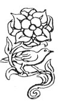

  
[Intangible Textual Heritage](../../index)  [Esoteric](../index.md) 
[Index](index)  [Previous](cdg10)  [Next](cdg12.md) 

------------------------------------------------------------------------

[Buy this Book at
Amazon.com](https://www.amazon.com/exec/obidos/ASIN/1564592014/internetsacredte.md)

------------------------------------------------------------------------

*Comte de Gabalis* \[1913\], at Intangible Textual Heritage

------------------------------------------------------------------------

p. 202

p. 203 p. 204

A

# COMMENTARY CONTINUED.

 

p. 205 p. 206

### MAP OF THE HOROSCOPE.

 HE charted observation
which an astrologer makes of the state of the heavens at the hour of a
child's birth and from which he seeks to determine the events of the
child's life. By Initiates, the planetary aspects at the moment of birth
are considered of utmost importance. In ancient times Astrology was
regarded as one of the most sacred of the sciences and was taught only
to those Initiates admitted to the Greater Mysteries, for it was
considered essential that the astrologer should have such spiritual
discernment as would enable him to check any astrological calculations
by visualising the effect of the planetary influences playing at any
moment upon the native or person for whom the horoscope was cast. As the
ebb and flow of the tides are due to the influence of the moon, so the
currents in man's superphysical bodies are subject to planetary
influence and their fludtuations are visible to the seer.

------------------------------------------------------------------------

[Next: B. Harmony of the World](cdg12.md)
