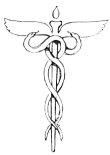

  
[Intangible Textual Heritage](../../index)  [Esoteric](../index.md) 
[Index](index)  [Previous](cdg14)  [Next](cdg16.md) 

------------------------------------------------------------------------

[Buy this Book at
Amazon.com](https://www.amazon.com/exec/obidos/ASIN/1564592014/internetsacredte.md)

------------------------------------------------------------------------

*Comte de Gabalis* \[1913\], at Intangible Textual Heritage

------------------------------------------------------------------------

### 1126 A.D. AVERROES, 1198 A.D.

EAn Arabian
philosopher born at Cordova in Spain, and at one time Cadi of Seville.
He revered Aristotle, and translated his works into Arabic with
commentaries which express his conception of the relation between
philosophy and religion. Averroes holds the highest bliss of the soul to
be union in this life with that actual intelledt or consciousness which
is one and

p. 211

continuous in all individuals, who differ solely in the degree of their
illumination through its manifestation. Mediævalism misinterpreted
Averroes, pronounced him an arch heretic, and his name became the
synonym for scoffer and sceptic.

 

------------------------------------------------------------------------

[Next: F. Saint Paul an Initiate](cdg16.md)
