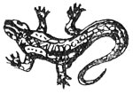

  
[Intangible Textual Heritage](../../index)  [Esoteric](../index.md) 
[Index](index)  [Previous](cdg17)  [Next](cdg19.md) 

------------------------------------------------------------------------

[Buy this Book at
Amazon.com](https://www.amazon.com/exec/obidos/ASIN/1564592014/internetsacredte.md)

------------------------------------------------------------------------

*Comte de Gabalis* \[1913\], at Intangible Textual Heritage

------------------------------------------------------------------------

### BENVENUTO CELLINI SEES A SALAMANDER.

HThe People of the
Elements have power over matter which enables them to transform their
appearance at will. They frequently make themselves visible under the
form of animals as did Melusina. Hence interest attaches to the
following testimony as to the existence of a living creature whose
habitat was fire taken from the Autobiography of Benvenuto Cellini.

p. 218

"When I was about five years old my father happened to be in a basement
chamber of our house, where they had been washing, and where a good fire
of oak-logs was still burning; he had a viol in his hand, and was
playing and singing alone beside the fire. The weather was very cold.
Happening to look into the fire, he spied in the middle of those most
burning flames a little creature like a lizard, which was sporting in
the core of the intensest coals. Becoming instantly aware of what the
thing was, he had my sister and me called, and pointing it out to us
children, gave me a great box on the ears, which caused me to howl and
weep with all my might. Then he pacified me good-humouredly, and spoke
as follows: 'My dear little boy, I am not striking you for any wrong
that you have done, but only to make you remember that that lizard which
you see in the fire is a salamander, a creature which has never been
seen before by anyone of whom we have credible information.' So saying
he kissed me and gave me some pieces of money."

JOHN ADDINGTON SYMONDS, "THE LIFE OF BENVENUTO CELLINI," BOOK FIRST,
CHAPTER IV.

 

------------------------------------------------------------------------

[Next: I. Book of Enoch](cdg19.md)
