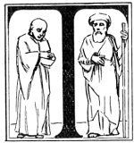

  
[Intangible Textual Heritage](../../index)  [Esoteric](../index.md) 
[Index](index)  [Previous](cdg20)  [Next](cdg22.md) 

------------------------------------------------------------------------

[Buy this Book at
Amazon.com](https://www.amazon.com/exec/obidos/ASIN/1564592014/internetsacredte.md)

------------------------------------------------------------------------

*Comte de Gabalis* \[1913\], at Intangible Textual Heritage

------------------------------------------------------------------------

### THOSE RESERVED FOR GREATER THINGS.

KReference is here
made to those great souls, priests "for ever after the order of
Melchizedek" or the Unspoken Name. They are Christs of former periods of
evolution bound to earth by their desire to lift mankind to their own
level of consciousness. These are the Masters of the Masters.
Melchizedek was himself the Master to whom Moses said, "Shall I follow
thee that thou teach me, for guidance, of that which thou too hast been
taught?" KORAN SURA 18.

St. Paul says of him, "For this Melchizedek, king of Salem, priest of
the most high God,--without father, without mother, without descent,
having neither beginning of days, nor end of life; but made like unto
the Son of God; abideth a priest continually." And of Christ he
declares, After the similitude of Melchizedek there ariseth another
priest, who is made, not after the law of a carnal commandment, but
after the power of an endless life." HEBREWS viii. 1, 3; 15, 16.

p. 227

### MOSES MEETS HIS MASTER MELCHIZEDEK.

<table data-align="LEFT">
<colgroup>
<col style="width: 100%" />
</colgroup>
<tbody>
<tr class="odd">
<td data-valign="CENTER"> 
T</td>
</tr>
</tbody>
</table>

HEN found they one of our servants to whom we had vouch-safed our mercy,
and whom we had instructed with our knowledge.

And Moses said to him, 'Shall I follow thee that thou teach me, for
guidance, of that which thou too hast been taught?'

He said, 'Verily, thou canst not have patience with me;

How canst thou be patient in matters whose meaning thou comprehendest
not?'

He said, 'Thou shalt find me patient if God please, nor will I disobey
thy bidding.'

He said, 'Then, if thou follow me, ask me not ofaught until I have given
thee an account thereof.'

So they both went on, till they embarked in a ship, and he--*the
unknown*--staved it in. 'What!' said Moses, 'hast thou staved it in that
thou mayest drown its crew? a strange thing now hast thou done!'

He said, 'Did I not tell thee that thou couldst not have patience with
me?'

He said, 'Chide me not that I forgat, nor lay on me a hard command.'

Then went they on till they met a youth, and he slew him. Said Moses,
'Hast thou slain him who is free from guilt of blood? Now hast thou
wrought a grievous thing!'

p. 228

He said, Did I not tell thee that thou couldst not have patience with
me?'

Moses said, 'If after this I ask thee aught, then let me be thy comrade
no longer; but now hast thou my excuse.'

They went on till they came to the people of a city. Of this people they
asked food, but they refused them for guests. And they found in it a
wall that was about to fall, and he set it upright. Said Moses, 'If thou
hadst wished, for this thou mightest have obtained pay.'

He said, This is the parting point between me and thee. But I will first
tell thee the meaning of that which thou couldst not await with
patience.

'As to the vessel, it belonged to poor men who toiled upon the sea, and
I was minded to damage it, for in their rear was a king who seized every
ship by force.

As to the youth his parents were believers, and we feared lest he should
trouble them by error and infidelity.

And we desired that their Lord might give them in his place a child,
better than he in virtue, and nearer to filial piety.

And as to the wall, it belonged to two orphan youths in the city, and
beneath it was their treasure: and their father was a righteous man: and
thy Lord desired that they should reach the age of strength,

p. 229

and take forth their treasure through the mercy of thy Lord. And not of
mine own will have I done this. This is the interpretation of that which
thou couldst not bear with patience.'" THE KORAN, SURA IS, THE CAVE,
EVERYMAN'S LIBRARY EDITION, PAGES 186-188.

------------------------------------------------------------------------

[Next: L. Panic Terrors. Origin of the Term](cdg22.md)
