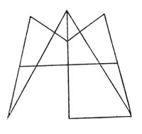

  
[Intangible Textual Heritage](../../index)  [Esoteric](../index) 
[Index](index)  [Previous](cdg26)  [Next](cdg28) 

------------------------------------------------------------------------

[Buy this Book at
Amazon.com](https://www.amazon.com/exec/obidos/ASIN/1564592014/internetsacredte)

------------------------------------------------------------------------

*Comte de Gabalis* \[1913\], at Intangible Textual Heritage

------------------------------------------------------------------------

### BACCHUS AND OSIRIS THE SAME.

Q"Now that *Osiris*
is really the same with Bacchus, nobody can be supposed to know better
than you, *O Clea*, not only as you are chief of his priestesses at
*Delphi*, but moreover as you are initiated, in right of both your
parents, into the service and religion of *Osiris*--As others, however,
may not be so well satisfied in this point; to omit the evidence which
may be brought in proof of it from those more secret rites which are not
to be divulged, do not those very cere- monies, which the priests
perform in public, when

p. 234

they carry the *Apis* on a raft to his funeral, correspond entirely with
what we see done in the festivals of *Bacchus?* They hang round them the
skins of hinds, they carry javelins in their hands crowned with ivy,
make the same sort of howlings, and use the same kind of gesticulations
as the votaries of *Bacchus* are wont to do, whilst they are celebrating
the orgies of their God. Hence likewise is it, that so many of the
Greeks, in their statues of *Bacchus*, have given him *the visage of an
ox;* that the women of *Elis* in their prayers to him, call upon the
*God with the oxe's feet* to come unto them; and that the people of
*Argos* not only give him the appellation of *Ox-begotten*, but likewise
invoke him, and endeavour to raise him from his watry dwelling by the
sound of the trumpet, throwing at the same time a lamb into the deep, as
a kind of fee to the porter, who keeps the door of the infernal regions
for letting him pass: these trumpets are concealed by them under boughs
of ivy, as *Socrates* relates in his treatise concerning the *Delphic
Hosii*--So again, the histories upon which the most solemn feasts of
*Bacchus*, the *Titania* and *Nuktelia*, are founded, do they not exa&ly
correspond with what we are told of the cutting in pieces of *Osiris*,
of his rising again, and of his new life? Nor does what relates to his
burial any way contradict this notion; for whilst the Egyptians, as has
been already observed, show many places as the sepulchres of their
*Osiris*, the *Delphians* pretend that

p. 235

the relics of *Bacchus* are deposited with them, and that they lye near
the oracle.: and in consequence of this opinion, the *Hosii*, or priests
appointed for that purpose, perform a secret sacrifice in the temple of
*Apollo*, whilst at the same time the *Thyades*, or priestesses of
*Bacchus*, with their hymns endeavour to raise their God, whom they at
that time distinguish by the name of the *Winnower*. Now that the Greeks
themselves do not look upon *Bacchus* as the Lord or President of wine
only, but of all kind of humidity in general, may be sufficiently proved
from the testimony of *Pindar*, where he says "may bountiful *Bacchus*,
the bright glory of the year, make all my trees fruitful;" thus likewise
the votaries of *Osiris* are expressly forbidden to destroy any
fruit-tree, or to mar any springs of water.

But to resume a while our former argument concerning the identity of
*Bacchus* and *Osiris;* as a farther proof of this point, we may mention
the *Ivy*, which as it is esteemed by the Greeks sacred to *Bacchus*, so
is it likewise stiled by the Egyptians, in their language, *Chenosiris*,
that is, as some interpret it, *the plant of Osiris*. In like manner
*Aristo*, who wrote a treatise of the Athenian Colonies, tells us, he
somewhere met with an epistle of *Alexarchus*, wherein *Bacchus* was
expressly said to have been the son of Isis, and to heve been named by
the Egyptians not *Osiris*, but *Asiris*, with an A; a word, in the
language of that country, signifying *strong and mighty:* and this is
farther

p. 236

confirmed by the testimony . of *Hermaeus*, who, in his first book
concerning the Egyptians, gives us a similar explication of the name
*Osiris* himself. . . . there is no need of any other evidence than that
I have formerly made use of, drawn from the similarity, which may be
observed, between the festivals and. sacred rites of these two Gods, a
proof much more strong and convincing than any authorities whatever can
be."

PLUTARCH'S TREATISE OF ISIS AND OSIRIS, §35, §37. TRANSLATED BY SAMUEL
SQUIRE, A.M., 1744.

 

------------------------------------------------------------------------

[Next: R. Muhammed](cdg28)
