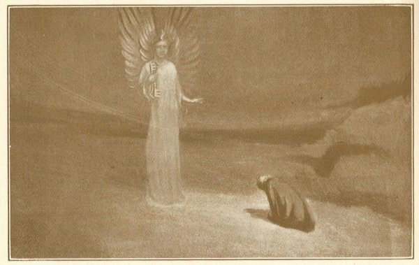
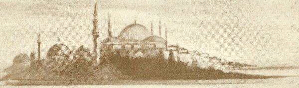

  
[Intangible Textual Heritage](../../index)  [Esoteric](../index) 
[Index](index)  [Previous](cdg27)  [Next](cdg29) 

------------------------------------------------------------------------

[Buy this Book at
Amazon.com](https://www.amazon.com/exec/obidos/ASIN/1564592014/internetsacredte)

------------------------------------------------------------------------

*Comte de Gabalis* \[1913\], at Intangible Textual Heritage

------------------------------------------------------------------------

p. 237

 

### 571, A.D. MUHAMMED. 632, A.D.

### PROPHET OF GOD AND BRINGER OF LIGHT TO ISLAM.

R"The word this man
spoke has been the life-guidance now of a hundred-and-eighty millions of
men these twelve-hundred years. The hundred-and-eighty millions were
made by God as well as we. A greater number of God's creatures believe
in Mahomet's word at this hour, than in any other word whatever." [1](#fn_174)

In the Koran, 'the light giving Book,' transmitted to Muhammed by the
Angel Gabriel from the Lord "that He may stablish those who have
believed, and as guidance and glad tidings to the Muslims," it is
written:

p. 238

"It beseemeth not a man, that God should give him the Scriptures and the
Wisdom, and the gift of prophecy, and that then he should say to his
followers, 'Be ye worshippers of me, as well as of God;' but rather, 'Be
ye perfect in things pertaining to God, since ye know the Scriptures,
and have studied deep.' God doth not command you to take the angels or
the prophets as lords.

Say: WE BELIEVE IN GOD, AND IN WHAT HATH BEEN SENT DOWN TO US, and what
hath been sent down to Abraham, and Ismael, and Isaac, and Jacob, and
the tribes, AND IN WHAT WAS GIVEN TO MOSES, AND JESUS, AND THE PROPHETS,
FROM THEIR LORD. WE MAKE NO DIFFERENCE BETWEEN THEM. And to Him are we
resigned (Muslims)." [2](#fn_175)

 

------------------------------------------------------------------------

### Footnotes

[237:1](cdg28.htm#fr_174) THOMAS CARLYLE. THE
HERO AS PROPHET. MAHOMET: ISLAM.

[238:2](cdg28.htm#fr_175) THE KORAN SURA III,
THE FAMILY OF IMRAN. EVERYMAN'S LIBRARY EDITION, PAGES 393-4.

------------------------------------------------------------------------

[Next: S. King Saul](cdg29)
