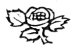

  
[Intangible Textual Heritage](../../index)  [Esoteric](../index.md) 
[Index](index)  [Previous](cdg44)  [Next](cdg46.md) 

------------------------------------------------------------------------

[Buy this Book at
Amazon.com](https://www.amazon.com/exec/obidos/ASIN/1564592014/internetsacredte.md)

------------------------------------------------------------------------

*Comte de Gabalis* \[1913\], at Intangible Textual Heritage

------------------------------------------------------------------------

### MOSES AN INITIATE.

HHNo less an
authority than St. Paul, himself an Initiate, declares that "Moses was
learned. in all the wisdom of the Egyptians," (*Acts
vii, 22*). The Greek word Sophia (Wisdom) has the same root and
cabalistically the same number (780) as the Greek word Ophis, (Serpent),
and often signifies Wisdom of the Serpent, Solar Force, and is here used
by St. Paul in this sense. We must, therefore, conclude that Moses was
an Initiate, which conclusion is confirmed by Manetho, "high priest and
scribe of the sacred adyta in Egypt and a citizen of Heliopolis" in the
reign of Ptolemy, who makes the following statement, "It is said also
that the priest, who ordained their polity and laws, was by birth of
Heliopolis, and his name Osarsiph, from Osiris the god of Heliopolis:
but that when he went over to these people his name was changed, and he
was called Moyses." [†](#fn_210.md) In the
Egyptian language the word Moses is spelled MSS, and means child, which
word is not infrequently used in sacred writings with the meaning of
Child of God or Initiate. [\*](#fn_209.md)
Accurately speaking, Moses is neither a surname nor a patronymic, but a

p. 285

title bestowed upon the leader of Israel by his followers in recognition
of his God-enlightenment or Initiation. Thus we perceive Moses to have
been an Initiate and a priest of Osiris, as well as the servant of
Jehovah, and a channel through which the esoteric teachings of Egypt
flowed into the Jewish, Christian and Muhammedan religions, moulding
their inner Truth in its own likeness. "That which is called the
Christian Religion existed among the ancients, and never did not exist,
from the beginning of the race until Christ came in the flesh, at which
time the true religion which already existed began to be called
Christianity." (*St. Augustine*).

### THE BRAZEN SERPENT.

In sacred writings letters not only have hidden meanings but numerical
values as well. And the key to many sacred allegories is concealed in
the numbers represented by the words used. Thus we find a clue to the
meaning of the story of the Brazen Serpent in the fact that, according
to the Rabbis, the number of the word Messiah and of the Hebrew word for
serpent are identical, being 358.

Book of Numbers, chapter xxi, verses 5-9.

5\. "And the people spake against God, and against Moses, Wherefore have
ye brought us up out of Egypt to die in the wilderness? for there is no
bread,Ineither is there any water; and our soul loatheth this light
bread." In this verse the children of Israel are portrayed

p. 286

as turning from divine direction and giving way to the desires of the
carnal nature.

6\. And the Lord sent fiery serpents among the people, "The Hebrew word
here used for serpent is Saraph, which properly signifies to
burn," [\*](#fn_211.md) and may he literally
translated as Serpent Fire, Solar Force. And the Lord sent the Serpent
Fire among the people, and because they had given way to their lower
natures, the manifestations of this Force "bit (burned) the people, and
much people of Israel died."

7\. "Therefore the people came to Moses, and said, We have sinned, for
we have spoken against the Lord, and against thee; pray unto the Lord,
that he take away the serpents from us. And Moses prayed for the people.

8\. And the Lord said unto Moses, Make thee a fiery serpent, and set it
upon a pole: and it shall come to pass, that every one that is bitten,
when he looketh upon it shall live." This verse states plainly that
Moses was direéed to place before his followers the image of the serpent
lifted up, or direted upward upon a pole, that "those who were bitten,"
those in whom the Serpent Fire was manifesting ungoverned to their
destruction, might have knowledge of its upward diretion, govern it, be
regenerated and live.

9\. And Moses made a serpent of brass, and put it upon a pole, and it
came to pass, that if a serpent had bitten

p. 287

any man, when he beheld the serpent of brass, he lived. In the Gospel of
St. John, [§](#fn_212.md) iii, 14, we read "and
just as Moses lifted high the serpent in the Desert, so must the Son of
Man be. lifted up in order that every one who trusts in him may have the
Life of the Ages" (literally of the Solar Force). [†](#fn_213.md) This verse intimates that the serpent
and the Son of Man or Messiah are manifestations of the same Divine
Force, a fact which their identity of numerical value indicates and
which Masonry confirms, "In the Templar and Philosophical degrees, the
serpent is an emblem of Christ." *The Royal Masonic
Cyclopædia, page 663*.

 

------------------------------------------------------------------------

### Footnotes

[284:\*](cdg45.htm#fr_210.md) COMPARE *Isaiah
lxv., 20, Luke xviii., 17*.

[284:†](cdg45.htm#fr_209.md) I. P. CORY, "ANCIENT
FRAGMENTS," PAGE 181.

[286:\*](cdg45.htm#fr_211.md) *Cruden's
Concordance, Page 628, Ed. 1855*.

[287:§](cdg45.htm#fr_212.md) *Testament in Modern
Speech*.

[287:†](cdg45.htm#fr_213.md) *Compare Saint Paul
an Initiate, Page [213](cdg16.htm#page_213.md) Commentary Continued*.

------------------------------------------------------------------------

[Next: II. Book of the Wars of the Lord](cdg46.md)
