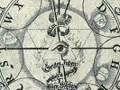

  
[Intangible Textual Heritage](../../index)  [Esoteric](../index) 
[Mysticism](../../myst/index)  [Index](index)  [Previous](cjb18) 

------------------------------------------------------------------------

[Buy this Book on
Kindle](https://www.amazon.com/exec/obidos/ASIN/B0031574NM/internetsacredte)

------------------------------------------------------------------------

  
*The Confessions of Jacob Boehme*, by Jacob Boehme, ed. W. Scott Palmer
\[1920\], at Intangible Textual Heritage

------------------------------------------------------------------------

p. 149

### CHAPTER XVII

THE disciple said to his Master: Sir, how may I come to the supersensual
life, so that I may see God, and hear God speak?

The Master answered and said: Son, when thou canst throw thyself into
That, where no creature dwelleth, though it be but for a moment; then
thou hearest what God speaketh.

When thou standest still from the thinking of self and the willing of
self; when both thy intellect and thy will are quiet, and passive to the
impress of the eternal Word and Spirit; and when thy soul is winged up
above that which is temporal, the outward senses and the imagination
being locked up in holy abstraction,

p. 150

then the eternal hearing, seeing, and speaking will be revealed in thee.
So God heareth and seeth through thee who art now the organ of his
Spirit; so God speaketh in thee and whispereth to thy spirit, and thy
spirit heareth his voice.

Three things are requisite in order to this. The first is, Thou must
resign thy will to God, and must sink thyself down to the dust in his
mercy. The second is, Thou must hate thy own will and forbear from doing
that to which thy own will doth drive thee. The third is, Thou must bow
thy soul under the Cross, heartily submitting thyself to it, that thou
mayest be able to bear the temptations of nature and the creature. And
if thou doest this, then thou shalt hear, my Son, what the Lord speaketh
in thee.

Though thou lovest the earthly wisdom now, yet when thou shalt be
clothed upon with the Heavenly Wisdom, then thou wilt see that all the
wisdom of the world

p. 151

is folly. So shalt thou be able to stand under every temptation and to
hold out to the end in a course of life above the world and above sense.
In this course thou wilt hate thyself; and thou wilt also love thyself;
I say, love thyself, and that even more than ever thou didst yet.

In loving thyself, thou lovest not thyself as thine own; but as given
thee from the love of God thou lovest the divine ground in thee, by
which and in which thou lovest the divine wisdom, the divine goodness,
the divine beauty. Thou lovest also God's works of wonder, and in this
same ground thou lovest thy brethren. In hating thyself thou hatest only
that wherein the evil sticks close to thee. There is, there can be, no
selfishness in love; they are opposed one to another. Love, that is,
divine love (of which alone we are now discoursing) hates all evil
selfhood. It is impossible that these two should subsist in one person;
by a necessity of nature the one drives out the other.

p. 152

The height of love is as high as God; it brings thee to be as high as
God himself is, by uniting thee with God. Its greatness is as great as
God: there is a latitude of heart in love which cannot be expressed; it
enlarges the soul as wide as the whole creation of God. This shall be
experienced by thee, beyond the compass of all words, when the throne of
love shall be set up in thy heart. Its power supports the heavens and
upholds the earth; its virtue is the principle of all principles, the
virtue of all virtues. It is the worker of all things and a vital energy
through all powers natural and supernatural. It is the power of all
powers, nothing being able to let or hinder the omnipotence of love, or
resist its penetrating might. If thou findest it thou comest into that
fountain from whence all things are proceeded, into that ground wherein
they subsist; and thou art a King over all the works of God.

Be silent therefore and watch unto

p. 153

prayer, that thy mind may be disposed for finding that jewel, which to
the world appears as nothing, but which to the children of Wisdom is all
things. The way to the love of God is folly to the world, but wisdom to
the children of God, for whom that which is despised of the world is the
most precious treasure; yea, so great a treasure it is, that no life can
express, nor tongue so much as name, what this inflaming, all-conquering
love of God is. It is brighter than the sun; it is sweeter than any
thing that is called sweet; it is stronger than all strength; it is more
nourishment than any food, more cheering to the heart than wine, more
pleasant than all the pleasantness of this world. Whosoever obtaineth it
is richer than any monarch on earth, and he who winneth it is nobler
than an emperor and more potent and absolute than all earthly powers and
authorities.

 

 

 

PRINTED BY MORRISON AND GIBB LTD.  
EDINBURGH

 

 

 

 

 
