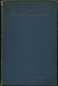

  
[Intangible Textual Heritage](../../index)  [Esoteric](../index) 
[Index](index)  [Next](cota01) 

------------------------------------------------------------------------

[Buy this Book at
Amazon.com](https://www.amazon.com/exec/obidos/ASIN/0853301018/internetsacredte)

------------------------------------------------------------------------

  
*The Consciousness of the Atom*, by Alice A. Bailey, \[1922\], at
Intangible Textual Heritage

------------------------------------------------------------------------

###### THE CONSCIOUSNESS OF THE ATOM.

 

#### Copyright 1922

#### by

#### Lucifer Publishing Company

 

# THE CONSCIOUSNESS OF THE ATOM

##### by

## ALICE A. BAILEY

### A series of lectures delivered in New York City Winter of 1921-22.

###### Author of "Letters on Occult Meditation" "Initiation, Human and Solar"

#### First Edition

#### Lucifer Publishing Co. 135 Broadway, New York City.

#### \[1922\]

Scanned, proofed and formatted at Intangible Textual Heritage, July
2008. This text is in the public domain in the United States because it
was published prior to 1923.

 
[  
Click to enlarge](img/cover.jpg)  
Cover  

  [  
Click to enlarge](img/cnote.jpg)  
Copyright Notice  

  [  
Click to enlarge](img/title.jpg)  
Title Page  

------------------------------------------------------------------------

[Next: Table of Contents](cota01)
