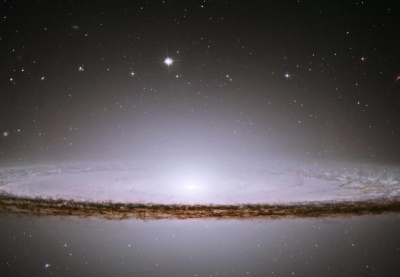

  
[Intangible Textual Heritage](../../index)  [Esoteric](../index.md) 

------------------------------------------------------------------------

[Buy this Book at
Amazon.com](https://www.amazon.com/exec/obidos/ASIN/0853301018/internetsacredte.md)

------------------------------------------------------------------------

<table width="75%">
<colgroup>
<col style="width: 50%" />
<col style="width: 50%" />
</colgroup>
<tbody>
<tr class="odd">
<td width="50%" data-valign="TOP"></td>
<td width="50%" data-valign="CENTER"><h1 id="the-consciousness-of-the-atom" data-align="CENTER">The Consciousness of the Atom</h1>
<h2 id="by-alice-a.-bailey" data-align="CENTER">by Alice A. Bailey</h2>
<h4 id="section" data-align="CENTER">[1922]</h4></td>
</tr>
</tbody>
</table>

------------------------------------------------------------------------

[Contents](#contents)    [Start Reading](cota00.md)    [Page
Index](pageidx)    [Text \[Zipped\]](cotatxt.zip.md)

------------------------------------------------------------------------

|                                                                                                                           |
|---------------------------------------------------------------------------------------------------------------------------|
|  |

The eminent esoteric author Alice Bailey, published dozens of books, but
they are hard to find in electronic form on the web. This is because
Lucis Publishing Company (in 1922 called 'Lucifer Publishing Company'),
her exclusive publisher, has aggressively challenged web postings of her
material using copyright law. However, this book, prepared from [a
genuine 1922 first edition](img/cnote.jpg.md), is firmly in the public
domain in the United States by the terms of the Digital Millennium
Copyright Act, because it was published prior to 1923.

This book was apparently delivered as a series of weekly lectures in
1921 and 1922, and published later in 1922. Bailey, even at this point
in her career, shows a mature grasp of esoteric issues, and deftly
brings in scientific concepts such as radioactivity and the fourth
dimension. Unlike some other authors of this genre, she invokes
leading-edge science when it moves the argument ahead, not to impress
the reader with her erudition, or to baffle the audience with irrelevant
facts.

She sees the universe as *alive* at all scales of existence. While the
comparison of an atom to a solar system no longer holds true, her vision
of how consciousness evolves even in the micro-scale and macro-scale,
and how that is mirrored in the tripartate human being, is a lucid
explanation of an occult world-view expressed by many other thinkers.

------------------------------------------------------------------------

 [Title Page](cota00.md)  
[Table of Contents](cota01.md)  
[Foreword](cota02.md)  
[Lecture I. The Field of Evolution](cota03.md)  
[Lecture II. The Evolution of Substance](cota04.md)  
[Lecture III. The Evolution of Form, or Group Evolution](cota05.md)  
[Lecture IV. The Evolution of Man, the Thinker](cota06.md)  
[Lecture V. The Evolution of Consciousness](cota07.md)  
[Lecture VI. The Goal of Evolution](cota08.md)  
[Lecture VII. Cosmic Evolution](cota09.md)  
