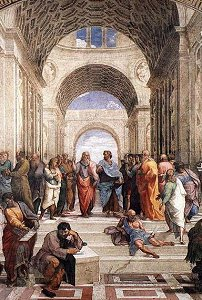

  
[Intangible Textual Heritage](../../index)  [Esoteric](../index) 

------------------------------------------------------------------------

[Buy this Book at
Amazon.com](https://www.amazon.com/exec/obidos/ASIN/1419179896/internetsacredte)

------------------------------------------------------------------------

<table width="75%">
<colgroup>
<col style="width: 50%" />
<col style="width: 50%" />
</colgroup>
<tbody>
<tr class="odd">
<td width="50%" data-valign="CENTER"> 
</td>
<td width="50%" data-valign="CENTER"><h1 id="the-chaldæan-oracles-of-zoroaster" data-align="CENTER">The Chaldæan Oracles of Zoroaster</h1>
<h2 id="by-w.-wynn-westcott" data-align="CENTER">by W. Wynn Westcott</h2>
<h4 id="section" data-align="CENTER">[1895]</h4></td>
</tr>
</tbody>
</table>

------------------------------------------------------------------------

|                                                                                                                           |
|---------------------------------------------------------------------------------------------------------------------------|
|  |

Attributed to, but probably not of Chaldean origin; not oracles (in the
sense of [prophecies](../../pro/index)); and definitely not
[Zoroastrian](../../zor/index); this is a famous collection of aphorisms
cherry-picked from classical sources. The earliest editions of the COZ
were published during the renaissance, when Chaldea was a land of
mystery to Europeans. Many of the cryptic 'Oracles' seem to reflect
Neo-Platonism, the Kabbalah and Gnostic views, which would have been
considered heretical at the time. Claiming an ancient Chaldean origin
might simply have been a flag of convenience.

The main text here was translated by the 19th century Neo-Platonist
Thomas Taylor, and I.P. Cory in his [Ancient
Fragments](../../cla/af/index). This edition was published and
introduced by the Theosophist W. W. Westcott in his series Collectanea
Hermetica in 1895. Despite the twisted background of this text, it has a
definite resonance which students of the Esoteric will enjoy. Indeed,
[W.B. Yeats](../../neu/yeats/index), who moved in Theosophical circles,
was an admirer of this text.

This is the first complete transcription of this edition of the COZ at
Intangible Textual Heritage. This version supersedes an earlier etext,
prepared by a third party, which was incomplete and defective.

------------------------------------------------------------------------

[Title Page](coz00)  
[Preface](coz01)  
[Introduction](coz02)  
[The Oracles of Zoroaster](coz03)  
[Ideas](coz04)  
[Particular Souls](coz05)  
[Matter](coz06)  
[Magical and Philosophical Precepts](coz07)  
[Oracles From Porphyry](coz08)  
