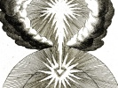

  
[Intangible Textual Heritage](../../index)  [Esoteric](../index) 
[Index](index)  [Previous](cuts06)  [Next](cuts08) 

------------------------------------------------------------------------

[Buy this Book at
Amazon.com](https://www.amazon.com/exec/obidos/ASIN/B002DYIYAY/internetsacredte)

------------------------------------------------------------------------

  
*The Cloud Upon the Sanctuary*, by Karl Eckartshausen, \[1909\], at
Intangible Textual Heritage

------------------------------------------------------------------------

p. 61

### LETTER V

In our last letter, my dear brothers (and
sisters), you granted me your earnest attention to that highest of
mysteries, *the real possession of God;* it is therefore necessary to
give you fuller light on this subject.

Man, as we know, is unhappy in this world because he is made out of
destructible matter that is subject to trouble and sorrow.

The fragile envelope—*i.e.*, his body—exposes him to the violence of the
elements, pain, poverty, suffering, illnesses. This is his normal fate;
his immortal spirit languishing in the bonds of sense. Man is unhappy,
because he is ill in body and soul, and he possesses no true panacea
either for his body or for his soul.

Those whose duty it is to govern and lead other men to happiness, are as
other men, also weak and subject to the same passions and prejudices.

Therefore, what fate can humanity expect? Must the greater part of it be
always unfortunate? Is there no salvation for all?

Brothers, if humanity as a whole is ever capable of being raised to a
condition of true happiness,

p. 62

such state can only be possible under the following conditions:—

First, poverty, pain, illness and sorrow must become much less frequent.
Secondly, passions, prejudices and ignorance must diminish.

Is this at all possible with the nature of man, when experience proves
that, from century to century, suffering only assumes fresh form; that
passions, prejudices and errors always cause the same evils; and when we
realise that all these things only change shape, and that man in every
age remains much the same weak man?

There is a terrible judgment pronounced upon the human race, and this
judgment is—men can never become happy so long as they will not become
wise; but they will never become wise, while sensuality governs reason,
while the spirit languishes in the bonds of flesh and blood.

Where is the man that has no passions? Let him shew himself. Do we not
all wear the chains of sensuality more or less heavily? Are we not all
slaves? All sinners?

This realisation of our low estate excites in us the desire to be raised
beyond it, and we lift up our eyes on high, and an angel's voice
says—*the sorrows of man shall be comforted*.

Man being sick body and soul, this mortal sickness must have a cause,
and *this cause* is to be found in the very matter out of which man is
made.

p. 63

The destructible imprisons the indestructible, the *ferment of sin* is
in us, and in this ferment is human corruption, and its propagation and
consequences form the perpetuation of original sin.

The healing of humanity is only possible through the destruction of this
ferment of sin, hence we have need of a physician and a remedy that
really can cure us. But an invalid cannot be cured by another; the man
of destructible matter cannot re-make himself of indestructible matter;
dead matter cannot awake other dead, the blind cannot lead the blind.

Only the Perfect can bring anything to perfection; only the
Indestructible can make the destructible likewise; only the Living can
wake the dead.

This Physician and this active Medicine cannot be found in death and
destruction, only in superior nature where all is perfection and life!

The lack of the knowledge of the union of Divinity with nature, nature
with man, is the true cause of all prejudice and error. Theologians,
philosophers, moralists, all wish to regulate the world, and they fill
it with endless contradictions.

Theologians do not see the union of God with nature and fall therefore
into error.

Modern philosophers study only matter, and not the connection of pure
nature with divine nature, and therefore announce the falsest opinions.

Moralists will not recognise the inherent corruption

p. 64

of human nature, and they expect to cure by words, when means are
absolutely necessary.

Thus the world, man and God, continue in permanent dissension; one
opinion drives out another; superstition and incredulity take turn about
in dominating society, separating man from the word of truth when he has
so much dire need of approaching her.

It is only in the true Schools of Wisdom that one can learn to know God,
nature, and man; and in these, for thousands of years, has work been
done in silence to acquire to the highest degree this knowledge,—the
union of man with pure nature and with God.

This great object, God and Nature, to which everything tends, has been
represented to man symbolically in every religion; and all the symbols
and holy glyphs are but the letter by which man can gradually, step by
step, recover the highest of all divine mysteries, natural and human,
and learn the means of healing his unhappy condition, and of the union
of his being with pure nature and with God.

We have attained this epoch solely under God's guidance. Divinity, next
remembering its covenant with man, has given forth the means of cure for
suffering mankind, and shewn thereby how to raise man to his original
dignity, uniting him to God, the Source of his happiness.

The knowledge of this method ensuring recovery

p. 65

is the science of Saints and of the Elect, and its possession the
inheritance promised to God's children.

Now, my beloved brothers, I want you to grant me your most earnest
attention to what I am about to say.

*In our blood there is lying concealed a slimy matter (called the
gluten) which has a nearer kinship to animal than to spiritual man. This
gluten is the body of sin*.

This material, this matter, can be modified in various manners,
according to the stimulus of sense; and according to the kind of
modification and change occurring in this body or matter of sin, so also
vary the diverse sinful tendencies of man.

In its most violent expansion this matter produces pride; in its utmost
contraction, avarice, self-will and selfishness; in its repulsion, rage
and anger; in its circular movements levity and incontinence; in its
eccentricity, greediness and drunkenness; in its concentricity, envy; in
its essence, sloth.

This ferment of sin, as original sin, is more or less working in the
blood of every man, and is transmitted from father to son, and the
perpetual propagation of this baneful material, everlastingly hinders
the simultaneous action of spirit with matter.

It is quite true that man by his will-power can put limits to the action
of this body of sin, and can dominate it so that it becomes less active,
but to

p. 66

destroy and annihilate it altogether is beyond his power. This then is
the cause of the combat we are constantly waging between the good and
the evil in us.

This body of sin which is in us, forms the ties of flesh and blood
which, on the one side, bind us to our immortal spirit, and, on the
other, to the tendencies of the animal man. It is as it were the
allurements of the animal passions that smoulder and take fire at last.

The violent reaction of this body of sin in us, on sensuous stimulation,
is the reason why we choose, for the want of calm and tranquil judgment,
rather the evil than the good, because the active fermentation of this
matter impedes the quiet action of the spirit necessary to instruct and
sustain the reason.

This same evil matter is also the cause of our ignorance, because, as
its thick and inflexible substance surcharges the fine brain fibres, it
prevents the co-action of reason, which is required to penetrate the
objects of the understanding.

Thus falseness and all evils are the properties of this sinful matter,
this body of sin, just as the good and the true are the essential
qualities of the spiritual principle within us.

Through the recognition and thorough understanding by us of this body of
sin we learn to see that we are beings morally ill, that we have need of
a physician who can give us a medicine which

p. 67

will destroy and eradicate the evil matter always fermenting banefully
within us, a remedy that will cure us and restore us to moral health.

We learn also clearly to recognize that all mere moralizing with words
is of little use *when real means are necessary*.

We have been moralizing in varied words for centuries, but the world
remains pretty much the same. A doctor would do but little good in
talking only of his remedies, it is necessary for him actually to
prescribe his medicines; he has, however, first to see the real state of
the sick person.

The condition of humanity—the moral sickness of man—is a true case of
poisoning, consequent upon the eating of the fruit of the tree in which
corruptible matter had the superiority.

The first effect of this poison resulted thus: the incorruptible
principle, the body of life as opposed to the body of sin or death,
whose expansion caused the perfection of Adam, concentrated itself
inwardly, and the external part was abandoned to the government of the
elements. Hence a mortal matter gradually covered the immortal essence,
and the loss of this central light was the cause subsequently of all
man's sufferings.

Communication with the world of light was interrupted, the interior eye
which had the power of seeing truth *objectively* was closed, and the
physical eye opened to the plane of changing phenomena.

p. 68

Man lost all true happiness, and in this unhappy condition he would have
for ever lost all means of restoration to health were it not that the
love and mercy of God, who had no other object in creation but the
greatest happiness for its creatures, immediately afforded to fallen man
a means of recovery. In this means, he, with all posterity, had the
right to trust, in order that while still in his state of banishment, he
might support his misfortune with humility and resignation, and,
moreover, find in his pilgrimage the great consolation, that every
corruptible thing in man could be restored perfectly through the love of
a Saviour.

Despair would have been the fate of man without such revelation.

Man, before the Fall, was the living Temple of Divinity, and at the time
when this Temple was destroyed, the plan to rebuild the Temple was
already projected by the Wisdom of God; and at this period begin the
Holy Mysteries of every religion, which are all and each in themselves,
after a thousand varying modes, according to time and circumstances, and
method of conception of different nations, but symbols repeated and
modified of one solitary truth, and this unique truth is—*regeneration,
or the re-union of man with God*.

Before the Fall man was wise, he was united to Wisdom; after the Fall he
was no longer one with Her, hence a true science through express
Revelation became absolutely necessary.

p. 69

The Revelation was the following:—

The condition of immortality consists in immortality permeating the
mortal. Immortal substance is divine substance, and is no other than the
magnificence of the Almighty throughout nature, the substance of the
world and spirits, the infinity, in short, of God in whom all things
move and have their being.

It is an immutable law, no creature can be truly happy when separated
from the source of all happiness. This source, this *in whom*, is the
magnificence of God Himself.

Through the partaking of destructible nourishment, man himself became
destructible and material; matter, therefore, as it were places itself
between God and man, that is to say, man is not directly penetrated and
permeated by divinity, and, in consequence, he is thenceforth subject
to, and falls under the dominion of, the laws regulating matter.

The divine in man, imprisoned by the bonds of this matter, is his
immortal part, the part that should be at liberty, in order that its
development should once again rule the mortal. Then once more does man
regain his original greatness.

But a means for his cure, and a method to externalize what is now hidden
and concealed within, is requisite. Fallen and unwise man of himself can
neither know nor grasp this expedient; he cannot even recognise it,
because he has lost pure knowledge and the light of true wisdom; he
cannot

p. 70

take hold of it, because this remedy is infolded in interior nature, and
he has neither the strength or power to unlock this hidden force.

Hence Revelation to learn this means, and strength to acquire this
power, are necessary to man.

This necessity for the salvation of man was the cause of the
determination of Wisdom, or the Son of God, to give Himself to be known
by man, *being the pure substance out of which* all has been made. In
this pure substance all power is reserved to vivify all dead substance,
and to purify all that is impure.

But before that could be done, and the inmost part of man, the divine in
him, be once more penetrated and re-opened again, and the whole world be
regenerated, it was requisite that this divine substance should
incarnate in humanity and become human, and therein transmit the divine
and regenerative force to humanity; it was necessary also that this
divine human form should be killed, in order that the divine and
incorruptible substance contained in the blood should penetrate into the
recesses of the earth, and thenceforth work a gradual dissolution of
corruptible matter, so that in due time a pure and regenerated earth
will be presented to man, with the Tree of Life growing once more, so
that by partaking of its fruit, containing the true immortal essence,
mortality in us will be once more annihilated, and man healed by

p. 71

the fruit of the Tree of Life, just as he was once poisoned by the
partaking of the fruit of death.

*This fact* is the first and most important revelation and it embraces
all, and it has been carefully preserved from mouth to mouth among the
Chosen of God up to this time.

Human nature required a Saviour, this Saviour was Jesus Christ, the
Wisdom of God itself, reality from God. He put on the envelope of
humanity, to communicate *directly* the divine and immortal substance
once more to the world, which was nothing else *but Himself*.

He offered himself voluntarily, in order that the *pure essential force*
in His blood could penetrate directly, bringing with it the potentiality
of all perfection to the hidden recesses of the earth.

Himself, both as High Priest and as Victim at the same time, entered
into the Holy of Holies, and after having accomplished all that was
necessary, he laid the foundation of the Royal Priesthood of His Elect,
and taught these through the knowledge of His person and of His powers;
now they should lead, as the first born of the spirit, other men, their
brethren, to universal happiness.

And here begin the Sacerdotal Mysteries of the Elect and of the Inner
Church.

The Royal and Priestly Science is that of Regeneration. It is called
*Royal Science* because it leads man to power and the dominion over
Nature.

It is called Sacerdotal, because it sanctifies and

p. 72

brings all to perfection, spreading blessing and goodness everywhere.

This Science owes its immediate origin to the *verbal revelation* of
God, it is always the Science of the Inner Church of Prophets and of
Saints, and it recognised no other High Priest but Jesus Christ the
Lord.

This Science has a triple object; first, regenerating the individual and
isolated man, or the first of the Elect; second, many men; thirdly, all
humanity.

Its exercise consists in the highest perfecting of itself and of
everything in Nature.

This Science was never taught otherwise than by the Holy Spirit of God,
and by those who were in unison with this Spirit, and it is beyond all
other sciences, because it can alone teach the knowledge of God, of
nature, and of man in a perfect harmony; while other sciences do not
understand truly either God or nature, neither man nor his destination.

The capabilities of this Science are the powers to know God in man, and
divinity in nature; these being, as it were, the Divine impression or
seals, by which our inner selves can be opened and can arrive at union
with Divinity.

Thus the re-union was the most exalted aim, and hence the Priesthood
derived its name *religio*, *clerus regenerans*.

Melchizedek was the first Priest King; all true Priests of God and of
Nature descend from him,

p. 73

and Jesus Christ himself was united with him as "priest" after the order
of Melchizedek. This word is literally of the highest and widest
significance and extent—‏מלכיצ-דק‎ (MLKIZ-DQ). It means literally the
introducing of the true substance of vital life, and the separation of
this true vital substance from the mortal envelope which encloses it.

A priest is one who separates that which is pure nature from that which
is of impure nature, a separator of the substance which contains all
from the destructible matter which occasions pain and misery. The
sacrifice or that which has been separated consists in bread and wine.

Bread means literally the substance which contains all; wine the
substance which vitalizes everything.

Therefore, a priest after the order of Melchizedek is one who knows how
to separate the all-embracing and vitalizing substance from impure
matter, one who knows how to employ it as a real means of reconciliation
and of re-union for fallen humanity, in order to communicate to him his
true and royal privilege of power over nature, and the Sacerdotal
dignity or the ability to unite himself by grace to the upper worlds.

In these few words is contained all the mystery of God's Priesthood, and
the occupation and aim of the Priest.

But this royal Priesthood was only able to reach perfect maturity when
Jesus Christ Himself as High

p. 74

\[paragraph continues\] Priest had
fulfilled the greatest of all sacrifices, and had entered into the Holy
Sanctuary.

Here we are now entering on new and great mysteries worthy, I entreat
you, of your most earnest attention.

When, according to the wisdom and justice of God, it was resolved to
save the fallen human race, the Wisdom of God had to choose the method
which afforded in every aspect the most efficacious means for the
consummation of this great object.

When man became so thoroughly poisoned by the fruit of evil, carrying in
himself henceforth the ferment of death, all around him became subject
to death and destruction, therefore, divine mercy was bound to establish
a counter remedy, which could be partaken of, containing within itself
the divine and revitalising substance, so that by taking this immortal
food, poisoned and death-stricken man could be healed and rescued from
his suffering. But in order that this Tree of Life could be replanted,
it was requisite beyond all things that the corruptible material in the
centre of the earth should be first regenerated, resolved and made
capable of being again one day a universally vitalising substance.

This capacity for new life, bringing about the dissolution of
corruptible essence which is inherent in the centre of the earth, was,
however, possible to no other matter than divine vital substance
enveloped in flesh and blood which could transmit

p. 75

the hidden forces of life to dead nature. This was done through the
death of Jesus Christ. *The tinctural force* which flowed from His shed
blood penetrated to the innermost parts of the earth, raised the dead,
rent the rocks, and caused the total eclipse of the sun when it pressed
from the centre of the earth where the light penetrated the central
darkness to the circumference, and there laid the foundation of the
future glorification of the world.

Since the death of Jesus Christ, the divine force, driven to the earth's
centre by the shedding of His blood, works and ferments perpetually to
press outward, and to fit and prepare all substances gradually for the
great cataclysm which is destined for the world.

But the rebuilding of the world's edifice in general was not only the
aim of Redemption. Man was the principal object for the shedding of
Christ's blood, and to procure for him already in this material world
the highest possible perfection by the amelioration of his being, Jesus
Christ submitted to infinite suffering.

He is the Saviour of the world and of man. The object and cause of His
Incarnation was to rescue us from sin, misery, and from death.

Jesus Christ has delivered us from all evil by His flesh, which he
sacrificed, and by His blood, which He shed for us.

In the clear understanding of what consists this *flesh* and this
*blood* of Jesus Christ lies the true

p. 76

and pure knowledge of the real regeneration of man.

The mystery of being united with Jesus Christ, not only spiritually *but
also corporeally*, is the greatest aim of the Inner Church. Become one
with Him in spirit and in being is the fulfilling and plenitude of the
efforts of the Elect.

The means for this real possession of God is hidden from the wise of
this world, and revealed to the simplicity of children.

Vain philosopher, bend thyself before the grand and Divine Mysteries
that thou in thy wisdom canst not understand, and for the penetration of
whose secrets the feeble light of human reason darkened by sense can
give thee no measure!

------------------------------------------------------------------------

[Next: Letter VI and Last](cuts08)
