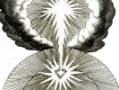

  
[Intangible Textual Heritage](../../index)  [Esoteric](../index.md) 
[Index](index)  [Previous](cuts07.md) 

------------------------------------------------------------------------

[Buy this Book at
Amazon.com](https://www.amazon.com/exec/obidos/ASIN/B002DYIYAY/internetsacredte.md)

------------------------------------------------------------------------

  
*The Cloud Upon the Sanctuary*, by Karl Eckartshausen, \[1909\], at
Intangible Textual Heritage

------------------------------------------------------------------------

p. 77

### LETTER VI AND LAST

God made Himself man to deify man. Heaven
united itself with earth to transform earth into Heaven.

But in order that these divine transformations can take place, an entire
change, a complete and absolute overturning and upsetting of our being,
is necessary.

This change, this upsetting, is called re-birth. *To be born*, simply
means to enter into a world in which the senses dominate, in which
wisdom and love languish in the bonds of individuality.

To be *re-born* means to return to a world where the spirit of wisdom
and love governs, and where animal-man obeys.

The re-birth is triple; first, the re-birth of our intelligence; second,
of our heart and of our will; and, finally, the re-birth of our entire
being.

The first and second kinds are called the spiritual, and the third the
corporeal re-birth.

Many pious men, seekers after God, have been regenerated in the mind and
will, but few have known the corporeal re-birth. This last has been
attained to but by few men, and those to whom it has been given have
only received it that they

p. 78

might serve as *agents* of God, in accordance with great and grand
objects and intentions, and to bring humanity nearer to felicity.

It is now necessary, my dear brothers, to lay before you the true order
of re-birth. God, who is all strength, wisdom, and love, works eternally
in order and in harmony.

He who will not receive the spiritual life, he who is not born anew from
the Lord, can not enter into heaven.

Man is engendered through his parents in original sin, that is to say,
he enters into the natural life and not the spiritual.

The spiritual life consists in loving God above everything, and your
neighbour as yourself. In this double-love consists the *principle* of
the new life.

Man is begotten in evil, in the love of himself and of the things of
this world. Love of himself! Self interest! Self gratification! Such are
the substantial properties of evil. The good is in the love of God and
your neighbour, in knowing no other love but the love of mankind, no
interest but that affecting every man, and no other pleasure but that of
the well-being of all.

It is by such sentiments that the spirit of the children of God is
distinguished from the spirit of the children of this world.

To change the spirit of this world into the spirit of the children of
God is to be regenerated, and it

p. 79

means to despoil the old man, and to re-clothe the new.

But no person can be re-born if he does not know and put in practice the
following principle—that of truth becoming the object for our doing or
not doing; therefore, he who desires to be re-born ought first to know
what belongs to re-birth. He ought to understand, meditate, and reflect
on all this. Afterwards he should act according to his knowledge, and
the result will be a new life.

Now, as it is first necessary to know, and to be instructed in all that
appertains to re-birth, a doctor, or an instructor is required, and if
we know one, faith in him is also necessary, because of what use is an
instructor if his pupil have no faith in him?

Hence, the commencement of re-birth is faith in Revelation.

The disciple should begin by believing that the Lord, the Son, is the
Wisdom of God, that He is, from all Eternity from God, and that He came
into the world to bring happiness to humanity. He should believe that
the Lord has full power in heaven and on earth, and that all faith and
love, all the true and the good, come from Him alone; that He is the
Mediator, the Saviour, and Governor of men.

When this most exalting faith has taken root in us, we shall think often
of the Saviour, and these thoughts turned towards Him develop, and by
His

p. 80

grace reacting in us, the seven closed and spiritual powers are opened.

*The way to happiness*.—Do you wish, man and brother, to acquire the
highest happiness possible? Search for truth, wisdom, and love. But you
will not find truth, wisdom, and love, save in the unity of the Lord
Jesus Christ, the Anointed of God.

Seek, then, Jesus Christ with all your strength, search Him from the
fulness of your heart.

The beginning of His Ascension is the knowledge of His absence, and from
the recognition of this knowledge is the desire for increased power to
seek Him, which desire is the beginning of faith.

Faith gives confidence, but faith has also its order of progress. First
comes historic faith, then moral, then divine, and finally *living*
faith. The progression is as follows: Historical faith when we learn to
believe the history of Jesus of Nazareth, and through this simple
historical faith in the existence of Jesus, will evolve moral faith,
whose development consists in the acquirement of virtue by its search
and practice, so that we see and find real pleasure in all that is
taught by this Man; we find that His simple doctrine is full of wisdom
and His teaching full of love; that His intentions towards humanity are
straight and true, and that He willingly suffered death for the sake of
justice. Thus, faith in His Person will be followed by faith in His
Divinity.

This same Jesus Christ tells us now that He

p. 81

is Son of God, and He emphasizes His words by instructing His disciples
in the sacred mysteries of nature and religion.

Here natural and reasonable faith changes into divine faith, and we
begin to believe that he was God made man. From this faith it results
that we hold as true all that we do not yet understand, but which He
tells us to believe. Through this faith in the Divinity of Jesus, and by
that entire surrender to Him, and the faithful attention to His
directions, is at last produced that living faith, by which we find
*within ourselves* and true through *our
own experience*, all that hitherto we have until now believed in merely
with the confidence of a child; and this living faith proved by
experience is the highest grade of all.

When our hearts, through living faith, have received Jesus Christ into
them, then this Light of the World is born within us as in a humble
stable.

Everything in us is impure, surrounded by the spider-webs of vanity,
covered with the mud of sensuality.

Our will is the Ox that is under the yoke of its passions. Our reason is
the Ass who is bound through the obstinacy of its opinions, its
prejudices, its follies.

In this miserable and ruined hut, the home of all the animal passions,
can Jesus Christ be born in us through faith.

p. 82

The simplicity of our souls, is as the shepherds who brought their first
offerings, until at last the three principal powers of our royal
dignity, our reason, our will, and our activity [\*](#fn_2.md) prostrate themselves before Him and offer
Him the gifts of truth, wisdom, and love.

Little by little, the stable of our hearts changes itself into an
exterior Temple, where Jesus Christ teaches, but this Temple is still
full of Scribes and Pharisees.

Those who sell, Dives and the money changers, are still to be found, and
these should be driven out, and the Temple changed into a House of
Prayer.

Little by little Jesus Christ chooses all the good powers in us to
announce Him. He heals our blindness, purifies our leprosy, raises the
dead powers into living forces within us; He is crucified in us, He
dies, and He is gloriously raised again Conqueror with us. Afterwards
his personality lives in us, and instructs us in exalted mysteries,
until He has made us complete and ready for the perfect Regeneration
when He mounts to heaven and thence sends us the Spirit of Truth.

But before such a Spirit can act in us we experience the following
changes:—

First, the seven powers of our understanding are lifted up within us;
afterwards, the seven powers of our hearts or of our will, and this
exaltation takes

p. 83

place after the following manner. The human understanding is divided
into seven powers; the first is that of looking at abstract
objects—*intuitus*. By the second we perceive the objects abstractedly
regarded—*apperceptio*. By the third, that which has been perceived is
reflected upon—*reflexio*. The fourth is that of considering these
objects in their diversity *fantasia*, *imaginatio*. The fifth is that
of deciding upon some thing—*judicium*. The sixth co-ordinates all these
according to their relationships—ratio. The seventh and last is the
power of realizing the whole intellectual intuition—*intellectus*.

This last contains, so to say, the sum of all the others.

The will of man divides itself similarly into seven powers, which, taken
together as a unit, form the will of man, being, as it were, its
*substantial* parts.

The first is the capacity of desiring things apart from
himself—*desiderium*. The second is the power to annex mentally things
desired for himself—*appetitus*. The third is the power of giving them
form, realizing them so as to satisfy his desire—*concupiscentia*. The
fourth is that of receiving inclinations, without deciding upon acting
upon any, as in the condition of passion—*passio*. The fifth is the
capacity for deciding for or against a thing, liberty—*libertas*. The
sixth is that choice or a resolution actually taken—*electio*. The
seventh is the power of giving the object chosen an existence

p. 84

\[paragraph continues\] —*voluntas*. This
seventh power also contains all the others in one figure.

Now the seven powers of the understanding, like the seven powers of our
heart and will, can be ennobled and exalted in a very special manner,
when we embrace Jesus Christ, as being the wisdom of God, as principle
of our reason, and His whole life, which was all love, for motive power
of our will.

Our understanding is formed after that of Jesus Christ; First, when we
have Him in view in everything, when He forms the only point of sight
for all our actions—*intuitus*. Second, when we perceive His actions,
His sentiments, and His spirit everywhere—*apperceptio*. Third, when in
all our thoughts we reflect upon His sayings, when we think in
everything as He would have thought—*reflexio*. Fourth, when we so
comfort ourselves in such wise, that His thoughts and His wisdom are the
only object for the strength of our imagination—*fantasia*. Fifth, when
we reject every thought which would not be His, and when we choose every
thought which could be His—*judicium*. Sixth, when in short we
co-ordinate the whole edifice of our ideas and spirit upon the model of
His ideas and spirit—*ratio*. Seventh, It is then will be born in us a
new light, a more brilliant one, surpassing far the light of reason of
the senses—*intellectus*. Our heart is also reformed in like manner,
when in everything,—First, We lean on

p. 85

\[paragraph continues\] Him
only—*desidare*. Second, We wish for Him only—*appetere*. Third, We
desire only Him—*concupiscere*. Fourth, We love Him only—*amare*. Fifth,
We choose only that which He is, so that we avoid all that He is
not—*eligere*. Sixth, We live only in harmony with Him after His
commandments and His institutions and orders—*subordinare*. By which in
short, Seventh, is born a complete union of our will with His, by which
union man is with Jesus Christ but as one sense, one heart; by which
perfect union the new man is little by little born in us, and Divine
wisdom and love unite to form in us the new spiritual man, in whose
heart faith passes into sight, and in comparison to this living faith
the treasures of India can be considered but as ashes.

This actual possession of God or Jesus Christ in us is the Centre
towards which all the mysteries converge like rays to the circle eye;
the highest of the mysteries is this consummation.

The Kingdom of God is a kingdom of truth, morality, and happiness. It
operates in the saints from the innermost to the outside, and spreads
itself gradually by the Spirit of Jesus Christ into all nations, to
institute everywhere an Order by means of which the individual can reach
as well as the race; our human nature can be raised to its highest
perfection, and sick humanity be cured from all the evils of its
weakness.

Thus the love and spirit of God will one day

p. 86

alone vivify all humanity; they will awake and rekindle all the strength
of the human race, will lead it to the goals of Wisdom and place it in
suitable relationships.

Peace, fidelity, domestic harmony, love between nations, will be the
first fruits of this Spirit. Inspiration of good without false
similitudes, the exaltation of our souls without too severe a tension,
warmth in the heart without turbulent impatience, will approach,
reconcile, and unite all the various parts of the human race, long
separated and divided by many differences, and stirred up against each
other by prejudices and errors, and in one Grand Temple of Nature, great
and little, poor and rich, all will sing the praise of the Father of
Love.

 

 

 

------------------------------------------------------------------------

### Footnotes

[82:\*](cuts08.htm#fr_2.md) The Three Magi.

 
