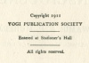

  
[Intangible Textual Heritage](../../index)  [Esoteric](../index.md) 
[Yoga](../../hin/yoga/index)  [Index](index)  [Next](dsc01.md) 

------------------------------------------------------------------------

[Buy this Book at
Amazon.com](https://www.amazon.com/exec/obidos/ASIN/1406777439/internetsacredte.md)

------------------------------------------------------------------------

  
*Yoga Lessons for Developing Spiritual Consciousness*, by A.P. Mukerji,
\[1911\], at Intangible Textual Heritage

------------------------------------------------------------------------

##### YOGA LESSONS

###### FOR

# DEVELOPING SPIRITUAL CONSCIOUSNESS

###### BY

## SWAMIE A. P. MUKERJI

### ASSOCIATE EDITOR,

### KALPAKA MAGAZINE OF INDIA

#### PUBLISHED BY

#### YOGI PUBLICATION SOCIETY

#### MASONIC TEMPLE, CHICAGO, ILL.

#### REPRESENTATIVES

#### L. N. FOWLER & COMPANY

#### 7, IMPERIAL ARCADE, LONDON, ENGLAND.

#### THE LATENT LIGHT CULTURE

#### TINNEVELLY, SOUTH INDIA.

#### \[1911\]

Scanned, proofed and formatted by John Bruno Hare at Intangible Textual
Heritage, May 2008. This text is in the public domain in the US because
it was published prior to 1923.

  [  
Click to enlarge](img/cover.jpg.md)  
Front Cover and Spine  

  [  
Click to enlarge](img/title.jpg.md)  
Title Page  

 
[  
Click to enlarge](img/verso.jpg.md)  
Verso  

<table data-border="1" width="50%">
<colgroup>
<col style="width: 100%" />
</colgroup>
<tbody>
<tr class="odd">
<td data-valign="top" width="655"><h3 id="dedication" data-align="center"><em>DEDICATION</em></h3>

<em>I dedicate this work with deep respect and love to D. P. Mukerji whose holy blessings I invoke for the spiritual well-being of my readers' intelligence. May this Great Soul inspire. Aum</em>.

<em>A. P. Mukerji</em>.
</td>
</tr>
</tbody>
</table>

 

------------------------------------------------------------------------

[Next: Contents](dsc01.md)
