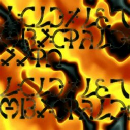

 [Internet Book of Shadows](../../bos/index) 
[Esoteric/Occult](../index)  

------------------------------------------------------------------------

|                                     |                                                 |
|-------------------------------------|-------------------------------------------------|
|  | Enochian Magic |

 

These texts relate to the theory and practice of Enochian Magic. All of
these texts are pre-World-Wide-Web bulletin board postings.

[The Calls of
Enoch](callench)  
[Enochian
Rituals](../../pag/enochrit.txt) \[Anon.\]  
[An Enochian
dictionary](../../pag/enoch1.txt) by Fra:.
Michael 111  
[An essay on the pronunciation of
Enochian](../../pag/pr_calls.txt) by Christeos
Pir  
[ADVORPT -- 90th region in the
progression of the Aethyrs](advorpt.txt) \[Anon.\]   
[A vision of the Square "T" of ISMT
of the Fiery Lesser Angle of the Earth Tablet](enochvis.txt)
\[Anon.\]  
[Gematria Values of the Enochian
Characters](keys.txt) \[Anon.\]  
[The Lotus of Power
Ritual](lotus.txt) by Josh
Norton  
[Enochian Magick](names.txt)
\[Anon.\]  

------------------------------------------------------------------------

### Texts by Benjamin Rowe

[Book of the
Seniors](seniors.txt)

#### Enochian Temples

[ENOCHIAN TEMPLES -- Contruction of
the Macrocosmic Enochian Temples](enochtmp.txt)  
[THE LOWER TEMPLE -- Construction of
the Microcosmic Temples](lowertem.txt)  
[THE TEMPLE OF FIRE -- Consecrating
the Temple of the Fire Tablet](firetmp.txt)  
[THE CACODEMONS -- Invoking the
Cacodemons with the Temples](cacodemo.txt)  
[THE ABYSS EXPERIENCE -- Generating
the Abyss Experience](abyss.txt)  
[THE FIRST KEY -- An Analysis of the
First Enochian Call or Key](1stkey.txt)  
[THE SECOND KEY -- Experiments with
the Second Enochian Call or Key](keytwo.txt)  
[THE RITUAL OF THE HEPTAGRAM --
Using Dee's Heptarchic System](hptgram.txt)  
[THE RITUAL OF THE HEXAGRAM -- An
experimental Enochian Ritual](hexgram.txt)  
[THE AEONIC PERSPECTIVE -- Temples,
INRI/IRNI and the Set/Horus Duality](aeonpers.txt)  
[SET / HORUS -- Further examination
of the Set/Horus Mythos](sethorus.txt)  
[DIVINE CREATION AND INTIATION --
The process of Aeonic Emanations](initseq.txt)  
[THE PATHS -- A brief listing of the
Achadian Paths](paths.txt)  
[THE LAND -- Medieval Social
Structure and the Achadian Tree](theland.txt)  
[THE BOOK OF THE ARCHER -- Using the
Astrological Chart as a Lamen](archer.txt)  
[THE ZODIACAL ROUND -- The
precessional sequence as steps in
Creativity](zround.txt)  
[SOME NOTES ON GEMATRIA IN LIBER AL
-- Random musings on Liber AL](alnotes.txt)  

------------------------------------------------------------------------

 Warning: Some of these texts may be
copyrighted.
