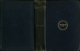
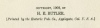

  
[Intangible Textual Heritage](../../index)  [Esoteric](../index.md) 
[Index](index)  [Next](goal01.md) 

------------------------------------------------------------------------

[Buy this Book at
Amazon.com](https://www.amazon.com/exec/obidos/ASIN/1428625305/internetsacredte.md)

------------------------------------------------------------------------

  
*The Goal of Life*, by Hiram Butler, \[1908\], at Intangible Textual
Heritage

------------------------------------------------------------------------

p. i

# THE GOAL OF LIFE

###### OR

## Science and Revelation

###### BY

### H. E. BUTLER

##### Author of Seven Creative Principles, Solar Biology, Narrow Way of Attainment, Practical Methods, et al.

Knowing is transcendently above all attributes. Reason is the dividing
line between the human and the animal. Sensations and emotions are
common to all life.

"The words that I have spoken unto you are spirit, and are life."—Jesus.

#### ESOTERIC PUBLISHING COMPANY

#### Applegate, California, U. S. A.

#### \[1908\]

Scanned, proofed and formatted at Intangible Textual Heritage by John
Bruno Hare, May 2008. This text is in the public domain in the US
because it was published prior to 1923.

 
[  
Click to enlarge](img/cover.jpg.md)  
Cover  

  [  
Click to enlarge](img/title.jpg.md)  
Title Page  

 
[  
Click to enlarge](img/verso.jpg.md)  
Verso  

p. ii

COPYRIGHT, 1908, BY

H. E. BUTLER.

\[Printed by the Esoteric Pub. Co., Applegate, Calif., U. S. A.\]

------------------------------------------------------------------------

[Next: Logical Structure of this Work](goal01.md)
