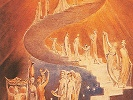

  
[Intangible Textual Heritage](../../index)  [Esoteric](../index.md) 
[Index](index)  [Previous](goal00)  [Next](goal02.md) 

------------------------------------------------------------------------

[Buy this Book at
Amazon.com](https://www.amazon.com/exec/obidos/ASIN/1428625305/internetsacredte.md)

------------------------------------------------------------------------

  
*The Goal of Life*, by Hiram Butler, \[1908\], at Intangible Textual
Heritage

------------------------------------------------------------------------

p. iii

### Logical Structure of this Work.

 

The facts in nature are the foundation out of which all consciousness
and knowledge grow. Science is the outgrowth of these facts through
careful investigation and study. Revelation is facts derived from the
inner-consciousness—intuition—which is allied to the cause-world and is
cognizant of the mind from which it originated, or from messengers
(angels) from God.

Revelation united with science gives a substantial foundation for
philosophy and theology, which are the proper outgrowth of science and revelation.

Philosophy is the mathematics of reason applied.

------------------------------------------------------------------------

[Next: Preface](goal02.md)
