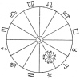

  
[Intangible Textual Heritage](../../index)  [Esoteric](../index) 
[Index](index)  [Previous](goal19)  [Next](goal21) 

------------------------------------------------------------------------

[Buy this Book at
Amazon.com](https://www.amazon.com/exec/obidos/ASIN/1428625305/internetsacredte)

------------------------------------------------------------------------

  
*The Goal of Life*, by Hiram Butler, \[1908\], at Intangible Textual
Heritage

------------------------------------------------------------------------

p. 192

### CHAPTER XVI.

#### THE IMAGE OF GOD

We read in Genesis i. 27, that "God
created man in his own image, in the image of God created he him." If we
are to consider "The Image of God" in man, as the physical expression or
form of man, then we must consider the *creative form* as manifested in
nature. As we have stated in a former chapter, that all nature is His
body and "God the soul" of all, it is evident that we have before us a
vast field of thought.

In the childhood of our race we were satisfied to believe that as man
was made in the image of God, God must be in the image of man. While
this statement is in itself correct, yet it comes so far short of the
great truth involved, that the early church was caused to draw a sharp
distinction between what is called the work of God and the work of
nature. It is a sad commentary on the advancement of our race that even
now, we hear professed scientists say that God has nothing to do with
some great convulsion of nature, because it can be traced to some
natural cause. It is just at this point that infidelity is growing most
rank.

p. 193

\[paragraph continues\] But when we accept
the fact that God is the Soul and Creative-Power active in all that is,
we have laid a foundation for reasonable, orderly thought.

Starting, then, from this, the fundamental truth, to search for the
*image of man* in the great universal whole, we are led back to a line
of thought that, because of the prevailing materialism and ignorance,
has been for the last century in great disrepute. We refer to the
recognition of the influence of the heavenly bodies over our earth and
over man.

Sometime in the long-forgotten past some one discovered what the Greeks
denominated the "circle of animals"—the *zodiac*. The term *circle of
animals*, although displaying a partial ignorance of the real nature of
the thing named, yet indicates a great truth—a truth discerned by seers
and sages of all past ages down to our own time; notably among whose
names stand those of Plato and Swedenborg, who saw what they called the
"Grand Man of the Heavens."

In 1887 the author of the present volume published a work entitled Solar Biology. The special object of this work
is to delineate character from the date of birth of a person. In this
work it is proved, as accurately as any scientific fact can be proved,
that a person is dominated and characterized by that function of the
human body represented by the particular sign of the zodiac in which the

p. 194

earth was at the time of his birth. The Apostle Paul seemed to have a
conception of this fact when he said:

"The body is one, and hath many members, and all the members of that one
body, being many, are one body For the body is not one member, but many.
If the foot shall say, Because I am not the hand, I am not of the body;
it is not therefore not of the body. And if the ear shall say, Because I
am not the eye, I am not of the body; it is not therefore not of the
body. If the whole body were an eye, where were the hearing? If the
whole were hearing, where were the smelling? But now hath God set the
members each one of them in the body, even as it pleased him. And if
they were all one member, where were the body? But now they are many
members, but one body. . . . And whether one member suffereth, all the
members suffer with it; or one member is honored, all the members
rejoice with it. Now ye are the body of Christ, and members each in his
part." (I. Cor. xii. 12-27.)

To make a statement of the fact without attempting to prove its verity,
let us assume that surrounding our sun there is what may be called
*twelve oceans of etheric life*, separated, one from another, by
well-defined lines, and that these *twelve oceans* contain qualities
represented by the twelve functions of the human organism, beginning
with Aries, the head of the Grand Man; followed by

p. 195

\[paragraph continues\] Taurus, the neck;
Gemini, the hands and arms; Cancer, the breast; Leo, the heart; Virgo,
the stomach and digestive system; Libra, the reins, and so on through
the twelve functions of the human organism.

Through these twelve oceans all the planets of the Solar System pass in
their voyage around their parent sun. A planet and the particular ocean
in which it is immersed reciprocally contribute their qualities—the
ocean of life receives from the planet and the planet, in turn, from the
ocean of life, its people being dominated by the qualities of that
ocean. With the aid of Solar Biology any
one can prove these statements to be facts.

We find that around our earth there is also a zodiac, whose influence
governs the physical body and its senses. This zodiac is separate from
the zodiac of the sun and in its exact image, with the single exception
that the order of the earth's zodiac is a reversal of the sun's zodiac.
For illustration: When the earth is on that side of the sun represented
by the sign Aries, and the moon is on a line with the sun and earth it
is new in the sign Aries of the earth's zodiac, thus showing that, in
relation to each other, the two zodiacs are in reversed order. Again,
the earth being in the sign Aries, the moon is full—that is, it is on a
line with the sun and the earth, and on the side of the earth opposite
to the

p. 196

sun—when it is in the sign Libra. (See accompanying diagram.)

  [  
Click to enlarge](img/19600.jpg)

We particularize in regard to this matter because it is an important
truth in psychology that this reversal is indicated in the fact that
every truth received by the individual through the senses is reversed to
the mind. This accounts for the great perversion of truth; no one can
realize to what extent truth is perverted until he has developed to a
point where the spiritual consciousness begins to dominate the
personality. We have diverged, however, from the direct line of our
thought—though, perhaps, necessarily.

p. 197

We have brought to your mind a picture of the Grand Man of the Heavens
in the position of the fetus in the womb, with head and feet together,
surrounding the sun, and another surrounding the earth. And we have also
hinted at the fact that in the movements of these heavenly bodies,
creation is carried on; that each of the various members of the human
family, created at the different periods of the year, is the embodiment
of a specific function of the Grand Man of the Heavens. But each of
these persons is also the embodiment of the qualities of the entire
zodiac or has these qualities represented in his organism. He is
dominated, however, by the quality of that particular function in which
he was born, for, as we have seen, each of the twelve oceans represents
one of the twelve functions that constitute the human organism.

As, therefore, the heavenly bodies are the mind-organs of the Infinite,
engaged in the work of creation by means of their constant revolution
around their center, and as man is the product of those creative
energies, being in the exact image of the zodiac, it is evident that, in
the words of the Scriptures, "God created man in his own image, in the
image of God created he him."

This fact gave rise to the following poem by a modern poet:

"Twelve Angels rule the planetary scheme;  
 Each hath an orb; one Deity supreme  
 Is their indwelling life; they bow the knee p.
198  
 To one God-man who rules immensity.  
 Twelve angel nymphs in air, earth, sea and fire  
 Dwell with a viewless and unnumbered choir,  
 Ruling the elements; twelve oceans roll  
 Their light waves from the one Creative Soul;  
 Twelve archetypal spheres rule time and space;  
 Twelve primal splendors shine from God's own face."

THE ORGANIZED IMAGE

We have been considering the *expression* of the *creative image* in its
material and earth-mind manifestation—a manifestation which had its
beginning when man was formed. But the image in its expression by no
means stops here—this is but its beginnings. In order that there may be
an organism capable of expressing Divinity, there must be an aggregation
of such individual bodies.

As the apostle has stated in the foregoing quotation, there must be the
bringing together of a Body of people whose minds have sufficiently
developed to realize something of their Source and to desire to come
into perfect unison, oneness, with the Mind and Will that formed them.

Man, as we find him at the beginning of this the Twentieth Century, has
his whole interest, desire and thought centered upon self—me and mine.
Thus he is held as a part separated from the Grand Body, the Body of
Humanity. As the animal world, he is struggling with his fellows,
fighting for his own supremacy. Consequently,

p. 199

labor, sorrow, and death appear on every side, arising from the same
cause which produces disease in the individual body, namely, every organ
is out of harmony with the body-general. Therefore the whole body of
humanity is diseased from the crown of the head to the soles of the
feet, every organ and function warring against the other members and
against the fountains of immortality—the Source of being.

Thus death reigns supreme and will so reign until the formation of the
Body of the Christ, vaguely referred to in the quotation from Paul. Each
individual is not in himself an organ or function of the Body of
humanity. Were this true, the race would be constituted of but twelve
individuals. On the contrary, each individual is but a molecule in the
Grand Body, and each of these molecules finds its place in its own
function, and thus the body is formed of a multitude of members.

All living bodies are composed of an aggregation of molecules, each a
living organism with a separate, yet united, consciousness, but governed
by a common law of attraction, which causes it to unite, become one,
with the general body. Now the body of the individual man, constructed
of these molecules becomes, in turn, a molecule in a greater and grander
aggregation which is called in Revelation "the Body of the Christ."

The question arises here: How can there be an

p. 200

aggregation of men and women so united as to constitute one body, a
united whole? Such a condition would certainly be a normal one in view
of the constitution of the race, but a survey of the plane next beyond
us answers the question more fully. The indications to which we
refer—active upon the plane next beyond the masses—are these:

Here and there scattered through the world are men and women who have
reached a degree of sensitiveness that enables them to feel the mental
state of a person as soon as they come in contact with him, and
immediately there arises within them a feeling either of attraction or
repulsion—a loving sympathy or a painful impression of something
poisonous to their nature. This is but the beginning, an anticipating,
of a plane of existence which must necessarily obtain in the order of
progressive unfoldment and refinement of the race.

Earth's greatest teacher used the vine as a symbol of the formation of
this body:

"I am the vine, ye are the branches: He that abideth in me, and I in
him, the same bringeth forth much fruit: . . . If a man abide not in me,
he is cast forth as a branch, and is withered."

The apostle takes up the thought expressed in this quotation and speaks
of the wild olive-branch being grafted upon the fruitful tree, and God
through the prophet uses like symbolism. Not to multiply words, but that
we may at once get at the central thought, we ask you to bear this
symbolism

p. 201

in mind. The methods of being grafted into the true vine are referred to
by the Christ in John xv. 1.

When men have been born from above and their soul-powers developed to
where they begin to live from God as did the Lord Christ, their minds
will be illuminated and they will see that the Spirit of God is one and
that all who live from the Spirit of God must necessarily be one. This
oneness is brought to light in Revelation, chapters i., vii., xiv., xxi.
and xxii.

In order to bring this thought more clearly to mind, let us picture
144,000 persons, or 288,000 men and women, who have become so developed
in soul consciousness that each individual feels the feelings of every
other and of the Body *in toto*, and not only feels but is as vividly
conscious of the thoughts of the individual members of the Body and of
the Body in its entirety as he is of his own thoughts. Would not this be
a condition that would virtually do away with the separate individuality
of the members of the Body? Would it not—we ask you to consider the
question—constitute all the members of that Body as perfectly one, as
are the molecules that compose our own organism, in their unity forming
the individual man?—It would most assuredly.

Now if this Body of 144,000 members is to be constituted of the most
highly developed men and women of our planet, we should naturally look
for

p. 202

the grandest aggregation of mind that the world has ever known.
Moreover, we must consider each and every member of that Body as living
the *regenerate life*, conserving and storing up within himself (or
herself) all the vitality that is generated by the body through a normal
sex action; thus, not only increasing his normal capacities many, many
fold, but, through the fires of the Divine Life active within him,
transmuting, refining and intensifying the elements of his own body,
increasing his sensitiveness, intensifying his sensibilities, and
becoming more and more vividly conscious of his dependence upon every
other member of the Body for the perfection of his own individual
organism.

It is evident, therefore, that such a Body of people would be so drawn
together by common sympathy that each member would be satisfied and
happy in the fact that he is able to be his own normal self,
supplemented and completed by the normal action of every other
individual. Thus, in the light of absolute truth, disagreement or
inharmony would be impossible in such a Body. Now this is the Body
brought to light in the twenty-first chapter of Revelation.

But this is only the human side of it. The prophet seeing the ultimation
of this, the Divine Purpose, exclaims, "Yahveh is in his holy temple: let all the earth
keep silence before him." (Hab. ii. 20.) And the apostle particularized
the same thought when he said, "Know ye not that ye are the temple

p. 203

of God, and that the Spirit of God dwelleth in you?"

As we have had occasion to say in former chapters—and shall more fully
elaborate in the chapters that are to follow—the methods of life which
are to bring men and women to this ultimate, all tend to the one central
object of uniting their consciousness to God, their Heavenly Father.
Herein is found the perfection of the symbolism chosen by the Lord
Jesus—the symbol of the vine—for, as spiritual beings, men came out from
God, and to attain this ultimate they must return to God, return to a
conscious oneness with their Source. They must live from God as
literally as the vine lives from the earth, air, and sun-light. And as
the same sap that nourishes the vine, nourishes all its branches and its
fruitage, so the Body as to its individual members—being united with the
Christ ("the true vine") and he with the Father—will be partakers of the
same life, the same Spirit. The mind and will (Spirit) of God will be
the mind of all the Body in the same direct way that a common life
unites all the molecules of our individual bodies.

Let us now sum up the dominant thought of this work:

This Grand Body has evolved from the lowest form of life to the most
highly developed men and women of our planet, these have increased,
refined, and intensified their faculties many fold; add to

p. 204

these highly developed mind-qualities, the mind-qualities gained by a
perfect unity with the whole Body of mind; illuminate such a Body of
mind by a perfect unity with the mind-currents of Yahveh Elohim, and you have man with the
"dominion" over the whole earth, the finished creation, the image of the
"God Man of the Heavens"—"The Image of God."

This is a brief summing up of the history of the journey of the soul
from God and its return to God—to his \[mage.

Can you imagine the power of this Body upon our planet? Do you wonder
that in the Revelation given to Saint John, it is said that they shall
be "kings and priests unto God and reign on the earth"? This Body will
be the God of the planet, even as Elohim is the God of the Solar System.

Herein is the fulfilment of the purpose declared in the beginning—to
make man in the Divine Image; for the Image of Yahveh Elohim can be perfected upon the earth
only through the organization, the fitting together, of such a Body. And
constituting that Body "Yahveh Elohim,"
or giving it a right to the name "Yahveh," means that every individual member in
his (or her) consciousness has united himself to the God of the
universe, in the same direct way that the members of that Eternal
Brotherhood—that has existed in all worlds from all time—have united
their lives with Yahveh the God of all
systems of worlds;

p. 205

and they are conscious in and of him, in other words, conscious that
they are merely a mind-center produced by Yahveh, through which he finds expression.

The next step in the developing of our race and planet, is to be the
*gathering* and *constructing* of such a Body as we have pictured, and
this Body will be but one mind-organ of the Infinite. But we are
encroaching upon our chapter on "The Image and Likeness," wherein this
subject will be further discussed.

------------------------------------------------------------------------

[Next: Chapter XVII. The Likeness of God: The Office of the
Christ](goal21)
