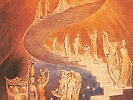

  
[Intangible Textual Heritage](../../index)  [Esoteric](../index.md) 
[Index](index)  [Previous](goal24)  [Next](goal26.md) 

------------------------------------------------------------------------

[Buy this Book at
Amazon.com](https://www.amazon.com/exec/obidos/ASIN/1428625305/internetsacredte.md)

------------------------------------------------------------------------

  
*The Goal of Life*, by Hiram Butler, \[1908\], at Intangible Textual
Heritage

------------------------------------------------------------------------

p. 266 p. 267

# THE PERSONAL APPLICATION

p. 268 p. 269

*We introduce the following chapters to aid those whose minds are
reaching out for methods by which to attain the ultimate that has been
set forth in this work. We have not attempted to give the methods in
their regular sequence, because the experiences of each individual will
be different, and the angel of the Lord will lead each one according to
his peculiar quality and temperament. We believe these facts are
presented for the first time to the world because the time has arrived
for the coming of the MESSENGER OF THE COVENANT referred to in the third
and fourth chapters of Malachi. The office of this MESSENGER OF THE
COVENANT will be to lead men to the Door, to the Christ, who will
introduce them in thru the gate into the city to the Father, for, as we
have before stated, the time has come for the establishment of that
Eternal Order in the physical form upon earth once more, of which Order
Christ came as a member, and as he said 1900 years ago, so say we, "Be
ye also ready; for in an hour that ye think not the Son of* \[*a*\] *man
cometh*."

------------------------------------------------------------------------

[Next: Chapter XXI. Part I](goal26.md)
