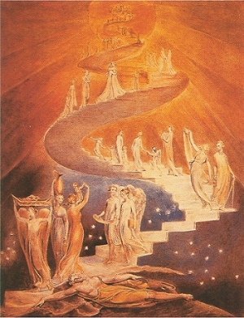

  
[Intangible Textual Heritage](../../index)  [Esoteric](../index.md) 

------------------------------------------------------------------------

[Buy this Book at
Amazon.com](https://www.amazon.com/exec/obidos/ASIN/1428625305/internetsacredte.md)

------------------------------------------------------------------------

<table width="75%">
<colgroup>
<col style="width: 50%" />
<col style="width: 50%" />
</colgroup>
<tbody>
<tr class="odd">
<td width="50%" data-valign="TOP"> 
William Blake, Jacob's Ladder, (ca. 1800) [Public Domain Image]</td>
<td width="50%" data-valign="CENTER"><h1 id="the-goal-of-life" data-align="CENTER">The Goal of Life</h1>
<h2 id="by-hiram-butler" data-align="CENTER">by Hiram Butler</h2>
<h4 id="section" data-align="CENTER">[1908]</h4></td>
</tr>
</tbody>
</table>

------------------------------------------------------------------------

[Contents](#contents)    [Start Reading](goal00.md)    [Page
Index](pageidx)    [Text \[Zipped\]](goaltxt.zip.md)

------------------------------------------------------------------------

|                                                                                                                           |
|---------------------------------------------------------------------------------------------------------------------------|
|  |

Hiram Butler, a 19th Century American occultist best known (if at all)
for the book [Solar Biology](../../astro/sb/index.md), started the Esoteric
Society in Boston in the late 1880s. He fled Boston in 1891 after a
murky dispute with the better-known Theosophical Society. He ended up in
Applegate, California, a small town on the outskirts of Auburn in the
Sierra foothills. The Esoteric Society was set up on land purchased from
Leland Stanford in 1892, and Butler and a handful of disciples lived
there. Later the Society had to change names to the Esoteric Fraternity
for legal reasons.

This book is Butler's description of the entire spiritual evolution of
humanity. Based on a mystical vision of Christianity, Butler thought
that an invisible 'Order of Melchisedek,' 288,000 strong (144,000
male-female couples) would eventually be able to transcend the
limitations of physical reality and become as 'Elohim,' the plural
components of God. He also brings into the mix other parts of his
world-view, including his simplified version of Astrology, and many
ideas similar to those promoted by [New Thought](../../nth/index.md).

Butler is practically unknown today but he had a huge influence on
vernacular occult writing in America, particularly the popular Yogi
Publication Society (YPS) books authored by William Atkinson, who was
known to quote Butler on occasion.--J.B. Hare, May
30th, 2008.

------------------------------------------------------------------------

 [Title Page](goal00.md)  
[Logical Structure of this Work](goal01.md)  
[Preface](goal02.md)  
[To the Reader](goal03.md)  
[Contents](goal04.md)  
[Chapter I. Development](goal05.md)  
[Chapter II. The Existence of Higher Faculties](goal06.md)  
[Chapter III. Reason and Religion](goal07.md)  
[Chapter IV. Conscience](goal08.md)  
[Chapter V. Evolution](goal09.md)  
[Chapter VI. Other Worlds Than Ours](goal10.md)  
[Chapter VII. The Immensity of the Universe](goal11.md)  
[Chapter VIII. The Great Name, Yahveh](goal12.md)  
[Chapter IX. The Manifestation of Yahveh](goal13.md)  
[Chapter X. Mind-Centers](goal14.md)  
[Chapter XI. The Elohim](goal15.md)  
[Chapter XII. The Eternal Order of Melchisedek](goal16.md)  
[Chapter XIII. Jesus of the Order of Melchisedek](goal17.md)  
[Chapter XIV. The Angels of God](goal18.md)  
[Chapter XV. The Miraculous Conception](goal19.md)  
[Chapter XVI. The Image of God](goal20.md)  
[Chapter XVII. The Likeness of God: The Office of the Christ](goal21.md)  
[Chapter VIII. The Likeness of God: Three Steps](goal22.md)  
[Chapter XIX. The Likeness of God: Man Becoming Yahveh Elohim](goal23.md)  
[Chapter XX. The Image And The Likeness](goal24.md)  
[The Personal Application](goal25.md)  

### Exit From the Old to the New

[Chapter XXI. Part I](goal26.md)  
[Chapter XXII. Part II](goal27.md)  
[Chapter XXIII. Part III](goal28.md)  
[Chapter XXIV. Part IV](goal29.md)  
[Chapter XXV. Part V](goal30.md)  
[Chapter XXVI. Part VI. Prayer](goal31.md)  
