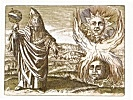

  
[Intangible Textual Heritage](../../index)  [Esoteric](../index.md) 
[Index](index)  [Previous](htaq06)  [Next](htaq08.md) 

------------------------------------------------------------------------

[Buy this Book at
Amazon.com](https://www.amazon.com/exec/obidos/ASIN/0911662316/internetsacredte.md)

------------------------------------------------------------------------

  
*Hidden Treasures of the Ancient Qabalah*, by Elias Gewurz, \[1918\], at
Intangible Textual Heritage

------------------------------------------------------------------------

p. 71

*The Mystery of Time and Space*

p. 72

<table data-border="0">
<colgroup>
<col style="width: 100%" />
</colgroup>
<tbody>
<tr class="odd">
<td data-valign="top">
<em>O, sometimes comes to soul and sense 
The feeling which is evidence 
That very near about us lies 
The realm of Spirit mysteries.—Whittier</em>.
</td>
</tr>
</tbody>
</table>

p. 73

### V.

### THE MYSTERY OF TIME AND SPACE

Time and space are the fundamental conceptions which form the warp and
woof of our thought. We cannot think of anything except it is, was or is
to be, and yet, in their very essence, time and space are the most
elusive of problems and can never be grasped by the mind of man. What is
time? What is space? What existed before time began, and what will
remain when time is no more? What does space mean? Is it a homogenous
substance of one kind? or is it heterogeneous and formed of a variety of
elements? Where does space cease to be? What is there where space is
not? Now these are a few questions very interesting indeed and pregnant
with thought. We may not succeed in finding a final solution to the lot
of them, but we may perchance succeed in contributing a mite towards a

p. 74

better understanding of them.

Science, the interpreter of the laws of nature and of the principles
underlying them, cannot help us in our search to solve the mystery of
time and space. The proper domain of Science is the physical universe.

This modern archangel (science) has no wings. An invincible giant, when
her feet touch the earth, her marvelous power, her initiative, wisdom
and penetrating intelligence are all gone the moment she rises above the
soil, and, though it be only a few inches, upon this battlefield she is
overcome at once—faint and almost inanimate in an unequal battle because
she could not readjust her energies to new conditions. At present
science is a child of earth and waits for her redeemer, through whom she
will be born again a child from heaven.

In the matter of positive investigations, science has no equal; she is
almost infallible, but she is at once rendered powerless when confronted
by a problem of the spiritual order, or even when it concerns a—so

p. 75

to say—mixed problem (such as the genesis of matter or the abnormal
organic growths of animals or plants) science is silent, or perhaps just
stammers.

Now that which the seemingly almighty scientific mind cannot accomplish
by its own unaided efforts, the spiritually awakened soul can, and often
does, accomplish. Time and space do not exist for the soul of man. The
mystery which they constitute to the earthly mind is non-existent to the
enlightened spirit. Time, or the succession of events pertain to things
material. On the spiritual planes we live in feeling and thought, and it
is the feebleness or strength of these which determines the quality of
our life on those planes, and distinguishes one being from another.
Space again is equally illusory to the soul. Spirit is not separated
from spirit by distance, but by discord of nature, and on the other hand
spirit is not united to spirit except by the affinity subsisting between
them. We can be thousands of miles away from our loved ones but we do
not get estranged from them

p. 76

thereby, whereas we may be very close in space to one wishing us ill,
and the fact of spatial proximity will not bring our souls nearer to
each other. The eternity of time and the infinity of space can be viewed
and grasped by those beings only whose minds have learned to function
beyond those concepts. Just like the law of Karma which must be
transcended in order to be understood, so must the limits of time and
space be got rid of by the spiritualization of our thought before we can
grasp their meaning. To incarnate humanity, dependent in a thousand
different ways upon material conditions, time and space are necessary
conceptions; without them there would be chaos in our minds. But for the
liberated soul, even on the earth plane, time and space can be relegated
to the limbo of things superfluous.

When man once makes up his mind to live the higher life and to think of
every experience as related to the spirit and either helpful or hurtful
to it, then time and space will matter little to him. His motive and

p. 77

his action and the spirit that prompts them are all that he cares for,
from the moment of his surrender.

The dignity and meaning of our lives do not depend upon the years we
have lived, nor does the height of our spiritual stature hear any
relation to our physical dimension in space. It is only the things which
make for growth in perfection that really do count.

And, on the other hand, only those events injure us which weaken our
faith and obscure the larger hope. The education and spiritualization of
our will being the immediate object of our terrestial existence, time
and space signify to us only as much as they serve that object. The only
other purpose which time and space serve is the lessening of the evils
inherent in the lower life of the race.

The evils from which humanity suffers are not eternal, but confined io
the limits of time. They diminish and their intensity decreases in the
same proportion as humanity expands its life both in space and in

p. 78

time. The end of all those evils will be their ultimate disappearance by
being reduced to what geometry call the "infinitely little." It will
happen in the same way—to use a simple illustration—as would be the case
if a pound of salt were thrown into a bucketful of water; it would
*strongly* salt it, while, if it were thrown into a cistern, it would
only *very slightly do so*. In a pond, its taste would hardly be
noticeable, and absolutely nothing would remain of its effect if it were
thrown into a river. Humanity's evils, too, will disappear in the
infinity of space and the eternity of time.

Time and space are the remedies which can cure the evils afflicting
mankind. These evils would be incurable had Adam (the universal man, or
group soul) preserved its life unchangeably. He had to be divided in
space, in order to be healed and for the sake of his reduction and
division *ad infinitum* by means of time; whenever this division is
accomplished time will come to an end, and divisible space will
disappear. Then will Adam (the universal life) return to its

p. 79

primitive state of an indivisible and immortal unity.

Death is only a phenomenal change, and of no more consequence to man
than the other changes he has to undergo in the course of his evolution.
It simply transmutes the human being from the state of visible nature
into that of formless and invisible substance, just like birth manifests
what was formerly in a state of substance, on the plans of visible
nature.

The old Kabbalists used to express it in a like manner: "There is no
birth, nor death, only continual change and transformation from state to
state. This makes up the being and existence of all the kingdoms,
mineral, vegetable, animal and human."

So time and space fulfill their mission by curing the evils from which
mankind must needs suffer in its early stages of evolution and by
providing the race with the means of redemption from all that is base
and unworthy.

Having freed himself from the limitations of time and space, man
realizes that

p. 80

he is a citizen of this grand cosmos and that his rights and privileges,
as an immortal and eternally progressive being, cannot be gainsaid. In
the infinity of the universe man feels for the first time at home. He
never again fears spiritual extinction, for his deathless soul ensures
for him life everlasting. If man identifies himself with nature, he has
to be transformed by her, if, with the Spirit, he is redeemed by God.

There is no death anywhere, except the unconsciousness of God's
presence. To acquire an abiding consciousness of God's presence means to
have transcended both time and space, to live in the spirit and to
prepare one's self for service in the higher worlds and vaster systems,
where there is neither time nor space, but where the Divine Spirit grows
in all excellence and perfection.

To the world at large these things sound strange, but to the children of
light, whose affections are set on things above, a glimpse comes now and
then of the glories awaiting the man who has overcome.

p. 81

The process of overcoming is an individual one and can only be known by
the soul that experiences it. The words of the prophet remain forever
true, "and to him that overcometh I will give to eat of the hidden
Mannah, and a white stone will I give him, and on it shall be written a
new name which no one knoweth save him who receiveth it."

------------------------------------------------------------------------

[Next: VI. The Peace That Passeth Understanding](htaq08.md)
