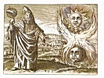

  
[Intangible Textual Heritage](../../index)  [Esoteric](../index) 
[Index](index)  [Previous](htaq09)  [Next](htaq11) 

------------------------------------------------------------------------

[Buy this Book at
Amazon.com](https://www.amazon.com/exec/obidos/ASIN/0911662316/internetsacredte)

------------------------------------------------------------------------

  
*Hidden Treasures of the Ancient Qabalah*, by Elias Gewurz, \[1918\], at
Intangible Textual Heritage

------------------------------------------------------------------------

p. 104 p. 105

*On the Threshold of the Sanctuary*

p. 106

<table data-border="0">
<colgroup>
<col style="width: 100%" />
</colgroup>
<tbody>
<tr class="odd">
<td data-valign="top">
<em>I know not where his islands lift 
Their fronded palms in air, 
I only know I cannot drift 
Beyond his love and care. 
                            —Whittier</em>.<em></em>
</td>
</tr>
</tbody>
</table>

p. 107

### VIII.

### ON THE THRESHOLD OF THE SANCTUARY

"Before the soul can stand in the presence of the Master she must have
been washed in the blood of the heart." The blood of the heart is, as we
know, the life-essence and for the soul to have been washed therein
means that life and all that belongs to it of joy and sorrow has been
relegated to a secondary place and that the foremost consideration of
that soul is now the will of her Lord who has been revealed to her in
the process of surrender. It is during this process of bathing in the
life-essence that the soul discovers some one, whom alone she would like
to serve. During the years of our indiscretion, while we are driven
hither and thither by our various likes and dislikes, we serve many
Masters, who often prove veritable tyrants to us, but when we have had
enough of them, we find that there

p. 108

is a Master of a different stamp, who lives not by our passions and
desires, but rather by their suppression and subdual. Now before the
soul has made this discovery, it is of no use for her to aspire to the
true Masters' presence. In fact, it may harm her to venture thus far. We
often find among seekers after truth, persons who have overstrained
themselves in one way or another and made themselves physical and mental
wrecks in their effort to find and live the higher life. The reason for
this is their disregard of the advice given to occultists by all the
great and good ones in respect to the dangers of the razor-edged path.
You remember how H. P. B., in the "Voice of Silence," admonishes us to
see to it that the ladder does not give way while we ascend its rungs.

The rungs of the ladder on which we climb upward are our weaknesses and
bodily failings. To overcome these is our first task before we enter the
outer court of the temple. To enter into the Holy of Holies with the old
desires clinging to us, spells

p. 109

disaster. No truly-great teacher will accept a pupil who does not seek,
by renunciation and by devotion to prove himself worthy of the wisdom
which he is striving to attain. In the Gita we are told that no one is
to be taught the higher truths who does not practice Tapas, which means
renunciation of all that is of the earth earthy. In the
[Upanishads](errata.htm#6) too, great stress is laid upon self-control,
and the great Yogis of the East have at all times been ascetics first
and disciples afterwards.

To stand in the presence of the Master implies to he a channel to their
sublime teachings, but how can one serve as a channel who has not been
purified? You would not think of drinking water that runs through an
unclean pipe, for fear of its having been contaminated. No more can one
benefit by a spiritual channel which is not thoroughly clean, for fear
of the impurities that may have found their way into it during the
process of transmission.

The blood of the heart symbolizes the passions of the earthly man, and,
in their

p. 110

control and final extinction, lies the secret of regeneration. The Path
of Discipleship is strewn with many wrecks on account of the failure to
heed the warnings of our ancient teachers who told us of the many
pitfalls on the way. The Master Hilarion, who inspired *The Light of the
Path* and who occupies a high rank in the great Hierarchy, had probably
unique opportunities to study the ways and means that best secure and
shorten the passage to the other shore. From his exalted position, he
could observe those who succeeded and those who failed and he also saw
the reason why. In this gem of occult literature, called *Light of the
Path*, he gives us the benefit of his experiences. If we value our
higher life we should not neglect so expert an advice as that of Master
Hilarion. That which troubles us most in treading the Path is our habit
of compromise. We are not whole-hearted and generally do things by
halves, the result being that, whenever we enter upon the higher stages
of advancement, we find many things to be undone and many a habit to be
broken.

p. 111

In those high altitudes the lightest discord creates wrong vibrations
which baffle the young soul just emerging from the Egyptian darkness and
not only bar her way to further progress but often throw her back into
the abyss of repeated incarnations in matter. This is not a figurative
mode of illustration, but a statement of actual fact.

There are two passages in The Outer Court to which I would like to call
your special attention. Here is the first: "When once a soul has passed
through the gateway of the Temple, she goeth out no more." The other
passage is a quotation from the Upanishads. It says, "If a man would
find his soul, the first thing to do is to cease from evil ways."

Now these two passages are complementary to each other, as you will see
presently. First, what does it mean "When a man enters the Temple he
goeth out no more." Well, it is this: If we pledge ourselves to service
and enter the Path, there can never be any withdrawal without utter
destruction of mind and body. The higher forces

p. 112

which we contact on entering the Path cannot he played with, any more
than you can play with fire. If we present ourselves to the Guardians of
these powers as servants, it is against the law to release us from our
pledge. Therefore the disciple used to he exhorted in olden times before
taking his vow, and terrible ordeals were imposed upon him prior to his
initiation.

Now turning to the other passage, "To cease from evil ways": Well, what
is evil? And what are evil ways? There are many things which the man in
the street would consider quite harmless, and yet to the disciple they
are harmful. It is this difference that must be borne in mind. For the
disciple to cease from evil ways means to refrain from every act (and
thought is an act, let us well remember) which has not the absolute
approval of the Higher Self. If the desire-nature and the mind have been
so trained as to respond to every command of the Lord within, and if
love has become the supreme Sovereign, ruling in the heart of the
disciple, then may he pledge himself

p. 113

without fear of falling back, for then only can he be sure to have
ceased from evil ways. There is a stage in the disciple's life which
merits our special attention. It is the period of the great trial of his
faith. At this stage the law of affinity makes itself felt. This
well-known law which governs the mineral world holds good in the
spiritual life of man. The affinities that bind atom to atom in the
mineral world govern also the association of thoughts and ideas. If we
try to cast aside the habits of a lifetime, as we generally do on
entering the Path, then this law of affinity, which lies latent in our
[subconscious](errata.htm#7) nature, suddenly rises against us and binds
us to those tendencies which have grown up within us throughout the
innumerable lives of the past. The disciple's task, having to face this
opposition, is to fortify himself in his inner stronghold, and to
exercise all the Divine patience of which he may be capable, in
liberating himself by short degrees from the chains which he himself has
forged. The quality most needful in this

p. 114

struggle is sweet patience. There may be failure to attain the ideal;
usually there will be many failures, for even in the higher altitudes of
spiritual endeavor there cannot be uninterrupted progress. You remember
it is said, "Even Great Ones have fallen from the threshold." So there
is great need for endurance and persistence, and after every slip and
fall the disciple must rise and take heart and, as the Gita tells us,
"return to the charge again and again."

Before the soul can stand in the Masters’ presence this battle must have
been fought and won. We are of no use to Them until this has been done.

To wash the soul's feet in the blood of the heart means to tear out the
old remembrances root and branch, not only to be able to control desire
but to have none; not only to look longingly to the great ideal before
us, but to be earnestly engaged in its realization. The mystery of the
threshold is to be ready; to have our loins girded and our lamps burning
awaiting the pleasure of the King and His command. The

p. 115

soul, which has fitted herself in good time, will find that love's labor
has not been lost and that a glorious fruition awaits her on the very
threshold of the Temple. But even while preparing for it in this life,
the truly-enlightened aspirant finds that it is indeed worth while to
obey the vision he has seen, and the calmness and serenity which
surrounds him after every conquest are the heralds of the great peace
which shall enter his heart when the sublime end has been achieved and
the day is at an end. Then the laborer shall find rest and while resting
prepare the ground for his future career in cycles yet to come and in
worlds yet to be.

We come now to a very important point, one which cannot be sufficiently
emphasized, and that is the best ways and means to be adopted by the
disciple to minimize the dangers of falling back after the Path has once
been entered. There are many books instructing us in this and each of
them is good in its own way. The Holy Qabalah teaches us that in most
cases the career of incarnate man upon earth is first expiation

p. 116

and then the acquisition of new experience. Now as to expiation, the
lives of many millions of human beings are really nothing more than one
long chain of expiation. Think of those masses of toiling, sorrowing,
starving people who have never had a chance in their lifetime. What are
they here for? But even iii the case of those whose lives are along more
pleasant lines, misery is not absent. There are plenty of heart-breaks
and sorrows, the causes of which are not always evident to the
sufferers. These causes lie generally far back in their former lives
upon earth, this present incarnation having for its object the expiation
of ancient wrongs. In the case of disciples, this truth of expiation
should never be lost sight of, for it supplies a much needed explanation
of many otherwise puzzling experiences that advanced students are called
upon to endure.

Then there is the second object of incarnation, namely, the acquisition
of new experience. This too applies to the disciple, for however
detached from earthly things

p. 117

he may already be, he still may stand in need of some knowledge which
can only be gained by his association with the children of men and by
the observation of, and participation in, these manifold struggles and
labors, incidental to earth-life. It is right here that he learns to be
in the world but not of it.

Now before the soul can stand in the presence of the Masters, this
ordeal of expiation and atonement must have been gone through. The blood
of the heart in which the Soul's feet are to be washed is just this
painful process of atoning for all the wrongs of days gone by. Thus the
soul pays back the uttermost farthing, as all souls must do, and learns
to identify herself with all that breathes and lives. No matter how
humble and lowly a human creature may be, no matter how sinful and weak,
the disciple who has learned his lessons aright knows all these
creatures to be parts of the Great Divine Love to whom they are

just as dear as he himself. Thus the Qabalah tells us that by learning

p. 118

this last lesson of identification with high and low, the disciple
becomes a cooperator with those high [intelligences](errata.htm#8) whom
we call Masters, and, under Their guidance and with their help, he
continues his career, ever upward, and ever onward, until he enters the
presence of the Ancient of Ancients, the merciful Teacher of Gods,
angels and men.

------------------------------------------------------------------------

[Next: IX. The Light Eternal According to the Qabalah](htaq11)
