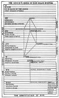

  
[Intangible Textual Heritage](../../index)  [Esoteric](../index.md) 
[Index](index)  [Previous](ihas02)  [Next](ihas04.md) 

------------------------------------------------------------------------

[Buy this Book at
Amazon.com](https://www.amazon.com/exec/obidos/ASIN/0853301107/internetsacredte.md)

------------------------------------------------------------------------

  
*Initiation, Human and Solar*, by Alice A. Bailey, \[1922\], at
Intangible Textual Heritage

------------------------------------------------------------------------

p. xiv

 
[  
Click to enlarge](img/chart.jpg.md)  
Chart  

### THE CONSTITUTION OF MAN

The constitution of man, as considered in the following pages, is
basically threefold, as follows:—

I. *The Monad, or pure Spirit, the Father in Heaven*.

This aspect reflects the three aspects of the Godhead:

|                         |                  |
|-------------------------|------------------|
| 1\. Will or Power       | The Father.      |
| 2\. Love-wisdom         | The Son.         |
| 3\. Active Intelligence | The Holy Spirit. |

and is only contacted at the final initiations, when man is nearing the
end of his journey and is perfected. The Monad reflects itself again in

II\. *The Ego, Higher Self, or Individuality*.

This aspect is potentially

|                             |                                            |
|-----------------------------|--------------------------------------------|
| 1\. Spiritual Will          | Atma.                                      |
| 2\. Intuition               | Buddhi, Love-wisdom, the Christ principle. |
| 3\. Higher or abstract Mind | Higher Manas.                              |

The Ego begins to make its power felt in advanced men, and increasingly
on the Probationary Path until by the third initiation the control of
the lower self by the higher is perfected, and the highest aspect begins
to make its energy felt.

The Ego reflects itself in

III\. *The Personality, or lower self, physical plane man*.

This aspect is also threefold:

|                       |                                          |
|-----------------------|------------------------------------------|
| 1\. A mental body     | lower manas.                             |
| 2\. An emotional body | astral body.                             |
| 3\. A physical body   | the dense physical and the etheric body. |

The aim of evolution is therefore to bring man to the realisation of the
Egoic aspect and to bring the lower nature under its control.

------------------------------------------------------------------------

[Next: Chapter I. Introductory Remarks](ihas04.md)
