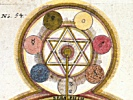

  
[Intangible Textual Heritage](../../index)  [Esoteric](../index) 
[Index](index)  [Previous](ihas05)  [Next](ihas07) 

------------------------------------------------------------------------

[Buy this Book at
Amazon.com](https://www.amazon.com/exec/obidos/ASIN/0853301107/internetsacredte)

------------------------------------------------------------------------

  
*Initiation, Human and Solar*, by Alice A. Bailey, \[1922\], at
Intangible Textual Heritage

------------------------------------------------------------------------

p. 20

### CHAPTER III

#### THE WORK OF THE HIERARCHY

Though the subject of the occult Hierarchy of the planet is of such a
profoundly momentous interest to the average man, yet its real
significance will never be understood until men realise three things in
connection with it. First, that the entire Hierarchy of spiritual beings
represents a synthesis of forces or of energies, which forces or
energies are consciously manipulated for the furtherance of planetary
evolution. This will become more apparent as we proceed. Secondly, that
these forces, demonstrating in our planetary scheme through those great
Personalities Who compose the Hierarchy, link it and all that it
contains with the greater Hierarchy which we call Solar. Our Hierarchy
is a miniature replica of the greater synthesis of those selfconscious
Entities who manipulate, control, and demonstrate through the sun and
the seven sacred planets, as well as the other planets, greater and
smaller, of which our solar system is composed. Thirdly, that this
Hierarchy of forces has four pre-eminent lines of work:

*To develop selfconsciousness in all beings*.

The Hierarchy seeks to provide fit conditions for the development of
selfconsciousness in all beings. This it produces primarily in man
through its initial work of blending the higher three aspects of spirit
with the lower four; through the example it sets of service, sacrifice,
and renunciation, and through the constant streams of light

p. 21

\[paragraph continues\] (occultly
understood) which emanate from it. The Hierarchy might be considered as
the aggregate on our planet of the forces of the fifth kingdom in
nature. This kingdom is entered through the full development and control
of the fifth principle of mind, and its transmutation into wisdom, which
is literally the intelligence applied to all states through the full
conscious utilisation of the faculty of discriminative love.

*To develop consciousness in the three lower kingdoms*.

As is well known, the five kingdoms of nature on the evolutionary arc
might be defined as follows:—the mineral kingdom, the vegetable kingdom,
the animal kingdom, the human kingdom, and the spiritual kingdom. All
these kingdoms embody some type of consciousness, and it is the work of
the Hierarchy to develop these types to perfection through the
adjustment of karma, through the agency of force, and through the
providing of right conditions. Some idea of the work may be gained if we
briefly summarize the different aspects of consciousness to be developed
in the various kingdoms.

In the *mineral kingdom* the work of the Hierarchy is directed toward
the development of the discriminative and selective activity. One
characteristic of all matter is activity of some kind, and the moment
that activity is directed towards the building of forms, even of the
most elemental kind, the faculty of discrimination will demonstrate.
This is recognised by scientists everywhere, and in this recognition
they are approximating the findings of the Divine Wisdom.

In the *vegetable kingdom*, to this faculty of discrimination is added
that of response to sensation, and the rudimentary condition of the
second aspect of divinity is to be seen, just as in the mineral kingdom
a similar rudimentary

p. 22

reflection of the third aspect of activity is making itself felt.

In the *animal kingdom* this rudimentary activity and feeling are
increased, and symptoms (if it might be so inadequately expressed) are
to be found of the first aspect, or embryonic will and purpose; we may
call it hereditary instinct, but it works out in fact as purpose in
nature.

It has been wisely stated by H. P. Blavatsky that man is the macrocosm
for the three lower kingdoms, for in him these three lines of
development are synthesised and come to their full fruition. He is
verily and indeed intelligence, actively and wonderfully manifested; He
is incipient love and wisdom, even though as yet they may be but the
goal of his endeavour; and he has that embryonic, dynamic, initiating
will which will come to a fuller development after he has entered into
the fifth kingdom.

In the fifth kingdom, the consciousness to be developed is that of the
group, and this shows itself in the full flowering of the love-wisdom
faculty. Man but repeats on a higher turn of the spiral, the work of the
three lower kingdoms, for in the human kingdom he shows forth the third
aspect of active intelligence. In the fifth kingdom, which is entered at
the first initiation, and which covers all the period of time wherein a
man takes the first five initiations, and that wherein he works as a
Master, as part of the Hierarchy, the love-wisdom, or second aspect,
comes to its consummation. At the sixth and seventh initiations the
first, or will, aspect shines forth, and from being a Master of
Compassion and a Lord of Love the adept becomes something more. He
enters into a still higher consciousness than that of the group, and
becomes God-conscious. The great will or purpose of the Logos becomes
his.

The fostering of the various attributes of divinity, the tending of the
seed of selfconsciousness in all beings, is the

p. 23

work of those Entities who have achieved, Who have entered into the
fifth kingdom and Who have there made Their great decision, and that
inconceivable renunciation which leads Them to stay within the planetary
scheme, and thus co-operate with the plans of the Planetary Logos on the
physical plane.

*To transmit the will of the Planetary Logos*.

They act as the transmitter to men and devas or angels, of the will of
the Planetary Logos, and through Him of the Solar Logos. Each planetary
scheme, ours amongst the others, is a centre in the body Logoic, and is
expressing some form of energy or force. Each centre expresses its
particular type of force, demonstrated in a triple manner, producing
thus universally the three aspects in manifestation. One of the great
realisations which come to those who enter into the fifth kingdom is
that of the particular type of force which our own Planetary Logos
embodies. The wise student will ponder on this statement, for it holds
the clue to much that may be seen in the world today. The secret of
synthesis has been lost, and only when men again get back the knowledge
which was theirs in earlier cycles (having been mercifully withdrawn in
Atlantean days) of the type of energy which our scheme should be
demonstrating, will the world problems adjust themselves, and the world
rhythm be stabilised. This cannot be as yet, for this knowledge is of a
dangerous kind, and at present the race as a whole is not group
conscious, and therefore cannot be trusted to work, think, plan, and act
for the group. Man is as yet too selfish, but there is no cause for
discouragement in this fact; group consciousness is already somewhat
more than a vision, whilst brotherhood, and the recognition of its
obligations, is beginning to permeate

p. 24

the consciousness of men everywhere. This is the work of the Hierarchy
of Light,—to demonstrate to men the true meaning of brotherhood, and to
foster in them response to that ideal which is latent in one and all.

*To set an example to humanity*.

The fourth thing that men need to know and to realise as a basic fact is
that this Hierarchy is composed of those Who have triumphed over matter,
and Who have achieved the goal by the very self-same steps that
individuals tread today. These spiritual personalities, these adepts and
Masters, have wrestled and fought for victory and mastery upon the
physical plane, and struggled with the miasmas, the fogs, the dangers,
the troubles, the sorrows and pains of everyday living. They have
trodden every step of the path of suffering, have undergone every
experience, have surmounted every difficulty, and have won out. These
Elder Brothers of the race have one and all undergone the crucifixion of
the personal self, and know that utter renunciation of all which is the
lot of every aspirant at this time. There is no phase of agony, no
rending sacrifice, no Via Dolorosa that They have not in Their time
trodden, and herein lies Their right to serve, and the strength of the
method of Their appeal. Knowing the quintessence of pain, knowing the
depth of sin and of suffering, Their methods can be exquisitely measured
to the individual need; yet at the same time Their realisation of the
liberation to be achieved through pain, penalty, and suffering, and
Their apprehension of the freedom that comes through the sacrifice of
the form by the medium of the purificatory fires, suffices to give Them
a firm hand, an ability to persist even when the form may seem to have
undergone a sufficiency of suffering, and a love that triumphs over all

p. 25

setbacks, for it is founded on patience and experience. These Elder
Brothers of humanity are characterised by a *love* which endures, and
which acts ever for the good of the group; by a *knowledge* which has
been gained through a millennia of lives, in which They have worked
Their way from the bottom of life and of evolution well nigh to the top;
by an *experience* which is based on time itself and a multiplicity of
personality reactions and interactions; by a *courage* which is the
result of that experience, and which, having itself been produced by
ages of endeavour, failure, and renewed endeavour, and having in the
long run led to triumph, can now be placed at the service of the race;
by a *purpose* which is enlightened and intelligent, and which is
co-operative, adjusting itself to the group and hierarchical plan and
thus fitting in with the purpose of the Planetary Logos; and finally
They are distinguished by a knowledge of the *power of sound*. This
final fact is the basis of that aphorism which states that all true
occultists are distinguished by the characteristics of knowledge,
dynamic will, courage, and silence. "To know, to will, to dare, and to
be silent." Knowing the plan so well, and having clear, illuminated
vision, They can bend Their will unflinchingly and unswervingly to the
great work of creation by the power of sound. This leads to Their
silence where the average man would speak, and Their speaking where the
average man is silent.

When men have grasped the four facts here enumerated, and they are
established as acknowledged truths in the consciousness of the race,
then may we look for a return of that cycle of peace and rest and
righteousness which is foretold in all the Scriptures of the world. The
Sun of Righteousness will then arise with healing in His wings, and the
peace which passeth understanding will reign in the hearts of men.

p. 26

In dealing with this matter of the work of the occult Hierarchy, in a
book for the general public, much must be left unsaid. The average man
is interested and his curiosity is aroused by reference to these
Personalities, but men are not yet ready for more than the most general
information. For those who, from curiosity, pass on to desire and seek
to know the truth as it is, more will be forthcoming, when they
themselves have done the necessary work and study. Investigation is
desired, and the attitude of mind which it is hoped this book will
arouse might be summed up in the following words:—These statements sound
interesting and perchance they are true. The religions of all nations,
the Christian included, give indications that seem to substantiate these
ideas. Let us therefore accept these ideas as a working hypothesis as to
the consummation of the evolutionary process in man and his work upon
the attainment of perfection. Let us therefore seek for the truth as a
fact in our own consciousness. Every religious faith holds out the
promise that those who seek with earnestness shall find that which they
are seeking; let us, therefore, seek. If by our search we find that all
these statements are but visionary dreams, and profit not at all,
leading us only into darkness, time will nevertheless not have been
lost, for we shall have ascertained where not to look. If by our search,
on the other hand, corroboration comes little by little, and the light
shines ever more clearly, let us persist until that day dawns when the
light which shineth in darkness will have illuminated the heart and
brain, and the seeker will awaken to the realisation that the whole
trend of evolution has been to bring him this expansion of consciousness
and this illumination, and that the attainment of the initiatory
process, and the entrance into the fifth kingdom is no wild chimera or
phantasm, but an established fact in the consciousness. This each man
must ascertain for himself. Those

p. 27

who know may state a fact to be thus and so, but the dictum of another
person and the enunciation of a theory do not aid beyond giving to the
seeker confirmatory indication. Each soul has to ascertain for himself,
and must find out within himself, remembering ever that the kingdom of
God is within, and that only those facts which are realised within the
individual consciousness as truths are of any real value. In the
meantime, that which many know, and have ascertained within themselves
to be truths of an incontrovertible nature for them, may here be stated;
to the intelligent reader will then arise the opportunity and the
responsibility of ascertaining for himself their falsity or truth.

------------------------------------------------------------------------

[Next: Chapter IV. The Founding of the Hierarchy](ihas07)
