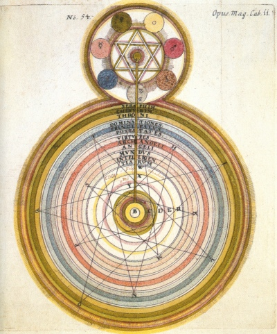

  
[Intangible Textual Heritage](../../index)  [Esoteric](../index) 

------------------------------------------------------------------------

[Buy this Book at
Amazon.com](https://www.amazon.com/exec/obidos/ASIN/0853301107/internetsacredte)

------------------------------------------------------------------------

<table width="75%">
<colgroup>
<col style="width: 50%" />
<col style="width: 50%" />
</colgroup>
<tbody>
<tr class="odd">
<td width="50%" data-valign="TOP"></td>
<td width="50%" data-valign="CENTER"><h1 id="initiation-human-and-solar" data-align="CENTER">Initiation, Human and Solar</h1>
<h2 id="by-alice-a.-bailey" data-align="CENTER">by Alice A. Bailey</h2>
<h4 id="section" data-align="CENTER">[1922]</h4></td>
</tr>
</tbody>
</table>

------------------------------------------------------------------------

[Contents](#contents)    [Start Reading](ihas00)    [Page
Index](pageidx)    [Text \[Zipped\]](ihas.txt.gz)

------------------------------------------------------------------------

|                                                                                                                           |
|---------------------------------------------------------------------------------------------------------------------------|
|  |

This is the second in our series of etexts of pre-1923 Alice A. Bailey
books. This covers her concept of the hierarchy of spiritual entities,
and the role initiation plays in that system.

------------------------------------------------------------------------

 [Title Page](ihas00)  
[Foreword](ihas01)  
[Table of Contents](ihas02)  
[Chart](ihas03)  
[Chapter I. Introductory Remarks](ihas04)  
[Chapter II. Initiation Defined](ihas05)  
[Chapter III. The Work of the Hierarchy](ihas06)  
[Chapter IV. The Founding of the Hierarchy](ihas07)  
[Chapter V. The Three Departments of the Hierarchy](ihas08)  
[Chapter VI. The Lodge of Masters](ihas09)  
[Chapter VII. The Probationary Path](ihas10)  
[Chapter VIII. Discipleship](ihas11)  
[Chapter IX. The Path of Initiation](ihas12)  
[Chapter X. The Universality of Initiation](ihas13)  
[Chapter XI. The Participants in the Mysteries](ihas14)  
[Chapter XII. The Two Revelations](ihas15)  
[Chapter XIII. The Rods of Initiation](ihas16)  
[Chapter XIV. The Administration of the Oath](ihas17)  
[Chapter XV. The Giving of the Word](ihas18)  
[Chapter XVI. The Imparting of the Secrets](ihas19)  
[Chapter XVII. Diversities of Initiations](ihas20)  
[Chapter XVIII. The Seven Paths](ihas21)  
[Chapter XIX. Rules For Applicants](ihas22)  
[An Esoteric Catechism](ihas23)  
[The Great Invocation](ihas24)  
[Glossary](ihas25)  
