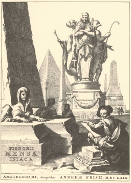

  
[Intangible Textual Heritage](../../index)  [Esoteric](../index.md) 

------------------------------------------------------------------------

[Buy this Book at
Amazon.com](https://www.amazon.com/exec/obidos/ASIN/0766181146/internetsacredte.md)

------------------------------------------------------------------------

<table width="75%">
<colgroup>
<col style="width: 50%" />
<col style="width: 50%" />
</colgroup>
<tbody>
<tr class="odd">
<td width="50%" data-valign="TOP"></td>
<td width="50%" data-valign="CENTER"><h1 id="the-isiac-tablet-of-cardinal-bembo" data-align="CENTER">The Isiac Tablet of Cardinal Bembo</h1>
<h2 id="by-w.-wynn-westcott" data-align="CENTER">by W. Wynn Westcott</h2>
<h4 id="section" data-align="CENTER">[1887]</h4></td>
</tr>
</tbody>
</table>

------------------------------------------------------------------------

[Contents](#contents)    [Start Reading](isi00.md)    [Page
Index](pageidx)    [Text](isi.txt.md)

------------------------------------------------------------------------

|                                                                                                                           |
|---------------------------------------------------------------------------------------------------------------------------|
|  |

The Bembine tablet, or the *Mensa Isiaca* is a bronze tablet with silver
and enamel inlay, probably of 1st Century Roman origin. Although it
depicts Egyptian themes, it is not Egyptian in origin. In the 17th
century, Athanasius Kircher attempted to interpret it as a key to the
Egyptian hieroglyphics, unsuccessfully. Occultists have long sought
esoteric meaning in the tablet: Westcott, Eliphas Levi, and Manly P.
Hall all believed that it was the key to the Tarot. The tablet is
currently on display in the Museum of Antiquities in Turin.

------------------------------------------------------------------------

 [Title Page](isi00.md)  
[Synopsis of Monograph](isi01.md)  
[The Isiac Tablet of Cardinal Bembo](isi02.md)  
[Advertisements](isi03.md)  
