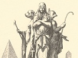

  
[Intangible Textual Heritage](../../index)  [Esoteric](../index) 
[Index](index)  [Previous](isi00)  [Next](isi02) 

------------------------------------------------------------------------

[Buy this Book at
Amazon.com](https://www.amazon.com/exec/obidos/ASIN/0766181146/internetsacredte)

------------------------------------------------------------------------

  
*The Isiac Tablet of Cardinal Bembo*, by W. Wynn Westcott, \[1887\], at
Intangible Textual Heritage

------------------------------------------------------------------------

### SYNOPSIS OF MONOGRAPH.

Introduction, Description, History.

Pignorius, opinion of.

Kircher, explanation of.

Middle Region, Theosophic system.

Superior Region, the Zodiac, and the Months.

Inferior Region, Four Quarters of the World.

Limbus, the: form of worship, the Sphynx.

Montfaucon, views of.

Shuckford, opinions of.

Warburton, opinions of.

Jablonski, annotations by.

Egyptian Chronology, the Sothiac Cycle.

Caylus, description of.

Banier, Mackenzie, Kenealy, and Winckelmann.

Recent Egyptology, the views of.

Opinions of the Author, esoteric design of the Tablet.

Occult Science, the views of Eliphas
Levi.

The Author's explanation of Levi's
Diagram.

The Book of Thoth, the Tarot.

------------------------------------------------------------------------

[Next: The Isiac Tablet of Cardinal Bembo](isi02)
