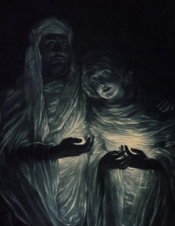

  
[Intangible Textual Heritage](../../index)  [Esoteric](../index) 
[Christianity](../../chr/index) 

------------------------------------------------------------------------

[Buy this Book at
Amazon.com](https://www.amazon.com/exec/obidos/ASIN/156459498X/internetsacredte)

------------------------------------------------------------------------

[Buy this Book on
Kindle](https://www.amazon.com/exec/obidos/ASIN/B0031574J6/internetsacredte)

------------------------------------------------------------------------

<table width="75%">
<colgroup>
<col style="width: 50%" />
<col style="width: 50%" />
</colgroup>
<tbody>
<tr class="odd">
<td width="50%" data-valign="TOP"> 
The Apparition, by James Jacques Joseph Tissot [19th cent.] (Public Domain Image)</td>
<td width="50%" data-valign="CENTER"><h1 id="jesus-the-last-great-initiate" data-align="CENTER">Jesus, the Last Great Initiate</h1>
<h2 id="by-edouard-schuré" data-align="CENTER">by Edouard Schuré</h2>
<h4 id="section" data-align="CENTER">[1908]</h4></td>
</tr>
</tbody>
</table>

------------------------------------------------------------------------

[Contents](#contents)    [Start Reading](jlgi00)    [Page
Index](pageidx)    [Text \[Zipped\]](jlgitxt.zip)

------------------------------------------------------------------------

|                                                                                                                           |
|---------------------------------------------------------------------------------------------------------------------------|
|  |

This little book, apparently excerpted from a longer work which included
sections on Krishna and Orpheus, is an esoteric look at the life of
Jesus, here considered the ultimate of a long line of 'Initiates.'
Schuré (1841-1929) was a French author who influenced Rudolph Steiner,
the German founder of Anthroposophy. Steiner also viewed Christ as both
an historical individual and as a manifestation of the divine in the
human realm.

The basis of this etext is the 1908 Yogi Publication Society edition.
There were several others, including a prior 1900 publication in London
and editions by Rider in 1917 and 1923. Unlike some of the other YPS
books, the identity of the author is not in question. Despite the
[typos](errata) which litter YPS editions, this is a delight to read.
Schuré dimensionalizes his 'Essene' Jesus by relating key points in the
story in an almost first-person fashion. --J.B.
Hare, June 25th, 2008.

------------------------------------------------------------------------

 [Title Page](jlgi00)  
[Preface](jlgi01)  
[Contents](jlgi02)  
[Chapter I. Condition of the World at the Birth of Jesus](jlgi03)  
[Chapter II. Mary—First Development of Jesus](jlgi04)  
[Chapter III. The Essenes—John the Baptist—The Temptation](jlgi05)  
[Chapter IV. The Public Life of Jesus—Popular and Esoteric
Instruction—Miracles—Apostles—Women](jlgi06)  
[Chapter V. Struggle With the Pharisees—Flight to Cæsarea—The
Transfiguration](jlgi07)  
[Chapter V. Final Journey to Jerusalem—The Promise—The Supper—Trial of
Jesus—Death and Resurrection](jlgi08)  
[Chapter VII. The Promise and Its Fulfilment—The Temple](jlgi09)  
[Advertisements](jlgi10)  
