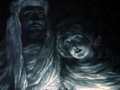

  
[Intangible Textual Heritage](../../index)  [Esoteric](../index) 
[Christianity](../../chr/index)  [Index](index)  [Previous](jlgi01) 
[Next](jlgi03) 

------------------------------------------------------------------------

[Buy this Book at
Amazon.com](https://www.amazon.com/exec/obidos/ASIN/156459498X/internetsacredte)

------------------------------------------------------------------------

[Buy this Book on
Kindle](https://www.amazon.com/exec/obidos/ASIN/B0031574J6/internetsacredte)

------------------------------------------------------------------------

  
*Jesus, the Last Great Initiate*, by Edouard Schuré, \[1908\], at
Intangible Textual Heritage

------------------------------------------------------------------------

p. 10 p. 11

### CONTENTS

|                                                                                                                        |                                 |
|------------------------------------------------------------------------------------------------------------------------|---------------------------------|
| CHAPTER I                                                                                                              |                                 |
|                                                                                                                        | PAGE |
| Condition of the World at the Birth of Jesus                                            | [13](jlgi03.htm#page_13)        |
|                                                                                                                        |                                 |
| CHAPTER II                                                                                                             |                                 |
| Mary—First Development of Jesus                                                         | [28](jlgi04.htm#page_28)        |
|                                                                                                                        |                                 |
| CHAPTER III                                                                                                            |                                 |
| The Essenes—John the Baptist—The Temptation                                             | [39](jlgi05.htm#page_39)        |
|                                                                                                                        |                                 |
| CHAPTER IV                                                                                                             |                                 |
| The Public Life of Jesus—Popular and Esoteric Instruction—Miracles—Apostles—Women       | [59](jlgi06.htm#page_59)        |
|                                                                                                                        |                                 |
| CHAPTER V                                                                                                              |                                 |
| Struggle With The Pharisees—Flight To Cæsarea—The Transfiguration                       | [74](jlgi07.htm#page_74)        |
| p. 12                                                                                        |                                 |
| CHAPTER VI                                                                                                             |                                 |
| Final Journey to Jerusalem—The Promise—The Supper—Trial of Jesus—Death and Resurrection | [88](jlgi08.htm#page_88)        |
|                                                                                                                        |                                 |
| CHAPTER VII                                                                                                            |                                 |
| The Promise and Its Fulfilment—The Temple                                               | [121](jlgi09.htm#page_121)      |

------------------------------------------------------------------------

[Next: Chapter I. Condition of the World at the Birth of Jesus](jlgi03)

