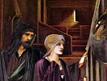

  
[Intangible Textual Heritage](../../index)  [Esoteric](../index) 
[Index](index)  [Previous](khw00)  [Next](khw02) 

------------------------------------------------------------------------

[Buy this Book at
Amazon.com](https://www.amazon.com/exec/obidos/ASIN/B002ECE508/internetsacredte)

------------------------------------------------------------------------

  
*Knowledge of the Higher Worlds and Its Attainment*, by Rudolf Steiner,
\[1947\], at Intangible Textual Heritage

------------------------------------------------------------------------

**CONTENTS**

|        |                                                                  |                           |
|--------|------------------------------------------------------------------|---------------------------|
|        | Preface to the Edition of May 1918                               | [vi](khw02.htm#page_vi)   |
|        | Preface to the Third Edition                                     | [vii](khw03.htm#page_vii) |
|        | Preface to the Fifth Edition                                     | [xi](khw04.htm#page_xi)   |
| I.     | How Is Knowledge of the High Worlds Attained?                    | [1](khw05.htm#page_1)     |
| II\.   | The Stages of Initiation                                         | [35](khw06.htm#page_35)   |
| III\.  | Some Practical Aspects                                           | [98](khw07.htm#page_98)   |
| IV\.   | The Conditions of Esoteric Training                              | [114](khw08.htm#page_114) |
| V.     | Some Results of Initiation                                       | [131](khw09.htm#page_131) |
| VI\.   | The Transformation of Dream Life                                 | [189](khw10.htm#page_189) |
| VII\.  | The Continuity of Consciousness                                  | [202](khw11.htm#page_202) |
| VIII\. | The Splitting of the Human Personality during Spiritual Training | [215](khw12.htm#page_215) |
| IX\.   | The Guardian of the Threshold                                    | [231](khw13.htm#page_231) |
| X.     | Life and Death. The Greater Guardian of the Threshold            | [245](khw14.htm#page_245) |
|        | Appendix                                                         | [260](khw15.htm#page_260) |

------------------------------------------------------------------------

[Next: Preface to the Edition of May 1918](khw02)
