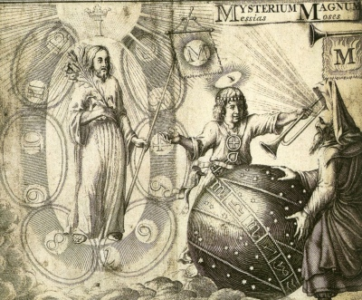

  
[Intangible Textual Heritage](../../index)  [Esoteric](../index) 

------------------------------------------------------------------------

<table width="75%">
<colgroup>
<col style="width: 50%" />
<col style="width: 50%" />
</colgroup>
<tbody>
<tr class="odd">
<td width="50%" data-valign="TOP"></td>
<td width="50%" data-valign="CENTER"><h1 id="the-life-and-doctrines-of-jacob-boehme" data-align="CENTER">The Life and Doctrines of Jacob Boehme</h1>
<h2 id="by-franz-hartmann" data-align="CENTER">by Franz Hartmann</h2>
<h4 id="section" data-align="CENTER">[1891]</h4></td>
</tr>
</tbody>
</table>

------------------------------------------------------------------------

[Contents](#contents)    [Start Reading](ldjb00)    [Page
Index](pageidx)    [Text \[Zipped\]](ldjb.txt.gz)

------------------------------------------------------------------------

This is an anthology of writings by the German Christian mystic, Jacob
Boehme, edited by the occult writer, Franz Hartmann. Hartmann was a
noted Theosophist, who also wrote [With the Adepts](../../sro/wta/index)
and [In the Pronaos of the Temple of Wisdom](../../sro/ptw/index). Other
than organizing the quotes from diverse books of Boehme into a set of
themes ('Angels,' 'The Christ,' 'Redemption'), Hartmann mostly lets
Boehme speak for himself. Boehme, typical of mystics who have
experienced ecstatic visions, can go into puzzling detail about the
structure of the universe, and the metaphysical reality that pervades
it. This is a great reference work on the thought of this profound
mystic for students of the occult.

Also by Boehme at Intangible Textual Heritage: [The Signature of All
Things](../sat/index), and [Confessions of Jacob Boehme](../cjb/index).

------------------------------------------------------------------------

 [Title Page](ldjb00)  
[Preface](ldjb01)  
[Contents](ldjb02)  
[The Life of Jacob Boehme](ldjb03)  
[Chapter I. Introduction](ldjb04)  
[Chapter II. The Unity of the All](ldjb05)  
[Chapter III. The Seven Properties or Qualities of Eternal
Nature](ldjb06)  
[Chapter IV. Creation](ldjb07)  
[Chapter V. The Angels](ldjb08)  
[Chapter VI. The Restoration of Nature and the Generation of
Man](ldjb09)  
[Chapter VII. Man](ldjb10)  
[Chapter VIII. Nature, or the Third Principle](ldjb11)  
[Chapter IX. Generation](ldjb12)  
[Chapter X. The Christ](ldjb13)  
[Chapter XI. Incarnation—The Celestial Virgin](ldjb14)  
[Chapter XII. Redemption](ldjb15)  
[Chapter XIII. Regeneration](ldjb16)  
[Chapter XIV. Death and Eternal Life](ldjb17)  
[Conclusion](ldjb18)  
[Appendix](ldjb19)  
[Index](ldjb20)  
