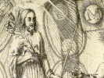

  
[Intangible Textual Heritage](../../index)  [Esoteric](../index.md) 
[Index](index)  [Previous](ldjb11)  [Next](ldjb13.md) 

------------------------------------------------------------------------

  
*The Life and Doctrines of Jacob Boehme*, by Franz Hartmann, \[1891\],
at Intangible Textual Heritage

------------------------------------------------------------------------

p. 180

### CHAPTER IX.

### GENERATION.

"Let every Brahman, with fixed attention, consider
all nature, both visible and invisible, as existing in the Divine
Spirit. For when he contemplates the boundless universe in the Divine
Spirit, he cannot give his heart to iniquity."—Manu.

God evolves the centre of light from
eternity to eternity within Himself, and likewise there is in the soul
of man a desire to penetrate into the second principle and to live in
the light of God. [1](#fn_105.md)

"The soul in its substance is a magical gush of fire from the nature of
God the Father. She is an ardent desire for the light. Thus, God the
Father very strongly, and from all eternity, desires his heart, the
centre of the light, and He generates it in His desiring will out of the
quality of the fire." (*Four Complexions*, ii.)

"God makes also the second principle in His love, wherefrom He generates
from eternity to eternity His eternal word and heart, and the spirit
ignites the bond of nature, and renders it luminous in the love and the
life of His heart by the power of the light. Likewise the soul of man
desires to penetrate into the second principle, and to still its hunger
with the power of God." (*Threefold Life*, i. 11–13.)

 

But if the soul, as has been the case with Adam, does

p. 181

not surrender her will to God, then will the divine idea not become
annihilated, but is rendered inactive in man.

"The soul has the seven qualities of the inner spiritual world
(modified) according to nature; but the spirit is without any qualities;
it is outside of nature and in the unity of God. By means of its fiery
nature the spirit becomes manifest in the soul, because it is the true
likeness of God, an idea wherein God Himself acts and resides, provided
that the soul enters with her desire into God and surrenders her will to
Him. If this does not take place, then will that idea, namely, the
spirit, be mute and inactive, like a picture in a mirror that has faded
and is without substance, as was the case with Adam in his fall."
(*Tabulæ Principæ*, 66.)

"It should not be supposed that the celestial *Ego* of man had become a
nothing. It has remained in him, but in his (personal) life it was then
like a nothing. It was then hidden in God and inconceivable to man, and
without (manifested) life." (*Mysterium*, xx. 28.)

"The essence of the soul, that issued from the unfathomable will, has
not died. Nothing can destroy it. It remains for ever a free will. But
it lost the divine state, wherein was burning the light of God and the
fire of His love. Not that the latter has become a nothing, although
within the created soul it became like nothing (unmanifested), and
unconscious; but the holy power, that is to say, the spirit of God,
which was the active life therein, became hidden." (*Grace*, vi. 2.)

 

If the soul thus permits her true light and life to be extinguished,
then it naturally follows that her opposite power, the principle of
wrath, becomes perceptible (conscious) in her. [1](#fn_106.md)

"As the word or heart of God takes its origin in the light of the
majesty, in the eternal fire-tincture of the

p. 182

\[paragraph continues\] Father, likewise
is this the case with the image of the soul. The true image of God
resides in the light of the soul-fire, and the fiery soul must draw that
light from the love-fountain in God, in His majesty, by means of her
imagination in God, and surrender of her self-will to God. If the soul
does not do this, but imagines within herself, in her own fierce forms
or states conducive to the fire-torture (passion), and not in the
fountain of love, then will her self-torture arise from her harshness,
acridity, and bitterness, and the image of God will be swallowed up in
the wrath (the dark fire)." (*Eye*, xiii. 15.)

"The soul is *per se* a fire-torture, and contains within herself the
first principle, the harsh acridity, which has for its object the fire.
If from this birth (evolution) of the soul is withdrawn the mildness and
love of God, or if she becomes infected with very strong matter (gross
material desire), she will then remain a severe harshness, consuming
itself, and nevertheless continually generating new hunger within her
own will." (*Menschwerdung*, i. 2.)

 

Thus has man, by his withdrawal from God, attracted unto himself the
wrath of God and opened for himself the kingdom of hell, and he now
forms in himself hellish figures. [1](#fn_107.md)

"After Adam had lost the pure and beautiful image, his soul stood then
only in the quality of the Father; that is to say, in eternal nature,
which, apart from the light of God, is a wrath and a consuming fire."
(*Tilk*. i. 285.)

"By means of the fall there was in man a door opened in the wrath of
God, namely, hell. The jaws of the devil were opened, and thereby was
inaugurated the realm of illusion." (*Grace*, vii. 7.)

p. 183

"If we investigate the substance of the soul and its essences, we find
that it is the most harsh thing in man; it is fiery, acrid, and bitter.
If it entirely loses the virgin of divine power who accompanies it, and
from which the light of God (in the soul) is born, it then becomes and
is a devil." (*Three Principles*, xiii. 30.)

"After man had entered the realm of his selfish enjoyment and turned his
will away from God, he then began to produce hellish figures, such as
cursing, blaspheming, and lying." (*Prayer*, 53.)

"We, the poor children of Eve, have to feel within ourselves, in great
suffering, sorrow, and misery, how the wrath moves, guides, and torments
us, so that we now no longer walk together in the love of God, but, full
of poison, envy, murder, and animosity, we persecute each other, we
denounce, dishonour, and vilify, wishing to one another death and all
kinds of evil, and enjoying each other's misery." (*Tilk*. i. 4.)

"That which malicious persons of this world do in their malignity and
falsehood is also done by the devils in the world of darkness." (*Six
Theosophical Points*, ix. 18.)

"Each person causes suffering to another, and is therefore the other's
devil." (*Threefold Life*, xvii. 10.)

 

God has, however, given to man protection, so that he may not so easily
become a devil, and He did this by causing him to enter into external
terrestrial life. [1](#fn_108.md)

"God caused the soul to enter into flesh and blood, so that she may not
so very easily become capable to receive the wrath. Thus (during her
terrestrial existence) she

p. 184

enjoys herself in the mirror of the sun, and is glad in her sidereal
essence." (*Six Theosophical Points*, vii. 19.)

"Not without cause has God breathed into the nostrils of Adam the
external spirit, the external life. Adam might have become a devil, like
Lucifer, but the external mirror prevented it." (*Forty Questions*, xvi.
2.)

"Many a soul in her malignity would become a devil within one hour if
the external life did not prevent it, so that her complete ignition
cannot take place." (*Forty Questions*, xvi. 12.)

"In examining our own selves we find that, on the whole, the external
spirit (our human nature) is very useful to us. Many souls would become
corrupted if the animal spirit did not hold captive the fire and present
to the fire-spirit terrestrial, animal occupation and joy, wherein it
may amuse itself until it obtains again a glimpse of its nobler image,
and begins to seek for it again." (*Forty Questions*, xvi. 10.)

"If the matter of this world (the imagery of external nature) were
broken, as it will be broken one day in the future, the soul would have
stood in eternal death, in the darkness. The beautiful creature (the
living image) would then have been captured by the realm of hell, and
the devil would have been triumphing over it." (*Threefold Life*, viii.
38.)

 

As the soul of man became captured by the spirit of this world, and as
she allowed its *tincture* to enter within herself, the terrestrial
qualities necessarily arose (became pre-eminently active) in him. [1](#fn_109.md)

"The poor soul of Adam was made captive by the spirit and principle of
this world, and allowed the tincture of this world to enter within her."
(*Threefold Life*, viii. 63.)

p. 185

"That in which the imagination of the spirit enters becomes expressed in
the corporeal form by means of the impression of the spiritual desire.
Therefore God commanded Adam, when he still was in Paradise, not to eat
with his imagination from the tree of self-knowledge of good and evil,
so that he should not sink into suffering and death and die to the
kingdom of heaven, as has actually occurred." [1](#fn_110) (Baptism, i. 22..md)

"The terrestrial quality, which formerly was in Paradise in an
unmanifested condition, manifested itself by means of the desire of the
soul. From this resulted heat and cold, the poison-life of all
adversities, and the supremacy of the body, so that the beautiful image
of Heaven and Paradise faded out of sight." (*Stiefel*, ii. 83.)

 

The bodies of the first human beings were of a spiritual, celestial
nature; but, in consequence of eating of the forbidden fruit, they
became terrestrial and material.

"God had given to man a body constituted of pure, essential power, after
the nature of the soul, and which, if compared with the grossly
terrestrial substance, may be looked upon as being a spiritual body."
(*Mysterium*, xvi. 3.)

"The body of the first human beings was of a celestial kind; but when
they ate of the terrestrial fruit and absorbed it into the bodies the
temperature separated, and the terrestrial body became manifest
according to all its qualities." (*Grace*, vii. 5.)

"When Eve reached out for the tree and broke the fruit, she did it
through the earthly *limus* and through the will of the soul, which
desired knowledge from the centre of nature. In eating actually of the
fruit, her body's essence,

p. 186

*i.e.*, the human essence, took in the essence in the tree." [1](#fn_111) (*Mysterium*, xx. 29..md)

 

Man hereby lost the life in eternity, and became subject to death. [2](#fn_112.md)

"We cannot say of man that in the beginning he was enclosed in time. In
Paradise he was embraced in eternity. God created him in His image; but
when he fell he became subject to the limitation of time." (*Grace*,
vii. 51.)

"Time has a beginning and an end, and as the will with its desire has
surrendered itself to the temporal guide, the body dies and perishes
therefore likewise." (*Signature*, v. 9.)

"After the fall man with his interior body lived only in time; the
precious gold of heavenly corporeity, which should tincture, penetrate
and bless the external body, had lost its colour." [3](#fn_113) (*Signature*, v. 8..md)

 

Moreover, the powers of animal life have gained so much room in man, and
become preponderating in him to such an extent, that in his external
essence he has become an animal himself. [4](#fn_114.md)

p. 187

"Man was not, like the animals, created from evil and good (out of the
merely terrestrial substance). If he had not eaten of evil and good
there would not be in him the fire of the wrath; but now he has also an
animal body." (*Aurora*, xviii. 109.)

"Before the sin the celestial image penetrated wholly the external man,
clothing him with divine power. The animal element was then not
manifested in him; but when that image, formed of the celestial essence,
paled and disappeared, then the poor soul, formed out of the first
principle, found herself surrounded by the animal body, naked and bare."
(*Mysterium*, xxi. 15.)

"After Adam and Eve had eaten from the tree of self-knowledge of good
and evil, they soon became ashamed, because in their ethereal form there
had grown up such a gross animal, made of common flesh and hard bones
and animal bowels. The animal being had swallowed up the celestial
state, and arisen in them as a creature foreign to their true nature,
such as they had not known heretofore." (*Mysterium*, xxiii. 1.)

"Let no one imagine that man before the fall had animal organs of
reproduction, neither did he have bowels such as he has now. Such
uncleanliness does not exist within the Holy Trinity, nor within
Paradise; it belongs to the earth. Originally man was created an
immortal being and holy, like the angels." (*Three Principles*, x. 7.)

"By means of the fall man, in regard to his external body, became the
animal of all animals; that is to say, he became the animal image of
God, wherein the word of God became manifested in an earthly manner.
Thus he became a master and king of all animals; but nevertheless

p. 188

only an animal; endowed, however, with a higher intellect than the
merely animal forms." (*Grace*, vii. 6.)

 

The senses of man also became of an earthly and animal nature, so that
he is no longer able to perceive God and that which is divine. [1](#fn_115.md)

"When man left the Paradise and entered into another generation, namely,
into the spirit of this world, into the quality of the sun, the planets
and elements, then his paradisiacal perception became extinct." (*Three
Principles*, xiv. 2.)

"After the fall man became degraded to an animal state of being, so that
Heaven, Paradise, and divinity became a mystery to him."
(*Menschwerdung*, i. 2, 14.)

"The serpent (of desire) said to Eve, 'You will not die; but your eyes
will be opened, and you will be like God.' It is true that her earthly
eyes became opened, but her celestial eyes became closed." [2](#fn_116) (*Stiefel*, i. 44..md)

 

Man's will and mind were captured by the spirit of this world, and are
now held by one or another element, as is shown by the power of the
temperaments.

"The soul entered with Adam into a strange habitation, namely, within
the spirit of this world. There are actually four dwellings in which
that precious jewel is imprisoned. Of these four there is always one
especially manifest in a person, and not all four, according to the four
elements which are within each man, and of which always one predominates
in the life of a person. These

p. 189

four states, forms, or temperaments are called the choleric, the
sanguine, phlegmatic, and melancholy temperament. In the choleric one is
the nature and quality of the fire manifested, in the sanguine that of
the air, in the phlegmatic the nature of water, and in the melancholic
the quality of the element of the earth." (*Four Complexions*, i. 6.)

 

Man's enjoyment and desire is now turned away from the divine, and
directed towards that which is earthly and animal.

"The angelic image in man became entirely destroyed both as to mind and
senses, as we may plainly see at present, both thoughts and senses are
shaped by an animal will, and it is very difficult for them to arrive at
a state in which they love God and justice." (*Grace*, vii. 36.) [1](#fn_117.md)

"After the fall the creatures (elementals) obtained -power in man and
arose in him. There are persons who live in the quality of a snake, and
are full of cunning and poisonous malice; others live in the quality of
a toad or a dog, a bear or a wolf; or one may have in him the quality of
some good and tame animal. All men are outwardly formed in the human
image, but within the quality is seated an animal." [2](#fn_118) (*Grace*, vii. 3, 4..md)

p. 190

Man's present animal method of reproducing himself originated in his
fall, as is proved by Eve having been projected from Adam at a later
period of time, and also by the inherited sense of shame in regard to
the organs of generation.

"If God had created man for this earthly, corruptible, poverty-stricken,
sickly, and animal life, He would not have put him into Paradise. If He
had originally intended that mankind should procreate themselves like
the brutes, He would have made them into men and women already at the
start." (*Mysterium*, xviii. 5.)

"The poor degraded soul is ashamed of the possession of animal organs of
generation, and of the way in which impregnation takes place. Does not
every one feel this? If we had been created beastlike in Adam, why
should we be ashamed of our beastliness? Why is it that the soul is
ashamed of the monstrosity of her outward body, and of its animal method
of procreation?" (*Tilk*. i. 608.)

 

If there had occurred no sin, man, being the living image of God, and
therefore possessing the power to create, could have produced his equals
out of his own self without the existence of severed sexes.

"The sum of all mankind constitutes the one original Adam. God created
him alone, and left it to him to produce other beings. He should have
surrendered his self-will entirely to God, and with God generated other
men out of himself, and in conformity with himself." (*Mysterium*, lxxi.
31.)

"Adam was a complete image of God, male and female, and nevertheless
neither of them separately, but pure like a chaste virgin. He had in
himself the desire (power) of the fire and the light, the mother of love
and wrath, and the fire in him loved the light, receiving from it
calmness and beneficence; while the light in him loved the fire as being
its life, in the same sense as God, in His

p. 191

quality as Father, loves the Son and the Son loves the Father."
(*Stiefel*, ii. 351.)

"Adam was man and wife in one individuality. However, he must not be
considered as having been a woman in the usual sense of this word, but
as a pure, chaste, virginal power. That is to say, he had within himself
the *tincture* or spirit of fire, and also that of water, and he loved
himself and God. He could generate in a virginal state, and procreate by
means of his will and out of his own substance, without any pain or
laceration." (*Threefold Life*, ii. 24.)

"If man had withstood the temptation one human being would have been
born from another, in the same way as Adam in his virginal state was
projected into objectivity as a human being and image of God, because
that which is of the Eternal can also procreate (multiply) itself
according to the law of eternity." (*Threefold Life*, xviii. 7.)

 

These descendants of man would have issued one from the other, and one
would have surpassed the other in his qualities and dignity before
God. [1](#fn_119.md)

"It is unnecessary to know whether, if man had remained in his original
state, all (future) individuals would have been the products of one
individual, or whether they would have been produced one from another;
but in seeking within the depth, in the centre, I find that one would
have come from the other. In the course of time they would have differed
in their qualities; some would have grown to be superior to others, as
is the case at present where not all men are equals, but some have more
genius and intelligence than others." (*Menschwerdung*, 1. 5, 4.)

 

But now, after the generative powers, which were formerly

p. 192

united in man, appear in a state of separation in males and females,
each sex seeks within the other the child that is to be generated, and
strongly desires to unite with the other. [1](#fn_120.md)

"In the beginning of creation all was born from one being, and a
separation of sex took place later on. Therefore each sex strongly
desires the other, as is seen in the process of procreation." (*Three
Principles*, viii. 40.)

"There is now a strong sexual desire in all creatures. The male spirit
seeks for the beloved child in the female, and the female seeks for it
in the male." (*Three Principles*, viii. 44.)

"The water-mother strongly desires for the fire-mother, and seeks for
the child of love. Likewise the fire-mother seeks for it in the
water-mother, and therefore both sexes have a strong desire to mingle
with each other." (*Three Principles*, viii. 42.)

 

This desire, wherein the two sexes are burning in regard to each other,
is an abomination before God; but if it is governed by faithfulness and
orderly conjugal love, it is patiently tolerated by the Lord. [2](#fn_121.md)

"Conjugal sexual cohabitation is not sinful, because it is in accordance
with man's human nature. It is incited by the power of nature, and
tolerated in divine patience by the spiritual soul." (*Stiefel*, ii.
409.)

"Lust, however, without being ennobled by faithful conjugal love, is
merely an animal and sinful desire; and if you seek in marriage only the
gratification of sexual lust, you are then not superior to an animal."
(*Three Principles*, xx. 64.)

p. 193

"Beware, O man, as to how you use the sexual animal desire! It is an
abomination before the Lord (the divine Being in man), whether it be
within or outside of legalised wedlock; but true lawful love and
faithfulness hides the desire before the sight of God." (*Three
Principles*, xx. 65.)

"If a couple generate children, their imagination or desire (during the
sexual act) is not holy, but the noble part of the soul is ashamed of
it. There are even animals that are ashamed of that act. Even in its
best aspect the performance is disgusting before the sanctity of that
which is divine, it having been caused by sin in consequence of
primordial man's degradation, but being patiently submitted to by that
which is divine in man, because it is a necessity of his present animal
state." [1](#fn_122) (*Stiefel*, ii. 396..md)

 

It is an error to suppose that one person is a descendant from others
merely as far as his corporeal form is concerned. The human soul is
likewise generated in that manner. If the heart were absent even the
body could not come into existence. [2](#fn_123.md)

"The soul is not every time created anew and breathed into the body, but
she is reproduced according to human natural law, like a branch growing
out of the trunk of a tree, or as a kernel or seed that is sown. Thus
the soul is sown that it may grow to be a spirit and body." [3](#fn_124) (*Forty Questions*, x. 4..md)

p. 194

"The souls of men, all taken together, are as only one soul, for they
have all been generated out of one soul."

"The soul is a cause of the existence of all the members necessary for
the life of man, for without the soul no organ would come into existence
to live in the life of man." (*Three Principles*, xiv. 14.)

"The heart is the true origin of the soul, and in the interior blood of
the heart (the will) is the soul, the fire, while in the *tincture* the
soul is its spirit (its light); the spirit floats above the heart, and
communicates itself to the body and to all of its organs." (*Forty
Questions*, xi. 3.)

 

In so far as by the connubial act a soul is generated, there is in it
even something of a paradisiacal nature. [1](#fn_125.md)

"While Adam remained in the love of God, and the woman (the female
principle) in him was a chaste virgin, the *tincture* of the fire (in
him) could have experienced much joy in the embrace of the *tincture* of
the light contained (in him); but the present external body is not
worthy of enjoying such an intercourse with the kingdom of delight,
wherein the life of the soul is sown. Only the inner essences, which
originate (directly) from the Eternal, are capable of participating in
such happiness; external animal man merely gratifies an animal desire,
and knows nothing of the delight of the (spiritual) essences. If,
however, the (external and internal) tinctures intermingle, then there
is therein something (a sensation) belonging

p. 195

to Paradise; but the earthly essence (lust) soon becomes mixed
therewith." (*Menschwerdung*, i. 7, 6.)

"The desire for conjunction in men and women results from the separation
of the fire and light-tincture in Adam. These principles in their own
essence are still much more noble and pure than the flesh. It is true
that they are now separated, and do not contain the true life; but they
are full of desire for that true life, and when they again meet with
each other in the unity of all being, they then awaken the true life to
which their desire is directed. They want to be again that which they
were in the image of God when Adam was man *and* woman." [1](#fn_126) (*Stiefel*, ii. 388..md)

"When the two tinctures are brought together into one, then the quality
of the eternal kingdom of joy, the highest desire and its fulfilment,
becomes manifested. If this could be done in purity, and without the
admixture of that which causes disgust, then would it all be holy; but
even the *sulphur* (the terrestrial element) of the seed is a cause of
disgust in the sight of true holiness." (*Stiefel*, ii. 402.)

 

During the connubial act a divine interaction takes place; but there are
also influences coming from the terrestrial and the satanic worlds. More
[especially](errata.htm#1.md) is the nature of the child dependent on the
quality of its parents. [2](#fn_127.md)

p. 196

"The will called into action during the connubial act is threefold.
Firstly, there arises between the parents of the child the animal desire
to commingle, and during the commingling the centre of love becomes
opened, even if they were otherwise dissatisfied with each other. That
love then participates in the qualities of the one element, and this
element with paradise; but the paradise is before God." (*Three
Principles*, xv. 30.)

"On the other hand, the external seed has also its own essences, and
they participate in the qualities of the external elements. These
external elements participate in the qualities of the external planets,
and they are connected with external wrath and malice; while the latter
are connected with the abyss of hell, and that abyss belongs to the
devils." (*Three Principles*, xv. 31.)

"If a branch grows out of a tree, its form approximates that of the
tree. Thus, if a mother produces a child, the child is formed in her own
image." (*Forty Questions*, v. 1.)

"An evil tree cannot produce good fruits. If both parents are bad and in
the power of the devil, a soul inclined to evil will be sown. It would
be well for parents to remember this fact. You are saving up money for
your children, but if you would furnish them with a good soul, that
would be more useful to them." [1](#fn_128.md)
(*Forty Questions*, x. 7–9.)

p. 197

"To the extent in which the parents have the essentiality of God
connected with their own souls will the seed not be introduced into the
Turba; for Christ says, 'A good tree cannot bring forth evil fruit.'"
(*Forty Questions*, x. 5.)

 

Each soul, however, is an individual being, and therefore a child born
from bad parents can again turn to God, or the reverse of this may take
place. [1](#fn_129.md)

"Although the soul is a branch from the tree, she is, nevertheless, an
individual being. Therefore a child, after being born, has a life of its
own, and the centre of nature is within its own power." (*Forty
Questions*, vi. 2.)

"Even if a child has good parents, it may afterwards enter into the
*Turba*. Likewise a child born of evil parents may become converted by
means of its imagination, and enter into the *Word* of the Lord. This
rarely takes place, but it is nevertheless possible. God throws no soul
away, unless the soul throws herself away. Each soul judges
herself." [2](#fn_130.md) (*Forty Questions*, x.
6–8.)

------------------------------------------------------------------------

### Footnotes

[180:1](ldjb12.htm#fr_105.md) It is the principle
of light in man that causes him to seek for the light, and to desire
that it should become manifest. If man were something entirely different
from God, and had consequently nothing divine in him, he would be an
atheist, incapable of conceiving of justice or truth, and have neither
any desire nor understanding for that which is divine.

[181:1](ldjb12.htm#fr_106.md) In proportion as the
will of man is not controlled by reason, that will becomes unreasonable
and follows its lower impulses.

[182:1](ldjb12.htm#fr_107.md) To express this in
other words, we may say that the will of man ceased to act within his
own higher nature, *i.e.*, the celestial virgin of divine wisdom,
wherein his power was united to sweetness, and became active within the
lower and animal elements of his constitution, so that brute passion
took the place of divine self-conscious will. This animal will produces
corresponding animal images in his soul.

[183:1](ldjb12.htm#fr_108.md) If man's imagination
were not excited by the pictorial representations which the objects of
the surrounding world call forth in his mind by means of his external
senses, but if his mental activity were restricted to forming images by
its own power, his fiery will, from which the recognition of his divine
bride has departed, would cause him to become self-conscious in evil.
For this reason asceticism without divine wisdom leads to the
acquisition of the powers of black magic.

[184:1](ldjb12.htm#fr_109.md) Man became an
organism wherein the powers of nature are acting, and in identifying
himself with nature he began to enjoy and to suffer with her.

[185:1](ldjb12.htm#fr_110.md) Man's constitution
resembles a garden, wherein all kinds of seeds, good and evil, are sown.
Those which he cultivates or permits to glow will become predominant in
him.

[186:1](ldjb12.htm#fr_111.md) If "Eve" had not
plucked the fruit from the tree of knowledge for "Adam," that is to say,
if he had not desired it merely in his imagination, but plucked the
fruit himself by entering therein with his own fiery will, the
consequences would have been still more disastrous to him. The universal
man (Adam) would then have become a devil, instead of a semi-animal
human being.

[186:2](ldjb12.htm#fr_112.md) This does not mean
to say that the true divine and immortal man did lose his immortality;
but man in his aspect as a human being became unconscious of his
immortality, and is now seeking for external proof for the purpose of
becoming convinced that there may be something immortal in him.

[186:3](ldjb12.htm#fr_113.md) The more of man
identifies itself with the body and its lower principles, the more of
him will die. That part of man which identifies itself with the immortal
part within becomes immortal with the latter. Man should, therefore, not
identify himself in thought and will with the lower elements in his
constitution, but employ the powers of the latter for the unfoldment of
his spirituality.

[186:4](ldjb12.htm#fr_114.md) As the whole of the
animal kingdom exists in macrocosmic man, likewise p. 187 the representative forms or germs of all
animals exist in the animal soul of microcosmic man, and they grow and
become predominant in him according to his predominant animal tendencies
or desires. They are the elementals which take possession of godless man
and render him subservient to their will.

[188:1](ldjb12.htm#fr_115.md) If man were truly to
realise his own divine state, there is no power that would retain him
against his will in his semi-animal body. He would then be the god which
in the course of ages he aspires to become.

[188:2](ldjb12.htm#fr_116.md) In the same sense,
the more we cling to merely external pursuits, the more are we liable to
lose the power of the true recognition of internal truth, and for this
reason we usually find the least amount of spirituality and intuition
among those that are very learned. The more we close our eyes and
speculate, the less shall we become capable to see.

[189:1](ldjb12.htm#fr_117.md) If the senses of man
were educated to love that which is true and divine, then would the
inner realm become opened to their perception, and man would know
"supersensual things."

[189:2](ldjb12.htm#fr_118.md) Every character,
when it is to be expressed, finds its expression in a certain form. All
the animals in this world are incarnations of certain characters, and
likewise the qualities of animal man are expressed in his animal soul
(on the astral plane) in corresponding animal forms. The above assertion
of Jacob Boehme is, therefore, not a mere figure of speech; but the
animal soul of every human being resembles a menagerie composed of
different animals, which may be seen by those that are sifted with the
astral perception, and according to the quality of the will of man,
whereon these animals live, some become sick and die, while others are
born and grow. The conditions of these animal elementals in the
constitution of man are some of those causes of his bodily ills of which
modern medical science is entirely ignorant.

[191:1](ldjb12.htm#fr_119.md) This is the way in
which the "personalities" mentioned in the Book Genesis were "begotten."

[192:1](ldjb12.htm#fr_120.md) Since the "woman"
has issued from man, his manner of reproduction has necessarily become
an external and animal one, and will continue to be so until the true
divine marriage has taken place, by which the Will of man becomes again
one with the goddess of wisdom.

[192:2](ldjb12.htm#fr_121.md) Each sex seeks
within the other that of which it is itself deficient, and therefore,
seen from the spiritual point of view, all sexual "love" may be regarded
as a manifestation of selfishness.

[193:1](ldjb12.htm#fr_122.md) "Sin" is that which
constitutes a disobedience against the will of God, which is also the
law of nature. He who resists the law of nature without being able to
rise above his own animal nature commits a crime against nature, and
therefore against God. But if we rise above our animal plane into the
higher regions of feeling and thought, then shall we be no longer
affected by the laws that govern that animal nature, and no resistance
will be needed, as the desires of the flesh do not affect the spirit
that is not identified with the flesh.

[193:2](ldjb12.htm#fr_123.md) Here Jacob Boehme
evidently refers to the human soul, the *Manas*, and not to the
*Buddhi*, or spiritual soul, which overshadows each new incarnation.

[193:3](ldjb12.htm#fr_124.md) The spiritual soul
in man has its origin in God, and its individual qualities are gathered
from the efflorescence of its experiences in previous p. 194incarnations; but the human and animal soul
are the products of the mental and astral influences acting through the
bodies of the parents; while the visible material form is made of the
elements of the earth.

[194:1](ldjb12.htm#fr_125.md) The highest sensual
pleasure which human beings can possibly enjoy is experienced by them
during the connubial act; but as this act constitutes the exercise of
the highest power which is still within man's dominion, namely, the
power to create a being like unto himself, therefore this power should
not be prostituted for baser motives, such as the gratification of
sensual desire.

[195:1](ldjb12.htm#fr_126.md) In the male is
represented especially the fiery essence (the will or obstinacy), in the
female the essence of light (spirituality or gentleness). The sexual
distinctions, however, do not belong to the external body exclusively,
but to the inner man, of whom the outer man is not always a correct
image, because there are other factors besides the true soul entering in
his formation. Therefore it sometimes happens that the sex of the
external body does not seem to correspond to that of the inner man. We
meet with male persons apparently inhabited by a female soul with female
tastes and tendencies, and vice versa; and in such persons there are
sometimes manifest apparently inexplicable sexual perversities.

[195:2](ldjb12.htm#fr_127.md) It should always be
remembered that man's constitution is not the p.
196 result of the action of only one principle, but of three,
manifesting themselves in the seven qualities of eternal nature, in
seven different forms, and that, therefore, his external body is not the
expression of only one principle, but of three. His spirit is from the
innermost fountain, his soul from the internal world, his body from
external nature.

[196:1](ldjb12.htm#fr_128.md) The absence of words
in modern languages for expressing internal facts in a comprehensible
manner leads to a continual confusion of terms. Thus the term "soul"
refers here not to the divine soul that originates directly from God,
nor to that part of man which becomes reincarnated (the *Karana
Sarira*), but to the "inner man" (the *Manas* and lower lsencippri).
Unless this distinction of the various aspects of man is kept in mind,
we are always exposed to mistaking the leaves of the tree of life for
the branches, and the branches for the trunk, and the trunk for the
roots.

[197:1](ldjb12.htm#fr_129.md) Each soul
constitutes an individual, but for all that not an independent, part of
the tree of life. The trunk (Christ) remains, but the leaves (the
personalities of men and women) drop off. The branches (the individual
human spirits) grow from year to year, and by the power of the sap which
the branches receive through the trunk they produce new leaves
(personalities) every spring. Thus it is not the Christ, *i.e.*, the
divine, man, who becomes reincarnated; neither do the same identical
leaves reappear upon the same tree, but the spirit of man (his higher
*Manas*) through the power of Christ (the *Atma-Buddhi*) produces new
personalities in whom is expressed the power which the spirit receives
from God.

[197:2](ldjb12.htm#fr_130.md) Each soul is
receptive of good and evil influences, but especially to such as are
predominant in her own nature. Whether or not a soul will inherit the
desire or power to overcome the evil in her own constitution, or whether
she will be more inclined to evil, will depend on the *Karma* acquired
by her in previous incarnations.

------------------------------------------------------------------------

[Next: Chapter X. The Christ](ldjb13.md)

