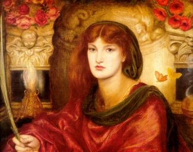

  
[Intangible Textual Heritage](../../index)  [Esoteric](../index.md) 

------------------------------------------------------------------------

[Buy this Book at
Amazon.com](https://www.amazon.com/exec/obidos/ASIN/0893144177/internetsacredte.md)

------------------------------------------------------------------------

<table width="75%">
<colgroup>
<col style="width: 50%" />
<col style="width: 50%" />
</colgroup>
<tbody>
<tr class="odd">
<td width="50%" data-valign="TOP"></td>
<td width="50%" data-valign="CENTER"><h1 id="the-most-holy-trinosophia" data-align="CENTER">The Most Holy Trinosophia</h1>
<h2 id="by-comte-de-saint-germain" data-align="CENTER">by Comte de Saint-Germain</h2>
<h4 id="section" data-align="CENTER">[1933]</h4></td>
</tr>
</tbody>
</table>

------------------------------------------------------------------------

[Contents](#contents)    [Start Reading](mht00.md)

------------------------------------------------------------------------

|                                                                                                                           |
|---------------------------------------------------------------------------------------------------------------------------|
|  |

This is the only book attributed to the mysterious, supposedly immortal
Comte St. Germain. (see [The Comte de St. Germain](../../sro/csg/index.md),
by Isabel Cooper-Oakley). This parallel French and English edition was
self-published in 1933 and introduced by Manly Hall, who also wrote [The
Secret Teachings of All Ages](../sta/index.md). The Trinosophia is an
allegorical account of spiritual initiation, in the vein of [The
Chymical Marriage](../../sro/rhr/rhr08.md). Whether Hall's claim that St.
Germain was (or is) a key Rosicrucian figure is true or not, this is
indeed one of the rarest of occult books. It appears here for the first
time on the Internet.

------------------------------------------------------------------------

 [Title Page and Front Matter](mht00.md)  
[Table of Contents](mht01.md)  
[Part One: The Man Who Does Not Die](mht02.md)  
[Part Two: The Rarest of Occult Manuscripts](mht03.md)  

### Part Three: Parallel French and English Text of the Most Holy Trinosophia

[Section One](mht04.md)  
[Section Two](mht05.md)  
[Section Three](mht06.md)  
[Section Four](mht07.md)  
[Section Five](mht08.md)  
[Section Six](mht09.md)  
[Section Seven](mht10.md)  
[Section Eight](mht11.md)  
[Section Nine](mht12.md)  
[Section Ten](mht13.md)  
[Section Eleven](mht14.md)  
[Section Twelve](mht15.md)  

 

[Notes and Commentaries](mht16.md)  
