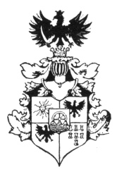
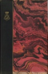
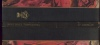
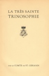
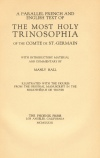
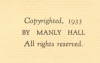

  
[Intangible Textual Heritage](../../index)  [Esoteric](../index) 
[Index](index)  [Next](mht01) 

------------------------------------------------------------------------

[Buy this Book at
Amazon.com](https://www.amazon.com/exec/obidos/ASIN/0893144177/internetsacredte)

------------------------------------------------------------------------

*Most Holy Trinosophia*, by Count St.Germain \[1933\], at Intangible
Textual Heritage

------------------------------------------------------------------------

p. 4

# LA TRÈS SAINTE

# TRINOSOPHIE

 

## PAR LE COMTE DE ST.-GERMAIN

p. 5

##### A PARALLEL FRENCH AND ENGLISH TEXT OF

#### THE MOST HOLY

# TRINOSOPHIA

## OF THE COMTE DE ST.-GERMAIN

##### WITH INTRODUCTORY MATERIAL AND COMMENTARY BY

### MANLY HALL

###### ILLUSTRATED WITH THE FIGURES FROM THE ORIGINAL MANUSCRIPT IN THE BIBLIOTHÈQUE DE TROYES

###### THE PHOENIX PRESS

###### LOS ANGELES, CALIFORNIA

###### MCMXXXIII

scanned at Intangible Textual Heritage, May 2007. Proofed and formatted
by John Bruno Hare. This text is in the public domain in the United
States because it was never registered or renewed at the US Copyright
office, as required by law at the time. These files may be used for any
non-commercial purpose, provided this notice of attribution is left
intact in all copies.

[  
Click to enlarge](img/cover.jpg)  
Cover  

[  
Click to enlarge](img/spine.jpg)  
Spine  

[  
Click to enlarge](img/title.jpg)  
Title Page  

[  
Click to enlarge](img/title2.jpg)  
Second Title Page  

[  
Click to enlarge](img/verso.jpg)  
Verso  

p. 6

Curieux scrutateur de la Nature entière,  
     J’ai connu du grand tout le principe et la fin.  
J’ai vu l’or en puissance au fond de sa rivière  
     J’ai saisi sa matière et surpris son levain.

J’expliquai par quel art l’âme aux flancs d’une mère  
     Fait sa maison, l’emporte, et comment un pépin  
Mis contre un grain de blé, sous l’humide poussière;  
     L’un plante et l’autre cep, sont le pain et le vin.

Rien n’était, Dieu voulant, rien devint quelque chose,  
     J’en doutais, je cherchai sur quoi l’univers pose.  
     Rien gardait l’équilibre et servait de soutien.

Enfin avec le poids de l’éloge et du blâme  
     Je pesai l’éternel; il appella mon âme:  
     Je mourrai, j’adorai, je ne savais plus rien.  
                                 —*Comte de St.-Germain*

------------------------------------------------------------------------

[Next: Table of Contents](mht01)
