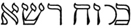
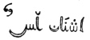

  
[Intangible Textual Heritage](../../index)  [Esoteric](../index) 
[Index](index)  [Previous](mht10)  [Next](mht12) 

------------------------------------------------------------------------

[Buy this Book at
Amazon.com](https://www.amazon.com/exec/obidos/ASIN/0893144177/internetsacredte)

------------------------------------------------------------------------

*Most Holy Trinosophia*, by Count St.Germain \[1933\], at Intangible
Textual Heritage

------------------------------------------------------------------------

p. 62

[  
Click to enlarge](img/06200.jpg)

p. 63

### SECTION EIGHT

<table data-border="0" width="100%">
<colgroup>
<col style="width: 50%" />
<col style="width: 50%" />
</colgroup>
<tbody>
<tr class="odd">
<td data-valign="top" width="327">
JE quittai la galerie par une porte basse et étroite et j’entrai dans un appartement circulaire . . . ses lambris étoient de bois de frêne et de sandal. au fond de l’appartement sur un socle composé de seps de vigne reposait une masse de sel blanc et brillant, au dessus étoit un tableau il représentoit un lion blanc couronné. et une grappe de raisin, ils etoient posés sur un même plateau, que la fumée d’un brasier allumé élevoit dans les airs. A ma droite et à ma gauche souvraient deux portes l’une donnoit sur une plaine aride. Un vent sec et brulant y régnoit en tout temps. l’autre porte souvroit sur un lac à l’extrémité du quel on appercevoit une façade de marbre noir.

Je m’approchai près de l’autel et pris dans mes mains du sel blanc et brillant. que les sages appellent

 

Je m’en frottai tout le corps. Je m’en pénétrai et après avoir lu les hierogliphes qui accompagnoient le tableau je m’apprêtai a quitter cètte salle. mon premier dessein etoit de sortir Dar la porte aui donnoit

 
</td>
<td data-valign="top" width="50%">
I LEFT the gallery by a low and narrow door and entered a circular apartment the panelling of which was made of ash and sandal wood. At the further end of the apartment on a pedestal composed of the trunk of a vine lay a mass of white and shining salt. Above was a picture showing a crowned white lion and a cluster of grapes; both rested on a salver sustained in the air by the smoke of a lighted brazier. To my right and left two doors opened, one giving unto an arid plain. A dry and scorching wind blew over it continually. The other door opened on a lake at the extreme end of which a black marble façade could be seen.

I approached the altar and took into my hands some of the white and shining salt which the sages call

 

and rubbed my entire body with it. I impregnated myself with it, and after having read the hieroglyphics accompanying the picture I prepared to leave this hall. My first intention was to leave

 
</td>
</tr>
</tbody>
</table>

p. 64

<table data-border="0" width="100%">
<colgroup>
<col style="width: 50%" />
<col style="width: 50%" />
</colgroup>
<tbody>
<tr class="odd">
<td data-valign="top" width="327">
sur la plaine, mais une vapeur brûlante s’en exalloit, je préférai le chemin opposé, j’avois la liberté de choisir, avec la condition cependant de ne pas quitter celui que j’aurois pris . . . Je me décidai à passer le lac, ses eaux étoient sombres et dormantes, j’appercevois bien à une certaine distance un pont nommé

 

mais je préférai traverser le lac à la longue route que j’aurois été obligé de faire pour atteindre le pont, en suivant les sinuosités d’un rivage semé de rochers. j’entrai dans l’eau, elle étoit épaisse comme du ciment, je m’apperçus qu’il m’étoit inutile de nager, par tout mes pieds rencontrêrent le sol. Je marchai dans le lac pendant treize jours. Enfin je parvins à l’autre bord.

 
</td>
<td data-valign="top" width="50%">
by the door opening upon the plain, but there issued therefrom a hot vapor and I preferred the opposite path. I had the freedom of choice with the condition, however, not to leave the one once chosen. . . I decided to cross the lake; its waters were sombre and sleeping. At a certain distance I clearly noticed a bridge called

 

To reach it I would have been obliged to follow the windings of a shore covered with rocks, and I preferred to cross the lake. I entered the water which was as thick as cement. I noticed that it was useless for me to swim since my feet touched bottom everywhere. I walked in the lake for thirteen days. At last I came to the other shore.

 
</td>
</tr>
</tbody>
</table>

------------------------------------------------------------------------

[Next: Section Nine](mht12)
