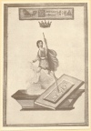
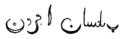

  
[Intangible Textual Heritage](../../index)  [Esoteric](../index) 
[Index](index)  [Previous](mht12)  [Next](mht14) 

------------------------------------------------------------------------

[Buy this Book at
Amazon.com](https://www.amazon.com/exec/obidos/ASIN/0893144177/internetsacredte)

------------------------------------------------------------------------

*Most Holy Trinosophia*, by Count St.Germain \[1933\], at Intangible
Textual Heritage

------------------------------------------------------------------------

p. 69

### SECTION TEN

<table data-border="0" width="100%">
<colgroup>
<col style="width: 50%" />
<col style="width: 50%" />
</colgroup>
<tbody>
<tr class="odd">
<td data-valign="top" width="327">
AQUEL que distance du rivage un palais somptueux élevoit dans les airs ses colonnes d’albâtre, ses différentes parties étoient jointes par des portiques couleur de feu, tous l’édifice étoit d’une architecture légère et aérienne. Je m’approchai des portes, sur le fronton était représenté un papillon. Les portes étoient ouvertes. J’entrai, le palais entier ne formait qu’une seule salle . . . trois rangs de colonnes l’entouraient, chaque rang était composé de vingt sept colonnes d’albâtre. Au centre de l’édifice était une figure d’homme, elle sortait d’un tombeau sa main appuyée sur une lance frappait le pierre qui la renfermait autrefois, une draperie verte, ceignit ses reins l’or brillait au bas de son vêtement sur sa poitrine était une table quarrée, sur laquelle je distinguai quelques lettres. Au dessus de la figure était suspendue une couronne d’or, elle semblait s’élever dans les airs pour la saisir. Au dessus de la couronne étoit une table de pierre jaune, sur la qu’elle étoient gravés quelques emblêmes, je les expliquai par le secours de l’inscription que j’apperçus sur le tombeau, et par celle que j’avais vûe sur la poitrine de l’homme.

 
</td>
<td data-valign="top" width="50%">
AT some distance from the shore a sumptuous palace raised aloft its alabaster columns; its different parts were joined by porticos of flame colour. The entire edifice was of light and airy architecture. As I approached the portals, I saw that the front was decorated with the figure of a butterfly. The doors stood open . . . I entered. The entire palace consisted of a single hall . . . surrounded by a triple colonnade, each rank composed of twenty-seven alabaster columns. In the middle of the building stood the figure of a man issuing from a tomb; his hand, holding up a lance, struck the stone which previously confined him. His loins were girt about with a green garment; gold gleamed from its hem. On his breast was a square tablet bearing several letters. Above this figure hung a golden crown and the figure seemed to lift itself into the air in order to seize the crown. Above it was a yellow stone tablet bearing several emblems which I explained by means of the inscription I saw on the tomb and by the one I had seen on the breast of the man.

 
</td>
</tr>
</tbody>
</table>

p. 70

[  
Click to enlarge](img/07000.jpg)

p. 71

<table data-border="0" width="100%">
<colgroup>
<col style="width: 50%" />
<col style="width: 50%" />
</colgroup>
<tbody>
<tr class="odd">
<td data-valign="top" width="327">
Je restai dans cètte salle appellée

 

le temps nécessaire pour en contempler tous les détours et j’en sortis bientôt dans l’intention de me rendre à travers une vaste plaine à une tour que j apperçus a une assez grande distance.

 
</td>
<td data-valign="top" width="50%">
I stayed in that hall which is called

 

the time needful for contemplating all its aisles, and soon I left it with the intention of crossing a vast plain in order to reach a tower that I had perceived at quite some distance.

 
</td>
</tr>
</tbody>
</table>

------------------------------------------------------------------------

[Next: Section Eleven](mht14)
