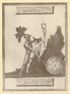
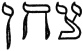
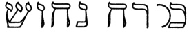
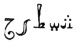

  
[Intangible Textual Heritage](../../index)  [Esoteric](../index) 
[Index](index)  [Previous](mht13)  [Next](mht15) 

------------------------------------------------------------------------

[Buy this Book at
Amazon.com](https://www.amazon.com/exec/obidos/ASIN/0893144177/internetsacredte)

------------------------------------------------------------------------

*Most Holy Trinosophia*, by Count St.Germain \[1933\], at Intangible
Textual Heritage

------------------------------------------------------------------------

p. 72

[  
Click to enlarge](img/07200.jpg)

p. 73

### SECTION ELEVEN

<table data-border="0" width="100%">
<colgroup>
<col style="width: 50%" />
<col style="width: 50%" />
</colgroup>
<tbody>
<tr class="odd">
<td data-valign="top" width="327">
APEINE j’avois quitté les marches du palais, que j’apperçus voltiger devant moi un oiseau semblable à

 

mais celui ci avoit deux ailes de papillon outre les siennes, une voix sortant d’un nuage m’ordonna de le saisir et de l’attacher. Je m’élançai àprès lui, il ne voloit pas mais il se servoit de ses ailes pour courir avec la plus grande rapidité, je le poursuivis, il fuyoit devant moi et me fit plusieurs fois parcourir la plaine dans toute son étendue, Je le suivis sans m’arreter, enfin après neuf jours de course je le contraignis d’entrer dans la tour que j’avois vû de loin en sortant de

 

les murailles de cet édifice étoit de fer . . . trente six pilliers de même métal les soutenoit l’intérieur étoit de même matiere, incrusté d’acier brillant. Les fondemens de la tour étoient construits de telle maniere que sa hauteur etoit doublée sous terre. à peine l’oiseau fut il entré dans cette enceinte qu’un froid glacial sembla s’emparer de lui il fit de vains efforts pour mouvoir ses ailes

 
</td>
<td data-valign="top" width="50%">
NO sooner had I quitted the steps of the palace when I saw fluttering in front of me a bird similar to

 

this one, however, having two wings like a butterfly’s besides its own. A voice issuing from a cloud commanded me to seize and to affix it and I darted forth after it. It did not fly but used its wings in order to run with the greatest rapidity. I pursued it; it fled before me and made me cover the entire plain several times. I followed it without pause. Finally, after pursuing it for nine days, I forced it to enter the tower which I had seen in the distance as I was leaving

 

The walls of this edifice were of iron. Thirty-six columns of the same metal supported it. The interior was of the same material, incrusted with shining steel. The foundations of the tower were so constructed as to be twice as deep in the earth as they were high above ground. The bird had barely entered this enclosure when an icy cold seemed to overcome it. In vain it

 
</td>
</tr>
</tbody>
</table>

p. 74

<table data-border="0" width="100%">
<colgroup>
<col style="width: 50%" />
<col style="width: 50%" />
</colgroup>
<tbody>
<tr class="odd">
<td data-valign="top" width="327">
engourdies. Il s’agittoit encore, essayait de fuir, mais si foiblement que je l’atteignis avec la plus grande facilité.

Je le saisis, et lui passant un clou d’acier

 

a travers les ailes je l’attachai sur le plancher de la tour. à l’aide d’un marteau appellé

 

à peine avois-je fini que l’oiseau reprit de nouvelles forces, il ne s’agitta plus, mais ses yeux devinrent brillants comme des topazes j’étois occupé à l’examiner quand un grouppe placé au centre de la salle attira mon attention, il représentoit un bel homme dans la fleur de rage il tenoit à la main une verge qu’entouraient deux serpens entrelacés, et s’efforçait de s’échapper des mains d’un autre homme grand et vigoureux, armé d’une ceinture et d’un casque de fer sur le qu’el flottoit une aigrette rouge; une épée étoit près de lui elle etoit appuyée sur un bouclier chargé d’hieroglyphes; l’homme armé tenoit dans ses mains une forte chaine il en lioit les pieds et le corps de l’adolescent qui cherchoit vainement à fuir son terrible adversaire; deux tables rouges renfermaient des caracteres.

Je quittai, la tour et ouvrant une porte qui se trouvoit entre deux pillers je me trouvai dans une vaste salle.

 
</td>
<td data-valign="top" width="50%">
tried to move its numbed wings. It still fluttered, trying to flee, but so feebly that I reached it with the greatest ease.

I seized the bird, and driving a steel nail

 

through its wings, I affixed it to the floor of the tower with the aid of a hammer called

 

Hardly had I finished when the bird acquired new strength. It did not move, however, but its eyes began to shine like topaz. I was gazing at it when my attention was attracted by a group in the center of the hall. It showed a handsome man in the prime of life. In his hand he held a staff about which two serpents were interlaced. The young man was striving to escape a larger and more powerful man who wore a girdle and a helmet of iron surmounted by waving red plumes. Near him a sword lay on a buckler covered with hieroglyphs. The armed man held in his hand a heavy chain with which he shackled the feet and body of the youth who tried in vain to flee from his terrible adversary. Two red tablets bore certain characters.

I departed from the tower, and opening a door between two pillars I found myself in a vast hall.

 
</td>
</tr>
</tbody>
</table>

------------------------------------------------------------------------

[Next: Section Twelve](mht15)
