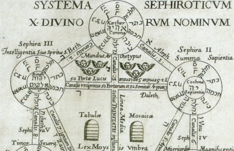

  
[Intangible Textual Heritage](../../index)  [Esoteric](../index.md) 

------------------------------------------------------------------------

[Buy this Book at
Amazon.com](https://www.amazon.com/exec/obidos/ASIN/0911662324/internetsacredte.md)

------------------------------------------------------------------------

<table width="75%">
<colgroup>
<col style="width: 50%" />
<col style="width: 50%" />
</colgroup>
<tbody>
<tr class="odd">
<td width="50%" data-valign="TOP"></td>
<td width="50%" data-valign="CENTER"><h1 id="mysteries-of-the-qabalah" data-align="CENTER">Mysteries of the Qabalah</h1>
<h2 id="by-elias-gewurz" data-align="CENTER">by Elias Gewurz</h2>
<h4 id="section" data-align="CENTER">[1922]</h4></td>
</tr>
</tbody>
</table>

------------------------------------------------------------------------

[Contents](#contents)    [Start Reading](moq00.md)    [Page
Index](pageidx)    [Text \[Zipped\]](moqtxt.zip.md)

------------------------------------------------------------------------

|                                                                                                                           |
|---------------------------------------------------------------------------------------------------------------------------|
|  |

This is the second book on the Kabbalah by Elias Gewurz, the other being
[Hidden Treasures of the Ancient Qabalah](../htaq/index.md). Written from a
Theosophical viewpoint, this thin volume has a lot more Kabbalah content
than the previous one. Gewurz explains 'signatures' of each Hebrew
letter, the use of techniques such as permutation and numerology to find
deeper meaning in the sacred writings, and the history and bibliography
of Jewish mysticism. Although, strictly speaking, this is uncredited,
the title page mentions 'E.G.' and most library catalogs list this as
attributed to Gewurz. Furthermore Gewurz is mentioned by name in a
footnote on [page 31](moq07.htm#fn_1.md). This joins the other books
published by Yogi Publications under an opaque, and unverified, byline.

------------------------------------------------------------------------

 [Title Page](moq00.md)  
[Contents](moq01.md)  
[Dedication](moq02.md)  

### Part I

[The Hieroglyphical Interpretation of the Hebrew Alphabet](moq03.md)  
[Explanatory Note on the Letters](moq04.md)  
[The Qabalistic Definition of the Snake Nachash](moq05.md)  
[The Brotherhood of the White Lodge](moq06.md)  
[Initiation according to the Qabalah, from a Scientific and
Philosophical Point of View](moq07.md)  

### Part II. The Mysteries of the Qabalah

[Chapter I. The Qabalah](moq08.md)  
[Chapter II. The Soul of the Qabalah](moq09.md)  
[Chapter III. Examples of Permutation and Numerical Valuation](moq10.md)  
[The Literature of the Qabalah Throughout the Ages](moq11.md)  
