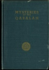

  
[Intangible Textual Heritage](../../index)  [Esoteric](../index.md) 
[Index](index)  [Next](moq01.md) 

------------------------------------------------------------------------

[Buy this Book at
Amazon.com](https://www.amazon.com/exec/obidos/ASIN/0911662324/internetsacredte.md)

------------------------------------------------------------------------

  
*Mysteries of the Qabalah*, by Elias Gewurz, \[1922\], at Intangible
Textual Heritage

------------------------------------------------------------------------

 
[  
Click to enlarge](img/cover.jpg.md)  
Cover  

p. 1

# THE MYSTERIES OF THE QABALAH.

## Vol. II.

##### Written down by seven pupils of

### E. G.

###### And prepared for publication by one of them whose symbol is

 

#### Published by

#### THE YOGI PUBLICATION SOCIETY

#### Chicago, Illinois.

#### \[1922\]

  [  
Click to enlarge](img/title.jpg.md)  
Title Page  

p. 2

 
[  
Click to enlarge](img/verso.jpg.md)  
Verso  

Scanned, proofed and formatted at Intangible Textual Heritage, April,
2008 by John Bruno Hare. This text is in the public domain in the US
because it was published prior to 1923.

------------------------------------------------------------------------

[Next: Contents](moq01.md)
