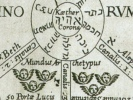

  
[Intangible Textual Heritage](../../index)  [Esoteric](../index.md) 
[Index](index)  [Previous](moq08)  [Next](moq10.md) 

------------------------------------------------------------------------

[Buy this Book at
Amazon.com](https://www.amazon.com/exec/obidos/ASIN/0911662324/internetsacredte.md)

------------------------------------------------------------------------

  
*Mysteries of the Qabalah*, by Elias Gewurz, \[1922\], at Intangible
Textual Heritage

------------------------------------------------------------------------

p. 76

### CHAPTER II.

#### THE SOUL OF THE QABALAH.

In the previous chapter the Qabalah has been considered from the
historical point of view, the written Qabalah being referred to
throughout. This may be called the body, the physical embodiment of the
Ancient Wisdom, which is the true Spiritus, the Ruach Elohim. For the
better understanding of the doctrines, however, a link is required, a
soul which shall connect us with the Spirit behind the writings, and
this soul we may think of as formed by the different methods called
Qabalistic, the methods of unveiling the writings and enigmatical
conversations of the Rabbis.

There are various modes of interpretation used for the purposes of
unravelling the mysteries of the Scriptures, some of which are of an
extraordinary nature, but it will be found difficult to put them aside
as fanciful until after due trial and strict examination.

The different methods are as follows:—

1\. The key to the scriptures, the meaning

p. 77

of the Hebrew letters themselves in addition to their meaning
collectively, *i.e.*, as words. Each letter has many meanings according
to the plane of manifestation, from the Human foetus and its
surroundings to the Cosmic foetus and its surroundings. These meanings
will be explained at length in a later part of this work. It is
sufficient to say, for the present that they constitute a veritable mine
of great wisdom and are collectively the true Key to the Scriptures.

2\. Each of the Hebrew letters besides the meanings spoken of above, has
in common with the letters of many other languages, notably the Greek, a
numerical value. These values are often written down in place of the
letters of a word which they represent and this constitutes the
numerical value of that word. From this method wonderful teachings can
be derived, given the aid of one who has had some experience in these
Qabalistic studies. It is called GMTRIA or Gematria, said to be a
synonym for the Greek word Grammateia \[Isaac Myer\], which means
literally "the amounting to," words of similar values being used

p. 78

to explain the deep truths hidden in the combinations of letters called
words. Thus the word Besheim, *in the Name* (of God), which is written
BSHM or 2—300 and 40, has the same value as the word MQRB which means
"to draw near," and also is equivalent to the word BTZRIM, meaning
"fortified."

3\. The third method is called Temura which means "to change," and is
called by Christian Qabalists "permutation." This is an anagrammatical
method in which the letters of a word are changed about in order to form
another word, or reversed, as the case may be, and in this way many
mysteries are brought to light. Examples of Temura will be given in a
later chapter.

4\. Notariqon is a method by which the initials of words are taken to
form other words, the most notable and the simplest example being that
of the Chochmah Nestirah, which means the "Hidden Wisdom." We ask "what
is this hidden wisdom and what its purpose?" The answer is shewn us by
the teacher who points to its initial letters, *viz*. Cheth and Nun, and
these two letters form the words NCH and CHN, the former

p. 79

referring to Rest, or Pralaya and the latter to "Grace," both being
symbols showing the result of a study of the Hidden Wisdom or Chochmah
Nestirah, the latter being supposed to bring Grace and lead to rest and
to the ultimate perfection of man. In a sense this is the human
condition of Pralaya, the condition of Heaven upon Earth. The meaning of
Notariqon is simply *quick-writing*, or shorthand.

5\. Finally there are the "Four Ways," *i.e.* the four ways of
interpreting the Sacred Scriptures, of which it will be well to have a
clear idea before proceeding to examples of the methods already spoken
of.

There is no special authority for all these statements, but they are
well-known and accepted by Qabalistic students, having been handed down
from father to son throughout the ages, further they can be read in very
many different works too numerous to mention, although each writer gives
an explanation of a different kind according to his predilections.
Qabalistic teachers seem to be acquainted with all these methods, and
that which is not taught by one may be learned from another and

p. 80

moreover the methods which we are now to consider will lead to a greater
insight of the Scriptures without the aid of any teacher except the
intuition.

The four ways of reading the sacred Scriptures according to Qabalists,
as mentioned in the Book of the Zohar are:—

First PShT, or Pshat, the plain or simple literal rendering, the
superficial knowledge which he who runs may read. The second method is
called RMZ or Ramaz, literally "a hint," and is intended for students
who are developing intellect and who do not care to be taught by those
who see no other than the literal meaning of the scriptures. The third,
DRSh or Darash, is the inferential method of reading, in which the eye
of intuition, the eye of the Spirit, is opened and the man soars far
above the lower mind, far beyond the intellect. The Intuition being
something beyond the intellectual reasoning of the brain consciousness,
as is well known to all occult students, though it should not be thought
that either is to be dispensed with by those who seek a true Balance.
Finally there is the fourth and most important method, called SUD or
Sod,

p. 81

literally "secret." This method is taught by initiates to their beloved
disciples only and they are careful to whom they divulge the deepest
mysteries, knowing that "those who hunt what the Gods hide have trouble
for their pay."

The four ways of reading the Sacred Scriptures correspond to the Four
Initiations of life, the lessons which man has to learn whilst passing
through the experiences of the physical, emotional, mental and higher
planes. These experiences have to be gained chiefly whilst in the dense
physical body. The man who has mastered all these four ways, who has
passed the initiations of Earth, Water, Air and Fire, rises above them
and becomes a Pure One (Tahar). Now it is curious to note the same
teaching in the Sanskrit, for in that wonderful language the word Tahar
or Arhat means a Perfected One, or Mahatma—a Master in Israel.

A Master is one who has passed these four initiations, but this does not
mean merely that he has learned to read the Sacred Scriptures which are
written upon paper, in these four ways, for there are indeed

p. 82

other scriptures, the scriptures formed in the hearts of men as well as
in the Mind of God. Those who would be perfect have to learn to read
these "Sacred Scriptures" in the "four ways," have to learn to view life
in the four manners corresponding to Pshat, Ramaz, Darash and SUD.

This then is the goal set before us, this is the Law: "Be Perfect, even
as the Father in Heaven is perfect." By conquering all the worlds, by
experiencing all things, by reading the Sacred Books, whether in the
hearts of men, or whether in the records of man or Nature, we rise above
the necessity for earthly lessons and become free from our bonds,
perfect masters of the Arts and Crafts. Thus viewing life, the Qabalist
attains to Paradise, which secret is hidden in the four words, *P*shat,
*R*amaz, *D*arash and *S*ud, the initials of which yield Prds (*viz*.,
Paradise).

What is Paradise? Is it a beautiful Garden of Eden, a materialistic
heaven, such as is dreamed of by so many? Not at all, Paradise or
Nirvana is a state of Consciousness, a condition, in which man becomes
all that is, in which he feels himself

p. 83

to be at one with all that is, in which he is at one with God and man
and henceforth has no further lessons to learn upon earth, for he has
attained the Goal set before humanity. He may then pass on to higher
realms and enter a new order of Beings or He may remain to help in the
great work on earth, that is to uplift and benefit His younger brothers.
During this time of helping, that condition which is symbolized by
Paradise is always with him.

All this is hidden in the words Pshat, Ramaz, Darash and Sud, as has
been said, for as the man progresses through the different experiences
of life and passes the initiations represented by these four words, the
"four ways," he extracts from each the essence and adds it to his store
of experience.

This then is the secret of the "Four Ways." Using these methods in
addition to those already mentioned, we are here attempting to unravel
some of the mysteries of the Scriptures but before continuing it will be
well to have some examples of the methods already mentioned, Gematria,
[Temura](errata.htm#4.md), etc. To this is devoted a separate chapter.

------------------------------------------------------------------------

[Next: Chapter III. Examples of Permutation and Numerical
Valuation](moq10.md)
