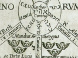

  
[Intangible Textual Heritage](../../index)  [Esoteric](../index) 
[Index](index)  [Previous](moq10) 

------------------------------------------------------------------------

[Buy this Book at
Amazon.com](https://www.amazon.com/exec/obidos/ASIN/0911662324/internetsacredte)

------------------------------------------------------------------------

  
*Mysteries of the Qabalah*, by Elias Gewurz, \[1922\], at Intangible
Textual Heritage

------------------------------------------------------------------------

p. 94

# THE LITERATURE OF THE QABALAH

## Throughout the Ages

### \*\*\*\*\*\*

### Complete List

p. 95

### *APPENDIX*.

### A Short History of the Qabalah as Shown in its Bibliography.

Date b.c.? From earliest times this oral
knowledge was prevalent amongst the Jews and others. It can be traced
back into the night of time, on the monuments and in the sacred scrolls
and hieroglyphs of all nations.

a.d. 100-200. It is generally accepted by
Qabalists that the various doctrines found in the *Sepher Yetzirah* or
*Book of Becoming* (*Formation*), in the *Book of Splendour* (*Zohar*)
and in the *Bahir*, were written down during this period by certain
students after discussion with a teacher, probably the Rabbi Shimeon ben
Yochai. From this time onward many MSS. were copied and circulated
throughout Europe, being, however, carefully guarded by esotericists.

1070\. Little is known of any actual Qabalistic writings during the
period between the first and tenth centuries, although there are many
MSS. now in the Vatican which treat of the doctrines. These are quoted
by Bartolocci in his *Bibliotheca Magna Rabbinica* (vol. 4). There was,
moreover, a floating body of esoteric wisdom known to students as
"Secrets and Mysteries" (see Furst's *Bibliotheca Judaica*) during this
epoch, for references to which see the works of [Ibn](errata.htm#6)
Gebirol (Isaac Myer's *Qaballah*).

1100-1400 a.d. The great outstanding work
of this period was the inspired effort of Rabbi Moses de Leon, who
either collected together the different manuscripts of the disciples of
Rabbi Shimeon and edited and arranged them in book form as a complete
work (*The Sepher Ha-Zohar*), or was impressed from higher
spheres—inspired—to give forth certain knowledge he had acquired through
oral teaching and in dreams, etc., that intuitional knowledge which
comes ever to the true disciple. Very many other Qabalistic works were
written during this period, though few are actually called "Qabalah,"
this name being as it were an after-thought of the scholars and of
comparatively modern invention. A name was required to cover the whole
ground, to include all these "mysteries" and "superstitions," as Kircher
calls them, and hence this name Qabalah was used, meaning the "Received
Doctrine." It is said by the editor of the complete

p. 96

\[paragraph continues\] *Zohar* which Jean
de Pauly translated, that the word Qabalah was first used by Rabbi Aaron
Ashkenazi, but otherwise the Qabalistic doctrines were simply known as
"Secrets and Mysteries,"

1150-1190. Maimonides’ works produced, chief amongst them being the
*Moreh Nebochim*, of which there is a modern English translation by
Friedlander, called *The Guide to the Perplexed*.

1190-? Isaac the Blind. The supposed writer of the *Sepher Ha-Bahir*, a
work containing similar doctrines to those of the *Zohar* and
*Yetzirah*. Treats of Reincarnation, Karma, the Trinity and Emanations,
etc.

1190-1270. Nahmanides’ different commentaries produced. Many Qabalistic
work ascribed to him and printed in later centuries. *Sha’ar Emunah*.
*On Prayers*, *The Decalogue*, etc. *Penish Sepher Yetzirah* (Mantua,
1562, imp.). *Bi’ur le-Sefer ha-Rimmon Eden Gan Elohim*, etc.

1200? *Commentary on the Ten Sephiroth*, by Azriel Ben Menahem (edited
by N. A. Goldberg, 1850, Berlin). *Sepher ha-Milluim*, (1719, Mantua,
Nachmanides) .

1270? *Midrash de R. Shimeon ben Yochai* by Moses de Leon. This is the
famous Zohar already mentioned. It was written in Aramaic, and has been
many times translated in different languages.

1270-1350-? *Poske Hilkot* by Recanati (1538, Bologna). He wrote also
many Qabalistic commentaries, endeavoring to support the views of
Qabalistic fellow students.

1310—. *Ars Magna*, by Raymond Lully.

1370-1430. *Commentary on the Sepher Yetzirah* by Moses Botarel (Mantua,
1562; Zolkiev, 1745; Grodno, 1806).

1455\. Works of Johann Reuchlin, *De Arte Cabalistica*, etc.

1460-1500? Commentary called *Ziyyuni*, by Menahem ben Meir (or Zioni),
(printed at Cremona, 1559).

1463\. Writings of Pico de Mirandola.

1487-1535. *De Occulta Philosophia* (many editions), a Qabalistic
writing by H. Cornelius Agrippa.

1490\. *De Harmonia Mundi*, by Francesco Zorri.

1493\. Theophrastus Paracelsus (works).

1519\. *Alpha Beta*, of Rabbi Akiba (various editions).

1533-72. Various works of Isaac de Luria, said to be "the founder of the
modern Cabala" (*Jewish Encyclopaedia*).

p. 97

\[paragraph continues\] Many of his
writings printed from 1595-1839. A list of same may be seen in *Jewish
Encyclopaedia* (art. Luria). The most important are: *The Purification
of the Soul* (1595, Venice), *Derek Emeth*, *Annotations on Zohar*
(1663, Venice), *Notes on Zohar he-Hadash* (1663, Venice), *Perush
Sepher Yetzirah* (1719, Amsterdam).

1535\. Philo's works, *Liber Antiquitatum Biblicarum* (Basel), etc.,
1527.

1550—. *Ez Hayyim* (Korzec, 1784), the teachings of Luria, collected by
his disciple, Hayyim Vital. Dealing with the different Qabalistic
doctrines of Reincarnation and Interpretation of Scripture, etc.

1552\. *Abrahami Patriarchæ liber Yetzirah*. Guillemo Postello.

1558\. *Mantua Text of Zohar*, etc.

1550\. *Cremona Text of Zohar*, etc.

1562\. *Mantuah Text of Yetzirah*, etc.

1566\. *Sepher Yuhasin* (*Book of Genealogies*), by R. Abraham ben Zakut
(1492).

1574\. Works of Robert Fludd.

1580\. Works of Jacob Boehme.

1585\. Works of J. B. von Helmont.

1587\. *Artis Cabalisticae Scriptores ex biblioth*. Pistorii.

1602\. *Oedipus Aegyptiacus*. Athenasius Kircher.

1607\. *Lexicon Chaldaicum* of Buxdorf.

1615\. Works of De Voisin.

1650\. Gaffael's *Unheard of Curiosities* (trans. from French).

1652\. Thomas Vaughan's Works.

1662\. *Liber Yesirah qui Abrahmae patriarchae adscribitur* (with Rabbi
Abraham's commentary).

1677\. *Kabbala* *Denudata*. Knorr von Rosenroth.

1678\. *Bibliotheca Magna Rabbinica*. J. Bartolocci.

1707\. *Histoire de la Religion des Juifs* (Vol. 3). J. Basnage.

1721\. *Introductio ad historiam philosophiae Hebraeorum*. J. F
Buddaeus.

1743\. *Nistorah R. Shimeon ben Yochai* (Salonica).

1783\. *Kontros Sepher Ha-Zohar*. J. Satanov (Berlin).

1785\. *Pitche Chochmah*. Korez.

1786\. *Ueber die Natur und den Ursprung der Emanations-lehre bei den
Kabbalisten* (Riga).

1798\. *Commentary on the Sephiroth*. Azariel.

1815\. *La Langue Hebraique Restituée*. Fabre D’Olivet.

p. 98

1827-1853. *Philosophie der Geschichte uber die Tradition*. F. J.
Molitor (said to be the greatest Qabalistic work of this century).

1832\. *Philosophia Cabbalistica*. Freystadt.

1833\. *Dictionnaire de la Conversation*, S. Munk; and other writings of
great importance.

1837\. *De ortu Cabbaloe*. F. A. Tholuck.

1843\. *La Kabbale*. Dr. A. Franck.

1844\. *Die Kabbala von Dr. Franck*. A. Jellinek.

     *De l’harmonie entre L’Eglise et la Synagogue*. Chev. Drach.

1849\. *Die Religions-philosophie des Sohar*. Dr. H. Joel.

1851\. [*Bibliotheca*](errata.htm#7) *Judaica* and

1857\. *Melanzes Juives*. Both in French.

1865\. *Gesch. der Philosophie des Mittelalters* (Vol. II). Stöckl.

1869\. *Le Juif*. G. des Mousseaux.

1872\. Philo . . . als Auslegger des Alten Testaments. C. Siegfried.

1876\. *History of Philosophy*. (I. 417). F. Ueberweg.

1880\. *System der altsynagogalen palastinischen Theologie*. F. Weber.

     *Talmudic Miscellany*. P. J. Herson.

1881\. *Historie de l’exegèse biblique*. L. Wogue.

1883\. *Encyclopaedia Britannica*. Dr. Schiller-Szinessy.

1884\. *Mission des Juifs*. St. Ives D’Alveydre.

1887\. *Kaballah Unveiled*. S. L. McGregor Mathers.

     *Sepher Yetzirah*. Trans. by Dr. Papus (Paris).

     *Leelenlehre des Qabalah*. Leiningen.

1888\. *Qabalah*. Isaac Myer.

     *Isis Unveiled*. H. P. Blavatsky.

     *Masonic Review*. Cincinnati. Railston Skinner's Articles on
*Qabalah*.

1889\. *Commentary on Sepher Yetzirah*. Eleazer of Worms.

1890\. *Essias des Sciences Mandites*. Stanislas de Ginta.

1819\. Graetz. *History of the Jews*. English Ed. (useless to the
mystic).

1893\. *The Secret Doctrine*. H. P. Blavatsky.

     *Sepher Yetzirah*, trans. Wynn Westcott.

1894\. *Le Livre des Splendeurs*. Eliphas Levi.

1896\. *History of the Jews*. Edersheim (3rd edition).

     *Book of the Secrets of Enoch*, trans. Charles.

p. 99

1898\. *Traité Elémentaire de Science Occulte* (5th edition).

1901\. *Histoire de la Litterature Juive*. Ch. 5.

     *Etude sur les Origines du Zohar*. Karppe.

1902\. *Philosophie, Qabbala* [*und*](errata.htm#8) *Vedanta*. Flugel.

1903\. *Jewish Encyclopaedia*. Art. Kaballah. Ginsburg (an article of
rare worth).

1906\. *Sepher Ha-Zahor* (6 vols.), Jean de Pauly. Edited by
Lafume-Giraud (the finest translation extant and most complete edition
of all).

1909\. *La Clef du Zohar*. Albert Journet.

1910\. *Introduction to the Kabalah*. Wynn Westcott (from p. 31
onwards).

p. 100

<table data-border="0" width="75%">
<colgroup>
<col style="width: 100%" />
</colgroup>
<tbody>
<tr class="odd">
<td data-valign="top" width="655">
Those that give us food nourish our mortal body only, those that entertain and instruct us in things of this world enchant our lower minds alone, but those who awaken the eternal spark within us, to them love and devotion are ever due.

—From <em>The Zohar</em>.
</td>
</tr>
</tbody>
</table>

 

 
