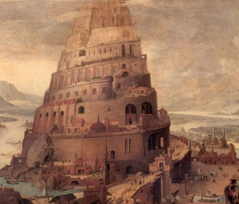

  
[Intangible Textual Heritage](../../index)  [Esoteric](../index.md) 

------------------------------------------------------------------------

<table width="75%">
<colgroup>
<col style="width: 50%" />
<col style="width: 50%" />
</colgroup>
<tbody>
<tr class="odd">
<td width="50%" data-valign="TOP"></td>
<td width="50%" data-valign="CENTER"><h1 id="mankind-united" data-align="CENTER">Mankind United</h1>
<h2 id="by-arthur-bell" data-align="CENTER">by Arthur Bell</h2>
<h4 id="section" data-align="CENTER">[1936]</h4></td>
</tr>
</tbody>
</table>

------------------------------------------------------------------------

[Contents](#contents)    [Start Reading](mu00.md)

------------------------------------------------------------------------

20th century California was a prolific hotbed of new religions. One of
the lesser-known of these was the 'Mankind United' cult. The primary
reason this group is of interest is because of a sociological study by a
scholar from Harvard, California Cult, The Story of 'Mankind United' by
H.T. Dohrman, (Beacon Press, Boston, 1958), which was one of the first
such studies to examine a new religion.

Founded by Arthur Bell in the depths of the Great Depression, Mankind
United claimed that a huge malevolent conspiracy ran the world, (the
"Hidden Rulers" and "Money Changers") responsible for war, poverty and
injustice. Opposing them were the "Sponsors", founded in 1875. The
Sponsors were shortly going to announce their presence, and put in place
a world-wide utopia, based on universal employment, a financial system
of credits, and an artificial language. The work day would be four hours
a day, four days a week. However, in order to do so, they had to get
massive support for their plan, promoted by the 'Pacific Coast Division
of North America, International Registration Bureau.' When 200 million
people accepted the Mankind United plan, the Sponsors would make their
move, and within 30 days utopia would ensue.

Of course, there were no Sponsors, no International Bureau: the group
was founded by Arthur Bell, never got much further than the Oregon
border and never numbered more than a few thousand adherents, if that.
The only true beneficiary of the group was Bell, who had several
luxurious apartments and mansions, including a swinging pad in Hollywood
on the Sunset Strip with an indoor swimming pool, a pipe organ and a
secret cocktail bar (alcohol was forbidden to the rank and file)
\[Dohrman, pp. 89-90\]. Bell was seen in the swankest nightclubs and was
a good tipper. He received $50,000 a year in tax-free income, which
adjusted for inflation would be the equivalent of nearly a million
today. His devotees, on the other hand, worked in various cult
businesses full time, including hotels, ranches and shops. They were
paid less than $40 a month, and worked up to 16 hours a day, seven days
a week, year round \[Dorhman p. 59\]--quite a bit more than four hours a
day, four days a week as promised in this book.

The group came under surveillance during World War II. They incorporated
as a church ('The Church of the Golden Rule') to obtain tax exemption.
Bell made bizarre claims, including that he could be in several
different places at once, and that the Sponsors had advanced technology
which would allow the dead to be resurrected on a distant planet
\[Dohrman p. 72\]. In 1951 Bell abdicated and the cult withered away
completely. Unlike other groups of that time such as '[I
AM](../um/index.md)' there were no successors.

This book, Mankind United, was the primary text of the cult. It was
undoubtedly written by Arthur Bell. The date of publication is
uncertain; the copy used here has '1937' pasted on the verso, and
library entries vary from 1936 to 1938. Much of the cult income was
derived from sales of this book. It is written in a turgid, repetitive
style, with overuse of bold type and large blocks of capitalized text.
Of interest is the description of the ant-hill dystopia that the Hidden
Rulers had in store for humanity ([Chapter VI](mu09).md), which could be
straight out of a Golden Age science fiction yarn.

------------------------------------------------------------------------

 [Title Page and Front Matter](mu00.md)  
[Contents](mu01.md)  
[A Topical and Statistical Index](mu02.md)  
[Preface](mu03.md)  
[Chapter 1. Our Early History and Sixty Successful Years of Secret
Service](mu04.md)  
[Chapter II. The World's Hidden Rulers](mu05.md)  
[Chapter III. The International Legion of Vigilantes and the Leadership
of Eternal Right Ideas](mu06.md)  
[Chapter IV. Universal Security, Peace and Happiness Versus Poverty,
Fear and War](mu07.md)  
[Chapter V. The Golden Rule—Or—The Rule of Gold—Which Shall It
Be?](mu08.md)  
[Chapter VI. 40,000 Principalities—One Thousand Million Slaves](mu09.md)  
[Chapter VIII. Shall Jesus—or—Judas Prevail?](mu10.md)  
[Chapter VIII. Christians Wanted!](mu11.md)  
[Chapter IX. Mankind's Self-Appointed Gods and the Monster Called
“Greed”](mu12.md)  
[Chapter X. The Priceless Gift of Life and What We Do With It](mu13.md)  
[Chapter XI. Shall We Be Master Builders Or Master Murderers . . .
“Extermination” or “Economic Equality”? . . . Mankind Must
Choose](mu14.md)  
[Chapter XII. Limitless Fields Of Interest . . . A “Universe” To
Explore](mu15.md)  
[Chapter XIII. Does Our World Belong Any More to One Than to
Another?](mu16.md)  
[Chapter XIV. Earnings—Hours—Education—Generous Benefits and Ample
Vacations](mu17.md)  
[Chapter XV. The Universal Service Corporation Equally Owned—Equally
Controlled Equally Beneficial](mu18.md)  
[Chapter XVI. Bigoted Skepticism and Inevitable
Extermination—Or—Intelligent Co-Operation And “Economic Equality” . . .
Which Shall It Be?](mu19.md)  
[Chapter XVII. Mankind United—And—The International 4-4-8-3-4
Club](mu20.md)  
[Chapter XVIII. Not A Mad Dream](mu21.md)  
[Chapter XIX. Christians of the World! . . . Have You the Courage to
Accept Our Invitation?](mu22.md)  
[Chapter XX. A Call to Arms and a Brief Summary of the Institute's
Program—What You Can Do to Help](mu23.md)  
