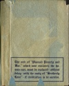
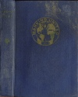
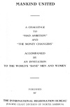
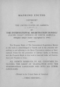

  
[Intangible Textual Heritage](../../index)  [Esoteric](../index) 
[Index](index)  [Next](mu01) 

------------------------------------------------------------------------

*Mankind United*, by Arthur Bell, \[1936\], at Intangible Textual
Heritage

------------------------------------------------------------------------

Jacket

[  
Click to enlarge](img/jacket.jpg)  
Outside Jacket  

MANKIND UNITED

. . . . PURPOSE . . . .

TO END ILLITERACY, POVERTY AND WAR. AND TO

BRING THE ASSURANCE OF LASTING PEACE

AND GUARANTEED SECURITY TO THE

PEOPLE OF EVERY NATION

Please return this book to the party from whom it was borrowed—as soon
as you have finished reading it—in order that it may be lent out again
and thereby be immediately placed in the hands of as many readers as
possible.

Copies of "Mankind United" are now being lent—as rapidly as public
co-operation permits—to 200,000,000 educated and clear-thinking men ant
women throughout the civilized nations of our world. It is most
important that the vital information it contains, be promulgated without
delay. Due to the urgent necessity of keeping this book in constant
circulation it should not be lent, to any one person, for a period of
mare than three days' time.

If, after reading "Mankind United," you believe, that its mes. sage
should also be brought to the attention of your friends and
acquaintances, your compliance with the recommendations contained on the
last two pages thereof, will be most deeply appreciated.

When you have finished reading this book please return it to:

PLEASE DO NOT REMOVE PAPER BOOK COVER

Inside Jacket

[  
Click to enlarge](img/injack.jpg)  
Inside Jacket  

The web of "Planned Poverty and War," which now enslaves the human race,
must be replaced—without delay—with the unity of "Brotherly Love"—if
civilization is to survive"

[  
Click to enlarge](img/fcover.jpg)  
Front Cover  

Title Page

[  
Click to enlarge](img/title.jpg)  
Title Page  

# MANKIND UNITED

#### A CHALLENGE

#### TO

#### "MAD AMBITION"

#### AND

#### "THE MONEY CHANGERS"

#### ACCOMPANIED

#### BY

#### AN INVITATION

#### TO THE WORLD'S "SANE" MEN AND WOMEN

###### PUBLISHED

###### BY

#### THE INTERNATIONAL REGISTRATION BUREAU

#### (PACIFIC COAST DIVISION OF NORTH AMERICA)

by Arthur Bell; Privately printed, California, \[1936?\]

Scanned at Intangible Textual Heritage, March 2007. Proofed and
formatted by John B. Hare. This text is in the public domain in the
United States because it was not renewed at the United States copyright
office in a timely fashion as required by law at the time. These files
may be used for any non-commercial purpose, provided this notice of
attribution is left intact in all copies.

Verso

[  
Click to enlarge](img/verso.jpg)  
Verso (note paste-over on date)  

#### MANKIND UNITED

COPYRIGHT

IN

THE UNITED STATES OF AMERICA

1937

BY

THE INTERNATIONAL REGISTRATION BUREAU

(PACIFIC COAST DIVISION OF NORTH AMERICA)

(Original subject matter copyrighted in 1934)

The Property Right of The International Registration Bureau in this work
is acknowledged in Canada and in the countries subscribing to and
adhering to the Berne Convention creating an International Union for the
protection of Literary works, as Revised, and the Property Right in this
work is reserved under all Conventions and Treaties in force.

ALL RIGHTS RESERVED, IN ALL COUNTRIES, INCLUDING THE RIGHT OF
TRANSLATION INTO THE SCANDINAVIAN LANGUAGES AND INTO ALL OTHER
LANGUAGES.

(Printed in the United States of America)

—THIRD EDITION—

Dedication

THEREFORE ALL THINGS WHATSOEVER YE WOULD THAT MEN SHOULD DO TO YOU, DO
YE EVEN SO TO THEM.

—Matthew 7:12.

------------------------------------------------------------------------

[Next: Contents](mu01)
