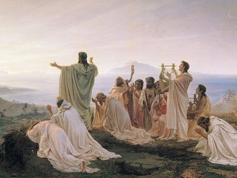

  
[Intangible Textual Heritage](../../index)  [Esoteric](../index) 

------------------------------------------------------------------------

<table width="75%">
<colgroup>
<col style="width: 50%" />
<col style="width: 50%" />
</colgroup>
<tbody>
<tr class="odd">
<td width="50%" data-valign="TOP"> 
Pythagoreans celebrate sunrise, by Fyodor Bronnikov [19th cent.] (Public domain image)</td>
<td width="50%" data-valign="CENTER"><h1 id="numbers-their-occult-power-and-mystic-virtues" data-align="CENTER">Numbers, Their Occult Power and Mystic Virtues</h1>
<h2 id="by-w.-wynn-westcott" data-align="CENTER">by W. Wynn Westcott</h2>
<h4 id="section" data-align="CENTER">[1911]</h4></td>
</tr>
</tbody>
</table>

------------------------------------------------------------------------

[Contents](#contents)    [Start Reading](nop00)    [Page
Index](pageidx)    [Text \[Zipped\]](nop.txt.gz)

------------------------------------------------------------------------

This is a review of number lore by W. Wynn Westcott, an esoteric author
of the 19th century. Westcott includes information on the Pythagoreans
and the Kabbalah. The main portion of this book includes a series of
chapters dealing with every-larger numbers, starting with the 'monad,'
1. Westcott had a grasp a wide range of occult correspondences, and this
short book includes many rare snippets of information.

------------------------------------------------------------------------

 [Title Page](nop00)  
[Contents](nop01)  
[Preface to the First Edition, 1890](nop02)  
[Preface to the Second Edition, 1902](nop03)  
[Part I. Pythagoras, his Tenets and his Followers](nop04)  
[Part II. Pythagorean Views on Numbers](nop05)  
[Part III. The Kabalah On Numbers](nop06)  

### Part IV. The Individual Numerals

[The Monad. 1.](nop07)  
[The Dyad. 2.](nop08)  
[The Triad. 3.](nop09)  
[Three and A Half, 3½](nop10)  
[The Tetrad. 4.](nop11)  
[The Pentad. 5](nop12)  
[The Hexad. 6.](nop13)  
[The Heptad. 7.](nop14)  
[The Ogdoad. 8.](nop15)  
[The Ennead. 9.](nop16)  
[The Decad. 10.](nop17)  
[Eleven. 11.](nop18)  
[Twelve. 12.](nop19)  
[Thirteen. 13.](nop20)  
[Some Hindoo Uses Of Numbers](nop21)  
[Other Higher Numbers](nop22)  
[The Apocalyptic Numbers](nop23)  
