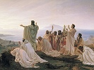

  
[Intangible Textual Heritage](../../index)  [Esoteric](../index.md) 
[Index](index)  [Previous](nop18)  [Next](nop20.md) 

------------------------------------------------------------------------

  
*Numbers, Their Occult Power and Mystic Virtues*, by W. Wynn Westcott,
\[1911\], at Intangible Textual Heritage

------------------------------------------------------------------------

p. 102

### TWELVE. 12.

THIS number has a perfect and notable character, and was highly esteemed
by most nations of antiquity. Almost all the twelves will be found to be
allied, either obviously or in a concealed manner, with the Signs of the
Zodiac, twelve signs or partitions of the great circle of the
heavens—twelve times thirty degrees forming the perfect cycle of 360
arithmetical degrees of the circle: each sign was further sub-divided
into three decans. There are many of the learned who believe the twelve
sons of Jacob, and twelve founders of tribes, are allegorical only. We
may mention the "Twelve Grand Points of Masonry," which used to form a
part of the lectures in the Craft degrees. Twelve events in the ceremony
of initiation, referred to the sons of Jacob, are given by Mackey:

I. To Reuben was referred the opening of the Lodge—he was the first-born
son.

2\. To Simeon, the preparation of the land—he prepared the destruction
of the Shechemites.

3\. To Levi, the report or signal—he gave the signal in the attack on
the men of Shechem.

4\. To Judah, the entrance of the land—that tribe first entered the
promised land.

5\. To Zebulun, the prayer—the prayer and blessing of his father fell on
him in preference to Issachar.

6\. To Issachar, the circumambulation—an indolent tribe, who required a
leader.

7\. To Dan, the advance to the Altar—for a contrast to their rapid
advance to idolatry.

p. 103

8\. To Gad, the obligation—on account of Jephthah's vow.

9\. To Asher, the entrusting; with rich Masonic blessings—resembled the
Fathers of their land.

10\. To Naphtali, the investment and declared "Free"—the tribe of
Naphtali had a peculiar freedom given by Moses.

11\. To Joseph, the N.E. corner—because Ephraim and Manasseh (grandsons)
represented him, newest corners.

12\. To Benjamin, the closing of the Lodge—as being the last son of the
Patriarch.

The following associations of Birds, Animals, and Flowers with heavenly
bodies has the authority of the Greco-Roman mythology:—

|                                   |                                   |                                  |                                    |                                       |
|-----------------------------------|-----------------------------------|----------------------------------|------------------------------------|---------------------------------------|
| Greek. | Latin. | Bird. | Animal. | Vegetable. |
| Pallas                            | Minerva                           | Owl                              | She-goat                           | Olive                                 |
| Aphrodite                         | Venus                             | Dove                             | He-goat                            | Myrtle                                |
| Helios                            | Sol                               | Cock                             | Bull                               | Laurel                                |
| Hermes                            | Mercury                           | Ibis                             | Dog                                | Hazel                                 |
| Zeus                              | Jupiter                           | Eagle                            | Hart                               | Horse-chestnut.                       |
| Demeter                           | Ceres                             | Sparrow                          | Sow                                | Apple                                 |
| Hephaistos                        | Vulcan                            | Goose                            | Ass                                | Box                                   |
| Ares                              | Mars                              | Magpie                           | Wolf                               | Dog-wood                              |
| Artemis                           | Diana                             | Daw                              | Hind                               | Palm                                  |
| Hestia                            | Vesta                             | Heron                            | Lion                               | Pine                                  |
| Hera                              | Juno                              | Peacock                          | Sheep                              | Thorn                                 |
| Poseidon                          | Neptune                           | Swan                             | Horse                              | Elm                                   |

The astrologers associated colours with the twelve Signs of the Zodiac,
thus:—

With Pisces, white

„ Aquarius, blue

„ Capricorn, black or brown

„ Sagittarius, yellow or green

„ Scorpio, brown

„ Libra, black or crimson

„ Virgo, black and blue

p. 104

With Leo, red and green

„ Cancer, green and brown

„ Gemini, red

„ Aries, white

„ Taurus, white and yellow

The Zodiacal Signs are also associated with Sex, and the contrast of Day
and Night.

|             |        |           |
|-------------|--------|-----------|
| Pisces      | Female | Nocturnal |
| Aquarius    | Male   | Diurnal   |
| Capricorn   | Female | Nocturnal |
| Sagittarius | Male   | Diurnal   |
| Scorpio     | Female | Nocturnal |
| Libra       | Male   | Diurnal   |
| Virgo       | Female | Nocturnal |
| Leo         | Male   | Diurnal   |
| Cancer      | Female | Nocturnal |
| Gemini      | Male   | Diurnal   |
| Taurus      | Female | Nocturnal |
| Aries       | Male   | Diurnal   |

And, again, there are other characters which astrologers deem of
importance, thus:—

|             |       |          |          |          |
|-------------|-------|----------|----------|----------|
| Pisces      | Water | Northern | Common   | Fruitful |
| Aquarius    | Air   | Western  | Fixed    |          |
| Capricorn   | Earth | Southern | Cardinal |          |
| Sagittarius | Fire  | Eastern  | Common   |          |
| Scorpio     | Water | Northern | Fixed    | Fruitful |
| Libra       | Air   | Western  | Cardinal |          |
| Virgo       | Earth | Southern | Common   | Barren   |
| Leo         | Fire  | Eastern  | Fixed    | Barren   |
| Cancer      | Water | Northern | Cardinal | Fruitful |
| Gemini      | Air   | Western  | Common   | Barren   |
| 'Taurus     | Earth | Southern | Fixed    |          |
| Aries       | Fire  | Eastern  | Cardinal |          |

Lastly, the twelve signs are allotted to the planets as their houses:—

p. 105

Pisces—the night house of Jupiter

Aquarius—the day house of Saturn (Uranus)

Capricorn—the night house of Saturn

Sagittarius—the night house of Mars

Libra—the day house of Venus

Virgo—the night house of Mercury

Leo—the sole house of Sol

Cancer—the sole house of Luna

Gemini—the day house of Mercury

Taurus—the night house of Venus

Aries—the day house of Mars.

This is very fully explained by Coley in his "Astrology," and also by
John Middleton in his "Astrology," 1679.

Herodotus tells us that the Egyptians founded the system of a Twelve-God
theology: Euterpe iv. The Hebrews certainly at times worshipped the Sun,
Moon, seven planets, and the Star Rulers of the Twelve Zodiacal Signs:
see 2 Kings xxiii. 5, and Job xxxviii. 32. Dunlop, in his "Vestiges,"
remarks that of the names of the twelve months in use among the Jews,
several are identical with names of Deities, as Tammuz, Ab, Elul, Bul.
Groups of twelve Gods are to be noticed in the religions of many of the
ancient nations, as the Chaldeans, Etruscans, Mamertines, Romans, etc.

In Scandinavia the Great Odin had 12 names—personified attributes.

The Kabalists esteem the 12 permutations of the Tetragrammaton, IHVH,
VHIH, HIHV, HVHI, IHHV, IVHH, HVIH, VIHH, HHVI, HHIV, HIVH, VHHI.

The Talmuds say:—

No deceased person is at heart lost to his relatives until after 12
months; see the Treatise Berachoth.

How was the Witch of Endor able to bring up Samuel by necromancy? To
this question Rabbi Abhu answered, because he had not been dead 12
months: after that time it would not have been possible, for then the
body is destroyed and the Soul has gone up into the next world.

p. 106

The Rabbis said that at the first revelation the True Name of God was a
word of 12 letters. Kiddushin, 71. 1.

The Mishna narrates the events of the first 12 hours; Adam fell into sin
in the tenth Hour, was judged in the eleventh, and was cast out of the
Garden in the twelfth; so he abode not even one day in his dignity.
Sanhedrin, 38. 2. Compare the "Nuctemeron" of Apollonius of Tyana, given
by Eliphaz Lévi in his "Rituel de la Magie," Paris, 1861.

The 12 Stones of the High Priest's Breast-plate were named;—Sardius,
Topaz, Carbuncle, Emerald, Sapphire, Diamond, Ligure or Jacinth, Agate,
Amethyst, Beryl, Onyx, and Jasper. See Hebrew Ancient Version, Exodus
xxviii.

The 12 Foundations of the Heavenly City, given in Revelations xxi.,
are,—Jasper, Sapphire, Chalcedony, Sardius, Sardonyx, Emerald, Topaz,
Beryl, Chrysolite, Amethyst, Jacinth and Chrysophrasus.

The 12 Hebrew Months were Abib or Nizan (March–April), Iyar or Zif,
Sivan, Thammuz, Ab, Elul, Tisri, Bul, Chisleu, Tebeth, Shebat, Adar; and
the inter-calary month Ve-Adar.

The 12 Egyptian Months were Pachon, Paoni, Epiphi, Mesori, Thoth,
Phaophi, Athyr, Choiak, Tobi, Mechir, Phamenoth and Pharmuthi; the last
beginning on March 27th.

The 12 Sons of Jacob were related to the 12 Signs of the Zodiac by the
Rosicrucians in a correct order; other schemes of attribution are given
by Athanasius Kircher and others.

That by Sir William Drummond is:—Aries to Gad, Taurus to Ephraim, Gemini
to Benjamin, Cancer to Issachar, Leo to Judah, Virgo to Naphtali, Libra
to Asher, Scorpio to Dan, Sagittary to Manasseh, Capricorn to Zebulun,
Aquarius to Reuben, and Pisces to Simeon and Levi.

The 12 Apostles of Jesus were;—Simon Peter, Andrew, James and John the
sons of Zebedee, Philip, Bartholomew, Thomas, Matthew also called Levi,
James son of Alphæus,

p. 107

\[paragraph continues\] Judas called
Lebbæus and Thaddeus, Simon the Canaanite, and Judas Iscariot. The
Venerable Bede proposed to rename the Signs with the names of the
apostles, and a scheme of allotment is to be found in "The Sphere of
Marcus Manilius," by Edward Sherburne, London, 1675. See "Notes and
Queries," Vol. xiv., Manchester, U.S.A., p. 211. Westcott on the Zodiac
in Soc. Ros. Reports gives the Christian allusions to the Zodiac.

In an ordinary pack of Playing Cards there are 12 Court Cards, but in
the Tarot Pack there are also 4 Cavaliers.

The Kabalists greatly esteemed the 12-lettered Name of God,
HIH-HVVH-VIHIH, meaning "fuit, est, erit,"—or,—He was, is, will be.

Less esoteric was the Triple Tetragrammaton, IHVH thrice written.

All Fratres of the Rosicrucian Society of England will also be familiar
with AB BEN V Ruch H QDSh, Ab-Ben-ve-Ruach-ha-Kodesh; meaning Father,
Son and Holy Spirit.

The Rosicrucian Society had a scheme of distributing 12 shades of Colour
among the Zodiacal Signs, but this is a secret matter; many erroneous
schemes have been published.

The 12 Signs of the Zodiac are named in Hebrew, beginning with Aries;
Taleh, Shur, Thaumim, Sartan, Ariah, Bethuleh, Mazanaim, Akrab, Kesith,
Gedi, Deli, and Dagim. In Arabic; Al Hamal, Al Thaur, Al Tauman, Al
Sartan, Al Asad, Sunbul, Al Zubena, Al Akrab, Al Kaus, Al Gedi, Debi and
Al Haut. In Chinese, Pe yaugh, the sheep; Kin nieu, golden bull; Shang
huing, two brothers; Kin hiai, crab; Sin, lion; Sha niu, the house girl;
Tien tchingh, the claws of a scorpion; Tien Kie, the scorpion; Gun Ma,
the man horse; Mu Thien, the hill sheep; Pao pingh, precious vase; and
Shang Yu, two fishes.

The old Sanskrit Hindoo names used by astrologers at the present time
are; Mesha, Rishaba, Mithuna, Katakam, Simha, Kanya, Tulam, Vrishchika,
Dhanus, Makaram, Kumbha and Minam.

The 12 simple letters of the Hebrew Alphabet have

p. 108

affinities with the Zodiacal Signs, but the order of relation is a
Rosicrucian private doctrine.

There were 12 recorded Appearances of Jesus after his death; to Mary
Magdalene, to the Galician women, to two disciples, to Peter, to ten
apostles, to eleven apostles, to seven apostles and others when fishing,
to 500 brethren at once, to James the Less, to eleven apostles, to
Stephen at his martyrdom, to Paul at his Conversion, and to the apostle
John.

The 12 hours marked in a watch face can be used to find the cardinal
points, if the time is correct, and the sun is visible. Lay the watch
flat and point the hour hand to the sun, and then the south will be half
way between that hour and the figure XII.

The author of the Hymns of Orpheus, the Scholiast on Hesiod, and
Porphyry state that the 12 Labours of Hercules are said to be emblems of
the sun in its passage through the 12 signs, and this is repeated by the
"Mystagogus Poeticus," 1653, and they have been allotted as follows:—to
Aries, the quest of the Golden Apples of the Hesperides; to Taurus, the
slaying of the Cretan Bull; Gemini, Hercules and his twin brother
strangle the serpents; Cancer, the taking of the Herds of Geryon; Leo,
the slaying of the Nemæan Lion; Virgo, the victory over the Amazon
Queen; Libra, the death of the Erymanthean boar; Scorpio, the death of
the Lernæan Hydra; Sagittarius, the shooting of the Stymphalian Birds;
Capricornus, taking of the hind alive to Mycenæ; Aquarius, cleaning the
stables of Augeas; Pisces, the capture of the horses of Diomedes.

Janus of the Romans is the God of the 12 months, and is drawn with 12
altars beneath his feet. He is the same as Assyrian Ain, Ion, Jan; On of Eastern nations (Dunlop's "Vestiges,"
31).

John Heydon gives the following statements:—

Prosperous numbers are 1 2 3 4 7 9 11 13 14

Very good „ 16 17 19 20 22 23 10 26 27

Indifferent „ 5 6 8 12 15 18 21

Very bad „ 24 25 28 29 30

------------------------------------------------------------------------

[Next: Thirteen. 13.](nop20.md)

