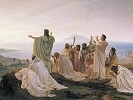

  
[Intangible Textual Heritage](../../index)  [Esoteric](../index) 
[Index](index)  [Previous](nop21)  [Next](nop23) 

------------------------------------------------------------------------

  
*Numbers, Their Occult Power and Mystic Virtues*, by W. Wynn Westcott,
\[1911\], at Intangible Textual Heritage

------------------------------------------------------------------------

p. 111

### OTHER HIGHER NUMBERS.

The 14 days of Burial, in the Master's
degree: 14 parts into which the body of Osiris was divided: a type of
Christ, sacrificed on the 14th day of the month: an amulet of 14 points
has been used to cure the sick.

There are 14 Books of the Apocrypha; they were written originally in
[Greek](errata.htm#1), never in Hebrew. An Israelite had to partake of
14 meals in the Booth during the Feast of Tabernacles.

The Israelites killed the Paschal Lamb on the 14th day of the Month
Nisan.

In Matthew, chap. i., we find the genealogy of Jesus recited in three
series of 14 names, the first under Patriarchs and judges, the second
under kings, and the third under priests and governors.

The ancient physicians considered that the 14th day was the crisis of
fevers.

The Moon waxes and wanes, each for 14 days.

15 was the number of Pairs of The Æons, or Holy Principles in the
Gnostic scheme of Valentinus.

15 is the number by Gematria of the 8th Sephira Hod, Hud.

There were 15 steps in the Temple between the ante-court of Israel and
the Women's Court, and in these were sung the 15 Psalms of Degrees;
Psalms cxx.–cxxxiv. 15 is the number of Jah, a name of God; so the Jews
who wrote letters for numbers, never wrote JH, 10, 5, for 15, but TV, 9,
6 15.

The great day of joyful recreation for Jewish Maidens

p. 112

was the 15th day of the month Ab. The Deluge covered the hills to the
depth of 15 cubits.

A Jewish boy in the olden time was ordered to begin the study of the
Gemara when 15 years of age.

16 means Felicity; a square number. There are 16 Court Cards in a Tarot
pack.

17\. In the treatise "De Iside et Osiride," Plutarch says Osiris was
killed on the 17th day of the moon, and hence when the moon was at the
full—and from that reason the Egyptians abominate the number 17, and so
did the Pythagoreans—they called in Antiphraxis (obstruction), because
it falls between the square number 16 and the oblong number 18.

18 was deemed a protection against thieves.

18\. Isaiah made 18 denunciations against Israel. At 18 years of age a
girl should go to the Nuptial Canopy. The Golden Candlestick of the
Temple was 18 hands-breadths tall. There are 18 Blessings in the Hebrew
Liturgy. There were only 18 High Priests during the existence of the
First or Solomonic Temple at Jerusalem.

19\. The number 19 is famous as being the number of years in the Metonic
Cycle; the cycle of the revolutions of the moon, after which she returns
to have her changes on the same day of the solar year. Meto lived 433
B.C.; he was an Athenian; he published his discovery at the Olympic
Games in the above year. The exact period is, however, 18 years and to
days. The Calippic period of four cycles, or seventy-six years, was
invented by Calippus, B.C. 330, to correct Meto. John Heydon says that
the number 19 facilitates births and menses.

20\. The Kiddushin, 29. 2, says God may curse a man who does not marry
at least when 20 years old, for his life is a constant transgression. A
woman marrying before 20 may bear children up to sixty; at 20 until
forty, and after forty will have none. Bava Bathra, 119. 2. To die after
20 days’ diarrhœa is to die pure.

21\. A hen sits 21 days, and the Almond is ripe 21 days after the flower
falls.

p. 113

22 Letters of the Hebrew Alphabet, used also as numerals. The
realization of a good Dream may be deferred 22 years. Berachoth, 55. 2.

From the Works of Hermes Trismegistus are abstracted 22 axioms on the
Human Will; they can be found in Tukaram Tatya's "Guide to Theosophy,"
Bombay, 1887.

There are 22 Trumps in a pack of ancient Tarot Cards, used for
Divination; Eliphaz Lévi, in his "Clef des Mystères," says that the
numbers 1 to 19 refer to the Keys of Occult Science, and that numbers 19
to 22 are the Keys of Nature: the relation of letters to these are
nowhere correctly printed in books.

23\. In the Sanhedrin 23 judges were required to try cases punishable by
death.

23\. This day of September is notable because the moon which comes to
the full within a fortnight of it is called the harvest moon, which
rises three days in succession at the same time, instead of getting
daily later.

24 is an evil number, referring to Cain, Qin, but not of his numeration, which is 100 +
10 + 50 =160, or else 100 + 10 + 700 = 810.

24\. There are 24 birds unclean as food; 24 ribs both in man and woman.

26\. The number of Jehovah, IHVH, 10 + 5 + 6 + 5.

26\. In the English language, which uses 26 letters, it is found that
the letters occur in very different proportions. In a fair example of
modern English it has been calculated that the proportion between the
frequency of the use of the letters was, of a, 85; b, 16; c, 30; d, 44;
e, 120; f, 25; g, 17; h, 64; i, 80; j, 4; k, 8; 1, 40; m, 30; n, 80; o,
80; p, 17; q, 5; r, 62; s, 80; t, 90; u, 34; v, 12; w, 20; x, 4; y, 20;
and z, 2.

27\. The number of the Izeds or Angels who ruled under the supervision
of the Seven Amshaspands of the Zoroastrian theology.

28\. A division of the Zodiac into 28 mansions of the moon, was probably
earlier than the solar division into 12

p. 114

parts. The names and symbols can be obtained in Sanskrit and in Arabic.
Proctor believes that Solar Astronomy of the 12 signs arose about 2170
B.C., in a country of about 36 degrees of north latitude, and at a
period when Taurus was the first constellation of the Zodiac.

29\. The Rosh Hashanha says the period of the Moon's Revolution is 29
days and six hours and forty minutes.

30\. A meal of Lentils once in 30 days keeps off the Quinsy. At 30 years
of age Jesus began his ministry; Joseph was 30 years old when he stood
before Pharaoh; David was 30 years old when he began to reign; 30 pieces
of silver was the price Judas received, and Jair had 30 sons.

31\. The number of El, God = Al. 1 + 30.

31\. Joshua did not complete the conquest of Canaan until he had slain
31 kings.

32\. The number of the Paths of Wisdom, of the Sepher Yetzirah, being Io
Sephiroth and 22 letters of the Hebrew alphabet.

33\. The years of the life of Jesus: King David reigned in Jerusalem 33
years: the number of vertebræ in the human spinal column.

35\. The number of Agla, AGLA, a composite Kabalistic wonder-working
name. See page [27](nop06.htm#page_27).

36\. Abaji said there are never less than 36 holy men of any generation
upon whom the Shekinah does not rest.

36\. Plutarch, "De Iside et Osiride," calls the Tetractys the power of
the number 36, and on this was the greatest oath of the Pythagoreans
sworn; and it was denominated the World, in consequence of its being
composed of the first four even and the first four odd numbers; for 1
and 3 and 5 and 7 are 16; add 2 and 4 and 6 and 8, and obtain 36.

39\. The number of Articles of the Protestant Christian Church belief.

40\. Up to 40 years of age eating is best for a man, after 40 drinking
suits best. He who has passed 40 days without an affliction has had his
reward in this life.

p. 115

For 40 days the Flood lasted, for 40 days the spies searched the
promised land, for 40 days Goliath challenged Israel, 40 days of
Ezekiel's penitence, the Jews were 40 years in the Wilderness, 40 days
of waiting before embalming the dead, Genesis 1. 3; for 40 days the
woman's purification lasted after childbirth; for 40 days Moses fasted
twice; for 40 days Elijah fasted, and for 40 days Jesus fasted in the
Wilderness, and 40 days elapsed between the Resurrection and Ascension
of Jesus. Moses was 40 years in Egypt, 40 in Midian, and 40 in the
Wilderness. The Israelites were 40 years among the Philistines.

42 is notable because of the 42-lettered name of God, taught by the
Kabalists: there were 42 Judges in the Judgment Hall of Osiris. See
Bettany, "The World's Religions," p. 166, on the events of the 42nd day
after death.

42\. The Talmud of Babylon in Kiddushin 71, mentions the 42-lettered
Name, and it is given by Ignatz Stern as composed of the Divine Names of
the Bible; thus Eheieh asher eheieh, Al, Jah, Jehovah, Elohim, Jehovah
Sabaoth, El Chai and Adonai. AHIH AShR AHIH; IH; IHVIH; AL; ALHIM; IHVH
TzBAVT; AL ChI; ADNI, Or 4, 3, 4, 2, 5, 2, 5, 4, 5, 2, 2, 4 = 42.

It is very curious that the Ten Sephiroth which denote the attributes of
God will show, when these letters are added together, and a V added for
*and* before the last one, this same number 42; if Chesed be called
Gedulah, as was common among Kabalists.

45\. The number of Adam, Adm.

45\. The world is preserved for the sake of 45 righteous persons.
Chullin, 92.

48\. There have been 48 prophets in Israel: 48 cities were assigned to
the Levites.

49\. Moses received 49 reasons for the cleanness and uncleanness of each
thing: so says The Talmud.

50\. The number of the Gates of Binah (Binh) the Understanding. The Kabalah states
that even Moses only reached the 49th. See my "Sepher Yetzirah," Third
Edition, 1911.

p. 116

58\. Noah, Nch.

60\. Aristotle stated that the Crocodile lives naturally 60 years, and
sits 60 days on 60 eggs.

The Chinese have a time cycle of 60 years, and call it Kya-tse. The
people of Malabar call this period Chi-tam.

60\. The Talmud refers to 60 deadly drugs, and 60 sorts of wines; the
sow bears her litter in 60 days.

6i. The number AIN, Negative existence of the Deity.

64\. Aletheia, truth.

65\. The number of Adonai, translated "Lord" (ADNI) and of Hs, Hes, keep
silence.

67\. The number of Binah, Supernal Mother, the 3rd Sephira.

70\. The number of Sud, Sod, a secret
doctrine and private assembly: the earliest name for the Kabalah: also
Iin, Yayin, wine, also meant a secret.

70\. The Rabbis considered that there were 70 nations, and Mordecai is
said to have known 70 languages. The Jewish 70 years of the captivity
are reckoned from their conquest by Nebuchadnezzar to the accession of
Cyrus.

71\. The number of the Members of the Sanhedrin.

72 has a large number of mystic references—to the 72 angels bearing the
names of God—derived from Exodus xiv. 19, 20, 21, by the Kabalists;
there is an important set of 72 pentacles which, placed in pairs, forms
a series of 36 talismans (see Dr. Rudd, the Lemegeton, Harleian MSS.);
it is also the number of Chesed (ChSD) the Sephira, Mercy.

72\. It is said that Ptolemy, King of Egypt, collected 72 Hebrew Rabbis
and confined each in a separate room, and ordered each to write out the
Mosaic Law, and that by the help of God each wrote out the same words.
Megillah of the Talmud, 9. 1.

This account is similar to that of Josephus and Aristæus, but different
to that of Philo: hence the name Septuagint.

73\. The number of Chokmah (ChKMH), Wisdom, the 2nd Sephira.

78\. The number of cards in a Tarot pack: 40 numerals, r6 court cards
and 22 Trumps.

p. 117

79\. Boz, Boaz, the left-hand brazen Pillar at the entrance to Solomon's
Temple.

80\. The number of Yesod, foundation, 9th Sephira. 80. The venerable
Rabbi Hillel had 80 pupils.

81\. According to the Book of Rites of Chao Kung, B.C. 1112, an Emperor
of China should have 3 concubines of the First rank, 9 of the Second, 27
of the Third and 81 of the Fourth Rank.

90\. Ikin, Jachin, the right-hand Pillar
of Solomon's Temple.

91 is the number of Amn and of
Tetragrammaton Adonai (Ihvh, Adni).

96\. According to Vitruvius the natural height of a typical adult man is
96 digits, which equalled 24 palms, or six feet.

99\. The Mahometans have 99 names attributed to God.

100\. This is the number of Mdvn, which
means strife, and it is the beginning of 100 lawsuits.

The Jerusalem Talmud, Bava Metzia, 85. 1, says that Rabbi Zira fasted
100 times to enable him to forget the Talmud of Babylon, in favour of
the Talmud of Jerusalem.

Obadiah was considered worthy to be called prophet, because he concealed
100 prophets in a cave.

103\. The family of Herod Asmonæus ruled Jewry 103 years.

120\. For 120 years the secret vault of Christian Rosenkreutz remained
unopened, as he had ordered, 1484 to 1604.

The Shemaneh Esreh, the 18 Blessings, were composed by 120 Elders.

130\. The Rabbis said that after the curse Adam fasted 130 years as a
penance. This number is referred to Elijah, Alihv, and to the word prophet, Hnbia; these names number 120, add 10 to this,
the number of letters. The Kabalists make a Mystical Square (rectangle)
or Kamea of Alihv of 130 permutations;
ten by thirteen.

152\. The number of Maria, the Greek name for Mary the Virgin, being 40,
1, 100, 10, 1 =152.

153\. The number of the great fishes caught in an unbroken net by the
Apostles after the Resurrection.

p. 118

200\. The number of the bones in the human body.

207\. This is the number of Ain Suph, Ain
Svp, the Boundless, and Aur, Avr,
Light, and of Adonai Olam, Adni Ovlam,
Lord of the Universe.

216\. The cube of 6; 216 years, the period of the Pythagorean
Metempsychosis.

221\. The Cup of David in heaven contains 221 logs of wine: (about 20
gallons) says the Talmud.

231\. The sum of the numbers 1 to 21, the Gates of the Sepher Yetzirah.

243\. Circles of Zoir Anpin; the number of the permutations, without
reversal of the Hebrew Letters. Kalisch.

248\. There are 248 members of the body, says Talmud Eiruvin, 53. 2, and
an anathema enters into all of them. The word ChRM, accursed, is 248,
but so is RChM, Mercy.

252\. It is said that the disciples of Rabbi Ishmael once dissected a
low woman, and found she had 252 members; but it does not say what the
extra ones were.

270\. Worlds of the Idra Rabba, or Greater Holy Assembly.

271\. The Talmud, in Niddah, says that the Hebrew woman's pregnancy
lasted 271, 272 or 273 days.

280 days the term of natural pregnancy, human;-ten times the Lunar 28
day period.

284\. The number of Theos, God, in Greek letters.

294\. Ekklesia, The Church and Rodon, the
Rose, and also Melchisedek, King of Salem.

300\. Mithras.

300\. The riches of Korah were so vast that it took 300 mules to carry
them.

There were 300 sorts of devils in Sichin.

The Veil of the Temple required 300 priests to draw it aside, and 300 to
cleanse it.

314\. The number of Shaddai, ShDI and of Metatron, Mttrun.

318\. Helios, the Sun.

345\. This is the number of El Shaddai, AL ShDI, God Almighty; and of
ShMH (Shemah), the Name of the Absolute God: also of MShH, Moses, and
ShILH, Shiloh.

p. 119

358\. The number of Messiah, Mshich and Nchsh nachash, the Serpent
symbol of life.

364\. The name Satan, the Shathan, H,shThN, contains 364, and all these
days of each year he can tempt man, but not on the 365th, the Day of
Atonement.

365\. The Greek numeration of Abraxas, a Gnostic talismanic word.

365\. Days of the year, Negative Jewish precepts, Dukes of Babylon, and
Streets in the City of Rome.

370\. Directions of the thought of Microprosopus. See Idra Rabba, 5.
537.

373\. Logos.

375\. ShLMH, Solomon.

394\. There were this number of law-courts in the Jerusalem of the
kingdom period.

400\. The body of Joseph was carried 400 miles to burial. David is said
to have had a guard of 400 young men who rode in golden chariots at the
head of his army.

410\. The First Temple stood ¢Io years, and the Second Temple 420.

474\. The number of Daath, Dot, Secret
Wisdom, the union of Chokmah and Binah.

496\. The number of Malkuth (Mlkt), the
Kingdom, the 10th Sephira.

500\. Kosmos.

543\. The number of the mystic name Aheie asher Aheie, "I am that I am"
(AHIH AShR AHIH).

550\. ShMIR, the Shamir, the magical insect which cut the stones for
Solomon's Temple.

608 is a very notable number, representing the Sun. Martianus Capella,
of the 5th century, says: "The Sun is called in Italy the 'God Sol'; at
the Nile, Serapis; at Memphis, Osiris; he is also Attis; Adonis at
Byblos; and Ammon in Libya; also Typhon, Mithras, and Pluto; his holy
name is of 3 letters, which number 608." In Chaldee and Hebrew 608 is
Cham, or Ham (ChM), which also means, "heat." In Greek Y.H.S. from
U.H.S. = 400 + 8 + 200 = 608. Tyre, TRCh, is also an example of 608.

p. 120

612\. Zeus.

613\. The words Moses our Rabbi, MShH RBINU; and Lord God of Israel,
IHVH ALHI IshRL both number by Gematria 613. The 613 Precepts of the
Jewish law were delivered to Moses. David, it is said, reduced them to
eleven, and Isaiah to six, and later to two. Habakkuk to One, viz., The
just shall live by Faith. 613 also refers to the holy garment which had
600 fringes, eight threads and five knots.

620\. The number of Kether, KTR, the Crown, or 1st Sephira.

622 years from the Christian era is the date of the Hegira, or flight of
Mahomet from Mecca, from which year the Mahometans reckon their
calendar.

632 years A.D. is the foundation of the Persian mode of reckoning years,
from their king Yezdegird.

640 is Shemesh, the Sun, ShMSh; Mem is water; place the three letters
one above the other, and we get Sh, fire, sun, rising above and sinking
below the waters.

646\. The total numeration of Elohim, or Aleim ALHIM, being 1 + 30 + 5 +
10 + 600; or avoiding the use of final Mem, we get 1 + 30 + 5 + 10 + 40;
neglecting the tens 1 + 3 + 5 + 1 + 4, and placing these figures in a
circle, we get the sequence 3.1415, notable as the value of π, or the
relation of a diameter to circumference of every circle. Elohim is both
a singular and a plural word.

650 has been referred by Godfrey Higgins to Noah, Menes, and Bacchus.
Noah, in Hebrew, is NVCh or 64.

651 Teletai, the Greek Ancient Mysteries and Epistëmë—Science.

666 is the pet number of Godfrey Higgins, as referred to Rasit (Rsvt), 200 + 60 + 6 + 400, which he insists
means Wisdom—or as most believe—Beginning or Principle: The first words
of Genesis are *be-rasit*, In the beginning.

666\. The number of the Beast, the number of a Man, has been associated
with Satan, Mahomet, the Pope and a hundred others. It is also the
number of Svrt, the Hebrew word for the
Sun. It occurs in Revelations xiii. 18.

p. 121

666 is also the diameter of a circle whose circumference is 2093, which
is the diagonal of a square whose sides are 1480, the number of
Christos. It is also the sum of the numbers 1 to 36. It is also the
number of Syënë in Greek, a place in Egypt at which, if a pit be dug,
said Eratosthenes, the rays of the Sun at the Summer Solstice shine
perpendicularly into it.

700\. The Talmud says there are 700 species of fishes, and in Eiruvin,
18. 1, it says that God plaited Eve's hair into 700 braids.

753 B.C. The founding of the City of Rome.

753\. The number alike of Abram with Sarai 243 and 510, and of Abraham
with Sarah 248 and 505, the change which led to parenthood.

780\. Ophis—serpent, and Sophia—wisdom.

Sol is the number of alpha and omega, 1 + 800, the Peristera or Dove,
vehicle of the Holy Ghost; being 80 + 5 + 100 + 10 + 200 + 300 + 5 + 100
+ 1 =801.

813 is the numeration of Ararita, a very
important Kabalistic word, its letters being collected from the initials
of the sentence, "One principle of his unity, one beginning of his
individuality, his vicissitude is one," or so it is rendered by S. L.
Mathers.

831\. Puramis, a pyramid and Phallos.

888\. The number of Iesous, Jesus, the great contrast with 666, the
number of the Beast.

891\. Uranus, ουρανος—Heaven.

903\. The Talmud in Berachoth, 8. 1, says that there are 903 kinds of
Death, for by Gematria of the word Tutzaut, which means "outlets" see Psalm
lxviii. 20; this number is obtained, thus T, 400: V, 6: Tz, 90: A, 1: V,
6: T, 400 = 903. Death by the Divine kiss is the Euthanasia; death from
quinsy is said to be the worst form, a sort of suffocation long drawn
out.

950\. According to Genesis ix. v. 29 Noah lived 950 years. The great
ages given in the book of Genesis to the patriarchs have long been a
cause of doubt: recent researches by a Hebrew scholar have led to the
opinion that these high

p. 122

numbers did not mean our solar years, but years of five months of thirty
days, and perhaps the earliest year was only one month. David spoke of
70 years as the length of human life; there was no such long period
between Noah and David as could reduce human life by eleven-twelfths.

974\. There were this number of generations from the writing of the Law
by the Holy One before he created Man in the World.

999\. At the Judgment, although there be 999 who condemn a man, he shall
be saved if One plead for him.

1000\. The 1000-headed serpent is Sesha or Ananta, the Hindoo emblem of
eternity.

1000\. The daughter of Pharaoh, whom Solomon married, told him of 1000
forms of musical instruments and taught him the chants for all the
idols. 1000 is the cube of Ten, a symbol of perfection.

Potiphar's wife tempted Joseph with 1000 talents of silver, when her
personal charms failed to move him.

The thickness of the earth's crust is 1000 ells: below this is an abyss
of 15,000 ells. Succah, 53. 2.

If you have a secret, tell it only to One in 1000.

1004\. B.C. The Consecration of Solomon's Temple.

1081\. The number of Tiphereth, the central Sephira, the Sun, Beauty,
Microprosopus, Sun-God.

1263\. The number of the word Gnosis.

1271\. He Gnosis, The Gnosis, and
Stauros, the cross of Jesus.

1322\. First year of Egyptian cycle of Sothis, B.C.; Rameses II. came to
the throne in this year, B.C.

1378\. The reputed year of the birth of Christian Rosenkreutz, founder
of the Rosicrucian philosophy.

1408\. Christian Rosenkreutz founded his arcane society in Germania.

1459\. The date of the writing of the Hermetic Romance of the Chemical
Wedding, by C. R.

1461\. The Egyptian Sothic Period, calculated by the heliacal rising of
Sirius, the Dog Star, at the solstice.

1480\. Christos, in Greek numeration: meaning Anointed:

p. 123

according to "The Canon" this number exhibits an important measure of
the Cosmos, and was the foundation of the scientific pantheism upon
which Christian theology was built, it was a part of The Gnosis and was
derived from the priestly astronomers of Egypt.

1484\. Christian Rosenkreutz died: the Vault closed over his body and
the secrets of the Order he had founded.

1604\. The Vault of C. R. opened by his successors after 120 years of
secret study and benevolence.

1614\. The Fama Fraternitatis Rosæ Crucis was printed.

1717\. Grand Lodge of Freemasons was founded.

1752\. New Year's Day changed from March 25 to January 1.

1865\. Frater Robert Wentworth Little founded the Rosicrucian Society of
Freemasons of England, in its present form.

1885\. Dr. Wm. Robert Woodman became Supreme Magus.

1892\. Dr. Wm. Wynn Westcott became Supreme Magus.

1911\. This year A.D. is the 5013th year of the Kali-Yuga of the Hindoo
sages; this Yuga is to continue 432,000 years.

2000\. A Sabbath day's journey was 2000 paces. Rabbi Gamaliel had a tube
made which, when he looked through, he could see objects at 2000 cubits
distance; this is the earliest suggestion of the telescope. Eiruvin, 43.
2.

2368\. The [Greek](errata.htm#2) number of Iesous Christos.

3000\. Rav Hammunah says that Solomon spoke 3000 proverbs. At the
mourning for Moses 3000 precepts were forgotten.

3102\. In B.C. 3102, in February the Kali Yuga, the Black Age of
humanity began, according to the Brahmins.

3761\. The Jewish Era was calculated to commence 3761 years before the
Christian Era.

4231 Years after the dispersion, said Rashi, the Jews will be restored
to their own land.

4291\. After these years the wars of Gog and Magog will cease, says the
Talmud.

5888\. The number of verses in the Pentateuch, says the Kiddushin: but
they are usually counted as 5845.

p. 124

6000\. The world was intended to last 6000 years: woo years of Disorder;
2000 of the Law: and woo more before Messiah should come; but his Coming
has been delayed by our iniquities; so says the Talmudic treatise.
Sanhedrin, 97. 1.

25,000. According to Ezekiel the mystical city of Jerusalem was
surrounded by a square space measuring 25,000 roods in length, and this
he called The Holy Oblation, and it was for the use of the priests, the
sons of Zadok.

3.14159, the value of ir, the ratio of diameter to circumference of a
circle.

Bode's Law is a curious arithmetical and astronomical problem:—

|                            |     |     |     |     |     |     |     |     |
|----------------------------|-----|-----|-----|-----|-----|-----|-----|-----|
| Take the series of numbers | 0   | 3   | 6   | 12  | 24  | 48  | 96  | 192 |
| Add 4 to each of them      | 4   | 4   | 4   | 4   | 4   | 4   | 4   | 4   |
| And we obtain the numbers  | 4   | 7   | 10  | 16  | 28  | 52  | 100 | 196 |

These show the relation of the ancient planets to the Sun, as to
distance, in the order Mercury, Venus, Earth, Mars, Jupiter, Saturn,
Uranus. The planet corresponding to 28 is missing, and seems to be
replaced by the asteroids. Uranus was discovered in 1781.

The Platonic Year, or great Period, according to Tycho Brahé, is 25,816
years; Ricciolus, 25,920 years; Cassini, 24,800 years; Norman Lockyer
now gives 24,450 years.

It is the period of time determined by the revolution of the equinoxes,
or the space of time wherein the stars and constellations return to
their former places in respect to the equinoxes by means of a constant
precession. The equinoxes moving backwards or westwards, meet the Sun
constantly earlier. In the time of the oldest Greek observations, the
equinoxial points were in the first stars of Aries and Libra
respectively; they are now in Pisces and Virgo. When these names were
given the sun entered

p. 125

\[paragraph continues\] Aries at the
Vernal equinox, and Sign and constellation coincided; now they do not,
so do not be confused by our still calling the first Sign of spring
Aries, although the Sun is now really at such time in Pisces: every 2160
years the Sign is changed. Precedent to Aries the Sun at the Vernal
equinox entered Taurus.

------------------------------------------------------------------------

[Next: The Apocalyptic Numbers](nop23)

