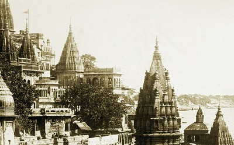

  
[Intangible Textual Heritage](../../index)  [Esoteric](../index.md) 

------------------------------------------------------------------------

[Buy this Book at
Amazon.com](https://www.amazon.com/exec/obidos/ASIN/B002FU5O7C/internetsacredte.md)

------------------------------------------------------------------------

<table width="75%">
<colgroup>
<col style="width: 50%" />
<col style="width: 50%" />
</colgroup>
<tbody>
<tr class="odd">
<td width="50%" data-valign="TOP"></td>
<td width="50%" data-valign="CENTER"><h1 id="occult-science-in-india" data-align="CENTER">Occult Science in India</h1>
<h2 id="by-louis-jacolliot" data-align="CENTER">by Louis Jacolliot</h2>
<h4 id="section" data-align="CENTER">[1919]</h4></td>
</tr>
</tbody>
</table>

------------------------------------------------------------------------

[Contents](#contents)    [Start Reading](osi00.md)    [Page
Index](pageidx)    [Text \[Zipped\]](osi.txt.gz.md)

------------------------------------------------------------------------

|                                                                                                                           |
|---------------------------------------------------------------------------------------------------------------------------|
|  |

This book was written in the 1860s, when reliable information about
Hinduism was just starting to filter back to the west. Jacolliot was
searching for the roots of western esoteric traditions in the far East.
The high point of this book is the travelogue of his encounters in India
with a *fakir*, who demonstrates his *siddis* (yogic powers)
exuberantly. There is also an extensive discourse on Kabbalah, and its
relationship to Eastern mystical beliefs. Jacolliot was a diffusionist,
and he believed that many western esoteric traditions, specifically
Egyptian, Jewish and Christian, had their origin in India.

Jacolliot, the author (1837-1890) was a French lawyer who worked as a
judge in India and Tahiti. He subsequently became a prolific author.
Although he apparently had enough familiarity with Sanskrit to do some
desultory translations of the Laws of Manu, Jacolliot was not an
academic. He quotes extensively here from a text called the
"Agrouchada-Parikchai," which appears to be a pastiche of the
Upanishads, Hindu law books, and a bit of Freemasonry. This text does
not seem to exist except in Jacolliot's imagination. Jacolliot also
believed in a lost Pacific continent, and was quoted by Helena Blavatsky
in [Isis Unveiled](../../the/iu/index.md) in support of Lemuria. --J.B. Hare, June 21, 2008.

------------------------------------------------------------------------

 [Title Page](osi00.md)  
[Preface](osi01.md)  

### Part I. The Doctrine of the Pitris

[Chapter I. The Initiated at the Ancient Temples](osi02.md)  
[Chapter II. The Brahmins](osi03.md)  
[Chapter III. The Brahmin—From His Birth To His Novitiate—The Ceremony
of the Djita Carma](osi04.md)  
[Chapter IV. The Brahmin—From His Novitiate to His Reception Into the
First Degree of His Initiation](osi05.md)  
[Chapter V. The First Degree of Initiation](osi06.md)  
[Chapter VI. The First Degree of Initiation.—(Continued.)](osi07.md)  
[Chapter VII. The Second Degree of Initiation](osi08.md)  
[Chapter VIII. The Third Degree of Initiation](osi09.md)  
[Chapter IX. The Grand Council](osi10.md)  
[Chapter X. The Election of the Brahmatma](osi11.md)  
[Chapter XI. The Yoguys](osi12.md)  

### Part II. The Philosophical Tenets of the Indian Initiates

[Chapter I. The Degree of Sanctity Which the Initiates Must Have
Attained Before Receiving the Sacred Formula and the Fatal
Secret](osi13.md)  
[Chapter II. The Superior Guru—The Sacred Decade](osi14.md)  
[Chapter III. The Guru—Evocations](osi15.md)  
[Chapter IV. The Frontal Sign of the Initiates According to the
Agrouchada-Parikchai](osi16.md)  
[Chapter V. The Interpretation of the Vedas and Other Works of Sacred
Scriptures](osi17.md)  
[Chapter VI. Psychology of the Book of the Pitris](osi18.md)  
[Chapter VII. Reason](osi19.md)  
[Chapter VIII. A Text From the Vedas](osi20.md)  
[Chapter IX. A Few Slocas From Manu](osi21.md)  
[Chapter X. Of the Supreme Being](osi22.md)  
[Chapter XI. Words Spoken by the Priests at Memphis](osi23.md)  
[Chapter XII. The Formulas of Evocation](osi24.md)  
[Chapter XIII. Formulas of Magical Incantation—Vulgar Magic](osi25.md)  

### Part III. Compared with the Jewish Cabala, etc

[Chapter I. Origin of the Cabala](osi26.md)  
[Chapter II. How the Sacred Books are to be Interpreted According to the
Jewish Cabalists](osi27.md)  
[Chapter III. Initiation Among the Cabalists](osi28.md)  
[Chapter IV. The Divine Essence, According to the Cabalists](osi29.md)  
[Chapter V. The Ten Zephiroth](osi30.md)  
[Chapter VI. The Cabalistic Trinity](osi31.md)  
[Chapter VII. The Belief in Mediating and Inspiring Spirits According to
the Jewish Cabalists](osi32.md)  
[Chapter VIII. Points of Resemblance Between the Doctrine of the Pitris
and That of the Zend-Avesta of Persia, the Philosophy of Plato, the
Alexandrian School, and of Christianity](osi33.md)  

### Part IV. Exoteric Manifestations and Demonstrations as Shown by the Fakirs

[To the Reader](osi34.md)  
[Chapter I. As to Who Are Initiated Into the Different Classes of Occult
Power](osi35.md)  
[Chapter II. Agasa](osi36.md)  
[Chapter III. The Performing Fakirs](osi37.md)  
[Chapter IV. The Leaf Dance](osi38.md)  
[Chapter V. The Bronze Vase—Musical Accompaniments](osi39.md)  
[Chapter VI. The Water-Spout—The Magic Stick](osi40.md)  
[Chapter VII. Phenomena of Elevation and Knocking.](osi41.md)  
[Chapter VIII. The Bamboo Stool—Aërial Flowers—The Mysterious
Punkah](osi42.md)  
[Chapter IX. The Stationary Table—A Shower Of Knocks—The Little
Mill—Flying Feathers—The Harmoniflute](osi43.md)  
[Chapter X. Sand Drawing—the Metor and the Bucket of Water—Loss of
Voice—Mind Reading—Reading in a Closed Book—Aërial Melody—the Flying
Palm—Leaf—Elevation of the Fakir](osi44.md)  
[Chapter XI. Spontaneous Vegetation](osi45.md)  

### Apparations

[Chapter I. Mysterious Hands—the Production of Flowers, Crowns,
etc.—Letters of Fire—The Spectre of a Priest of Brahma—the Phantom
Musician](osi46.md)  
[Chapter II. The Phantom of Karli](osi47.md)  

 

[Conclusion](osi48.md)  
