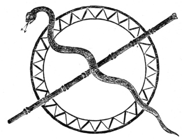

  
[Intangible Textual Heritage](../../index)  [Esoteric](../index) 
[Index](index)  [Previous](osi15)  [Next](osi17) 

------------------------------------------------------------------------

[Buy this Book at
Amazon.com](https://www.amazon.com/exec/obidos/ASIN/B002FU5O7C/internetsacredte)

------------------------------------------------------------------------

  
*Occult Science in India*, by Louis Jacoilliot, \[1919\], at Intangible
Textual Heritage

------------------------------------------------------------------------

p. 100

### CHAPTER IV.

### THE FRONTAL SIGN OF THE INITIATES ACCORDING TO THE AGROUCHADA-PARIKCHAI.

Every morning those who have been initiated into the third degree, after
terminating 

|                    |
|--------------------|
|  |

their ablutions, and before going to the pagoda to listen to the
discourse on the occult sciences, should trace upon their foreheads,
under the direction of the Gurus, the accompanying sign, which is a
symbol of the highest initiation. The circle indicates infinity, the
study of which is the object of the occult sciences.

The border of triangles signifies that everything in nature is subject
to the laws of the Trinity.

Brahma—Vischnou—Siva.

The germ—The womb—The offspring.

The seed—The earth—The plant.

The father—The mother—The child.

The serpent is a symbol of wisdom and perseverance. It also indicates
that the multitude are not to be admitted to a revelation of the higher
truths, which often lead weak minds to insanity and death. The
seven-knotted stick represents the seven degrees of the power of
evocation and external manifestation, which form the subject

p. 101

of study to those who have been initiated into the various degrees with
which we are acquainted:

Grihasta—or House-Master.

Pourohita—or Priest of Popular Evocations.

Fakir—Performing.

Sanyassis—Superior Exorcists.

Nirvanys—Naked Evocators,

Yoguys—Contemplative.

Brahmatma—Supreme Chief.

------------------------------------------------------------------------

[Next: Chapter V. The Interpretation of the Vedas and Other Works of
Sacred Scriptures](osi17)
